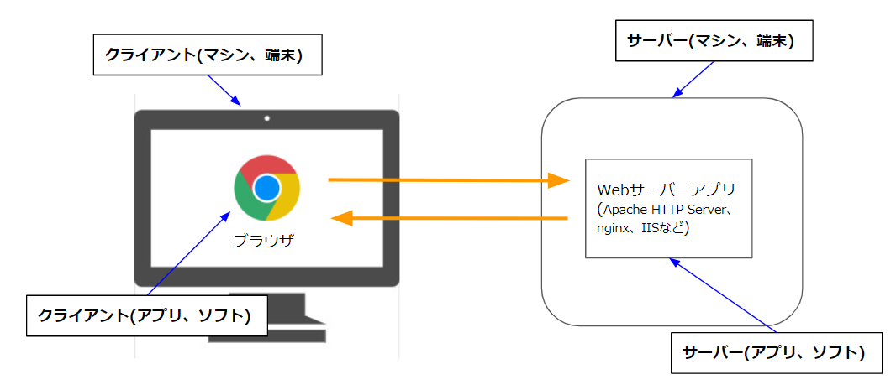
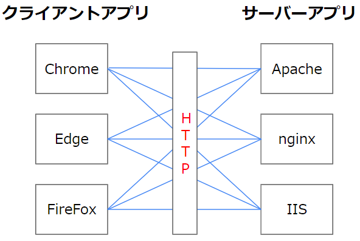
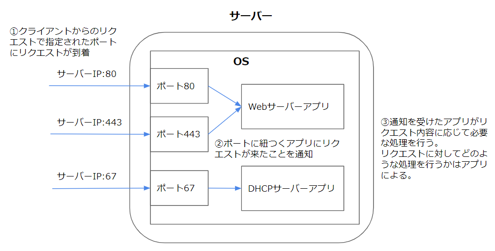
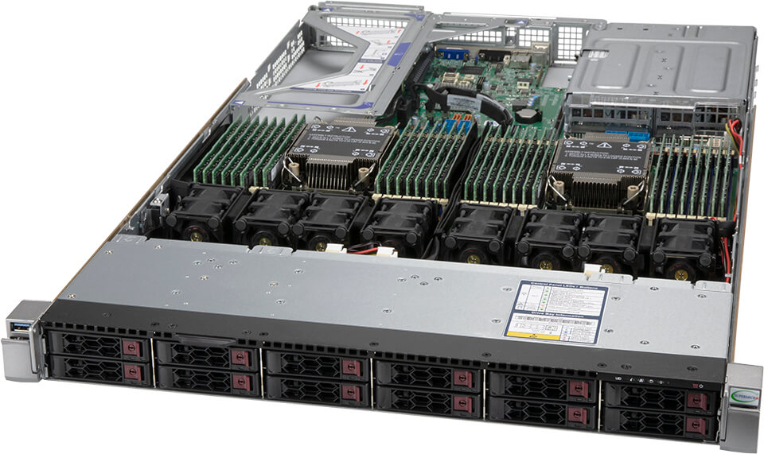
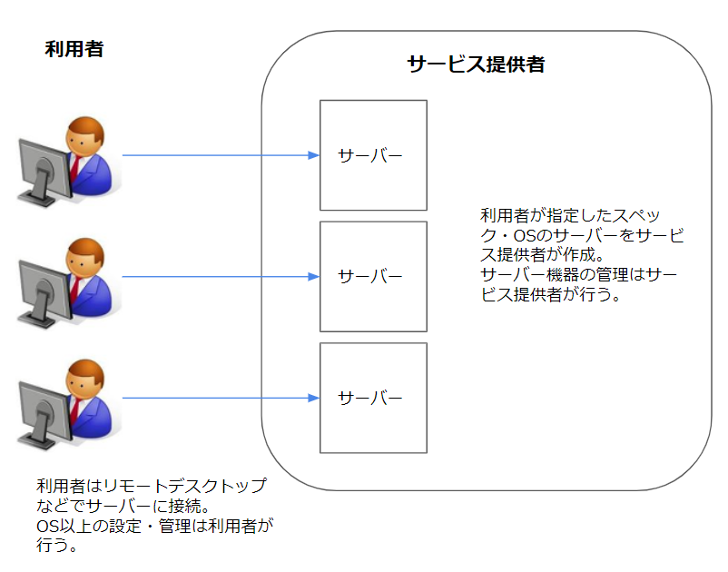
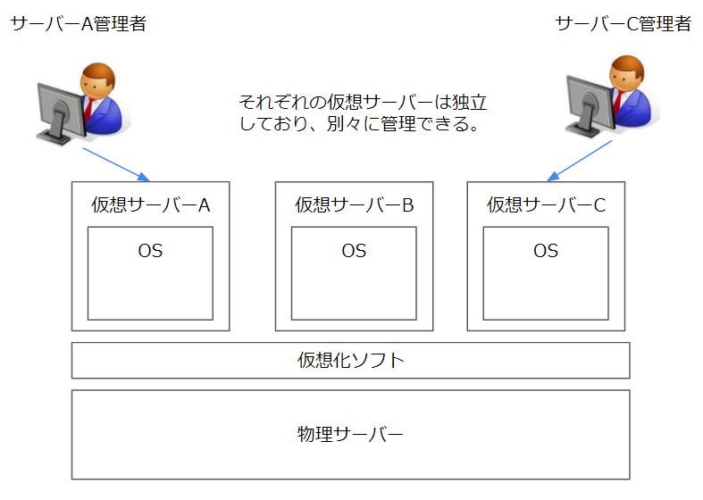
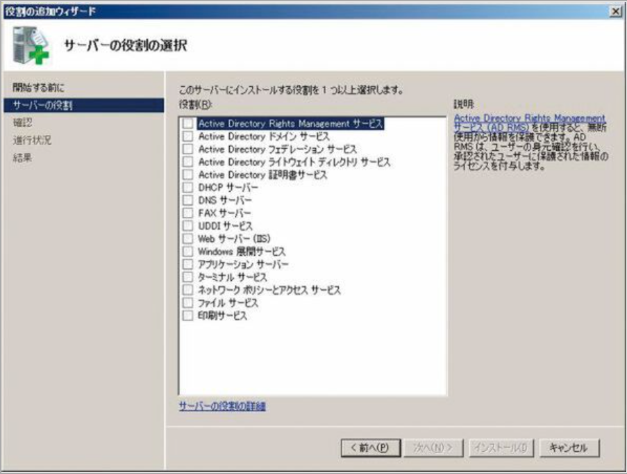

# サーバーとは？  

## なにこれ？  
ITの仕事をしていると、サーバーという単語がよく出てきます。  
ある程度経験がある人は当たり前に使っている単語だと思いますが、文脈によって指しているものが違う為、新入社員の方などは聞いていて混乱するかも知れません。

この記事はそういった方たちが、サーバーという単語が指す意味合いを理解できるようになることを目的としています。

## 対象者
サーバーと聞いてもよく分からない人

## サーバー（Server）、クライアント（client）の意味 
serveという英単語は、「（飲食物などを）出す、（サービスなどを）提供する」という意味合いがあります。
serverとは「提供する人や物」というような意味合いになります。  

また、提供されたサービスなどを利用する人や物を「client」といいます。  

- server  
(サービスなどを)提供する人や物。

- client  
(サービスなどを)利用する人や物。

  
ITの文脈で出てくるserver・clientも同じような意味合いになります。

- server  
ある機能やコンテンツについて、それを提供する側（応答する側）のコンピュータまたはソフトウェア  

- client  
ある機能やコンテンツについて、それを利用する側（要求する側）のコンピュータまたはソフトウェア

「あるサービスやコンテンツの提供」というのは、例えばWebサイトの提供などがあります。  
IEやchromeなどのブラウザからgoogleなどのWebサイトを閲覧する場合、大まかに以下の流れでWebサイトが表示されます。  

1. IEやchromeなどのブラウザが、入力されたURLに対応するIPを持つコンピュータに対して、Webサイトを表示する為のコンテンツを下さいと要求する[^1]  

1. リクエストを受け取ったコンピュータは、Webサイト表示に必要なファイルなどを返却する[^2]   

Webサイト表示の場合  

この場合、Webサイトを下さいと要求しているブラウザ側が「クライアント」、クライアントからの要求に応じてWebサイトに必要な情報を返却している側が「サーバー」となります。

[^1]: DNSという仕組みでURLからIPが分かるので、そのIP向けにHTTPリクエストという形式のメッセージを送信しています。詳しくは別の記事で説明します。  

[^2]: HTML、Javascript、CSS、jsonなどを返却します。こちらも詳しくは別の記事で説明します。  

別の例として、DHCP（IPを発行する機能）を利用する場合は、    
IPを要求する側が「クライアント」、要求を受けてIPを払い出す側が「サーバー」ということになります。

DHCPでのIP発行の場合  

このようにある機能を提供する側が「サーバー」、利用する側が「クライアント」と呼ばれます。

どの機能かに関わらず、サーバーとクライアントのやりとりは以下の流れで行われます。
1. クライアントがサーバーに要求（リクエスト）を投げる
1. サーバーが要求内容に応じた処理を行う（Webサイトのコンテンツの準備、IPの発行など）
1. サーバーがクライアントに処理の結果を返す（レスポンス）

## もう少し細かい言い方
サーバー・クライアントの説明時に、「～する側のコンピュータまたはソフトウェア」という表現をしました。  
ここを明確に分けて呼ぶ場合もあります。  
決まった言い方は無いので人それぞれな部分はありますが、大体以下のように呼ばれます。

- クライアント側  
ある機能やコンテンツについて、それを利用する側（要求する側）の
  - ソフトウェア  
→クライアントアプリ、クライアントソフト　などと呼ばれる

  - コンピュータ  
→クライアントマシン、クライアント端末　などと呼ばれる  

Webサイト表示の例でいうと、ブラウザがクライアント（アプリ、ソフト）、ブラウザを立ち上げてるPCがクライアント(マシン、端末)　ということになります。

サーバー側も同じです。
クライアントからの要求への応答は、サーバー側で起動しているアプリケーションが行っています。   

- サーバー側  
ある機能やコンテンツについて、それを提供する側（応答する側）の
  - ソフトウェア  
→サーバーアプリ、サーバーソフト　などと呼ばれる

  - コンピュータ  
→サーバーマシン、サーバー端末　などと呼ばれる  

Webサイト表示の例だと、サーバー側のアプリとしてApache HTTP Server、nginx、IISなどがよく使われます（詳しくは別記事で解説します）  
それらのアプリがサーバーアプリ（ソフト）、それが稼働している端末がサーバーマシン（端末)ということになります。

アプリやマシン固有の話題で、明確に２つを区別したい場合はこのように細かい言い方になる場合があります。  
利用(要求)する側か、提供（応答）する側かが重要な場合は、いちいち細かい言い方はせずにまとめて「クライアント」、「サーバー」ということも多いです。  
（クライアントサイド、サーバーサイドという事もあります。）

## ○○サーバー
サーバーについて、「ある機能やコンテンツ」を提供するものだと説明しました。  
Webサイトの表示やDHCPを例に出しましたが、他にも様々な機能があります。

- メール送信
- ファイル共有
- データベース
- DNS  
他多数

このうちのどの機能を提供しているサーバーかを判別する為に、機能名や、その機能のプロトコル*（HTTP、SMTPなど）を頭につけて呼ぶことも多いです。

例えば以下のように呼ばれます。
- Webサイトを提供しているサーバー  
Webサーバー、Httpサーバー　など

- メール送信機能をしているサーバー  
メールサーバー、SMTPサーバー　など

- ファイル共有機能をしているサーバー  
ファイルサーバー、SMBサーバー　など

システム構成図などでサーバーの一覧を書く際などは、このように機能名まで付けて書きます。   
(単に「サーバー」と書かれたものが複数あってもよく分からないので)  

ただ会話の中では、何のサーバーかが自明な場合は、省略して単にサーバーといわれる事も多いです。  
（例えばWebサイト表示の話をしている場合、サーバーはWebサーバーを指すと予想できる。）    

また、何の機能を提供しているかに関わらず、機能提供側のコンピュータの事をサーバという事も多いです。

#### プロトコルとは  
ある機能において、クライアントとサーバーがやり取りする際の仕様・ルールのことです。  
例えばWebサイト表示の場合、クライアント側のアプリ（ブラウザ）と、サーバー側のアプリは、「HTTP」という仕様に乗っ取ってデータをやり取りしています。  
HTTPの仕様には、送信するデータの形式などのルールが定義されています。  
（送信元IPはここに書く、このデータとこのデータの間は1行空ける、改行文字はCR＋LF、など）  

ブラウザにはchrome、firefox、IEなど様々な種類がありますし、サーバー側のアプリもapache、nginx、IISなど様々なアプリがあります。  
上記のどんな組み合わせでもWebサイトを表示する事が可能です。  
それは、クライアント側・サーバー側両方のアプリが、「HTTP」という共通のルール（プロトコル）に従ってやりとりするよう実装されている為です。  
(別の記事で解説しますが、HTTPだけではなく、html、css、javascriptなども仕様が決められています)  

## 「機能の提供」について
サーバーにおいて、「○○の機能を提供している」とは具体的にどのような状態でしょうか。  
それは、「○○の機能をもったアプリケーションが稼働している状態」を指します。

例えばWebサーバーとは、「Webサーバーアプリがインストールされており、稼働している（他の端末からの要求を受け付けられる）状態のコンピュータ」ということになります。  

あるコンピュータをWebサーバーとして利用する場合、大まかに以下の手順を踏むことになります。  
1. コンピュータにWebサーバーアプリをインストール[^3] 
1. インストールしたWebサーバーアプリを起動  
1. Webサーバーアプリが外部からの通信を受け付けられるように設定  

そのように設定できるコンピュータであれば何でもWebサーバーに出来ます。  
例えば、皆さんが使っているノートPCに上記の設定をすればそれはWebサーバーと言えます。

[^3]: サーバーのOSに初めから含まれている場合もあります。  
例えばWindosServerというOSにはIISというWebサーバーアプリが最初から含まれています。

また、1台のコンピュータで複数のアプリケーションを稼働させることも可能です。  
ある端末でWebサーバーアプリとDHCPサーバーアプリが稼働している場合、それはWebサーバー兼DHCPサーバーと言えます。  

 

ただこのように1台に機能をまとめると、負荷が高くなったり、障害に弱くなったりする為、重要な機能は別々の端末にすることが多いです。

### サーバーアプリとポート
上記のように複数の機能が提供されているサーバーにおいて、どちらの機能に対する要求かをどのように判別しているのでしょうか。  
それは、サーバーアプリが紐ついているポートによって判断されています。

大まかな仕組みは以下になります。

1. クライアントアプリからサーバーにリクエストを送る際、サーバーのIPだけではなく、ポート番号も指定します。  
（どのポート番号を使用するかは、そのアプリが利用するプロトコルによって異なります。）

1. サーバー（のOS）がクライアントからのリクエストを受け付けた際、リクエストで指定されたポートに紐ついているアプリにリクエストが来たことを通知します。

1. 通知を受けたアプリはリクエストの内容を取得し、必要な処理を行います。  

 

#### アプリとポートの紐付け
アプリがポート番号と紐ついていることを、アプリがポートをリッスン（LISTEN）していると言います。  
（正確にはアプリのプロセスがポートをリッスンしています。  
プロセスとは、「OS上で実行中のプログラム」を指します。  
Windowsならタスクマネージャーからプロセスの一覧を確認できます。）  

どのアプリがどのポートをLISTENしているかはOSが管理しており、アプリは起動時にOSに対してLISTENしたいポート番号を申請します。  
そうすることで、そのポートにリクエストが来た際にOSから通知をもらうことが出来ます。

１つのプロセスで複数のポートをLISTENすることも可能ですが、１つのポートに紐つくプロセスは１つと決まっています。  
その為、どのアプリへの通知すべきか分からないということにはなりません。  

### プロトコル毎のポート番号
例えばHTTPプロトコルで通信する際、あるサーバー81番ポートを使用し、別のサーバーは82番ポートを利用している、となると混乱してしまいます。

その為、主要なプロトコルについては、使うべきポートがあらかじめ定義されています。  
(HTTPポートは80、HTTPSは443など）  
参考：[TCPやUDPにおけるポート番号の一覧](https://ja.wikipedia.org/wiki/TCP%E3%82%84UDP%E3%81%AB%E3%81%8A%E3%81%91%E3%82%8B%E3%83%9D%E3%83%BC%E3%83%88%E7%95%AA%E5%8F%B7%E3%81%AE%E4%B8%80%E8%A6%A7)  

あくまで使用が推奨されているだけなので、 セキュリティ対策などであえて違うポート使用することもあります。  
（大半のアプリは設定でLISTENするポートを変更できます。）

ただ一般に公開されているWebサイトなどはデフォルトのポート番号を使うことがほとんどです。  
（変えるとクライアント側も対応しなくてはいけないため。例えばhttpを81ポートで公開した場合、URLに:81と付けなくてはいけない。）

#### 送信元のポート番号
クライアント側の送信元ポートは定義されている場合と無い場合があります。

DHCPなどはクライアント側の送信元ポートも定義されていますが、HTTPなどは定義されていません。  
定義されていない場合、クライアント側のアプリ(ブラウザなど)は空いているポートを送信元ポートとして使用します。  
（動的・私用ポート番号とよばれる範囲の番号から選ばれます。）

 

## サーバー用の機器
前述の通り、サーバーとはある機能を提供しているコンピュータのことであり、その機能さえ提供できればノートPCなどをサーバーとして利用する事も可能です。  

例えば少人数の会社で社員しか利用しない場合や、個人で利用する場合は余っているPCをサーバーとして使う、ということもあるかと思います。  

ただインターネットに公開しているサーバー（企業サイトを公開しているWebサーバーなど）など、多数のクライアントからアクセスされるサーバーの場合、アクセス数が多くなるとサーバーに対する負荷が高くなります。  
その場合、個人利用が目的のPCではスペック的に不足してしまいます。  

その為、負荷が高いサーバー用途に使える、ハード的に高スペックなサーバー用機器が販売されています。  

例  
 

これらのサーバー用機器は、製品によりますが主に以下のような特徴があります。  

- CPU・メモリ・HDDなどを挿すためのスロットが多く、スペックを上げやすい。
- 予備電源を配置出来るなど、安定した稼働。
- ラックにまとめて配置できるように形状が工夫されている。

サーバー機器を置き換えたい、という文脈の話をしている場合などは、サーバー機器の事を指してサーバーと言うこともあります。  

### クラウドやレンタルサーバーの利用
サーバー用の機器を購入した場合、機器を置くスペースを確保したり、機器を自分たちでメンテナンスしていく必要があります。  
機器を配置するスペースの温度管理などもしなければいけないですし、地震などで倒れないように考慮する必要があります。  
また機器をメンテナンスするにはスキルを持った人員を確保する必要があります。  

それらの負担を回避するために、レンタルサーバーやクラウドのIaasと呼ばれるサービスを利用する事も多いです。  

利用イメージは以下になります。  

1. 利用者が必要なスペック（メモリ、CPUなど）やOSの種類など指定  
（サービス提供業者が用意したWebサイトから指定出来ることが大半です。）

1. サービス提供業者が指定されたスペックのコンピュータを用意  
(このコンピュータは単にサーバーと呼ばれることも多いです。)

1. 利用者はリモート接続*でサーバーを管理

*OSがWindowsならリモートデスクトップ、LinuxならSSHで接続します。

 

### サーバー仮想化
1台のコンピュータを複数台の仮想的なコンピュータに分割して利用する仕組みです。  
仮想化ソフトウェアを用いて実現します。  
仮想的なコンピュータは、仮想サーバー、仮想マシン(VirtualMachine)などと呼ばれます。  
（ベースとなるサーバーは「物理サーバー」などと呼ばれます。）  
それぞれの仮想サーバーではOSやアプリケーションを実行させることができ、あたかも独立したコンピュータのように使用することができます。

 

仮想サーバーを利用する事で、サーバー増やすごとにサーバー機器を新たに購入することを避けることができます。  
（高スペックな物理サーバーを用意しておき、新しいサーバーが必要になった際はその上に仮想サーバーを作成するようにする。）  

前述のレンタルサーバーやクラウドサービスで貸し出されるサーバーも、裏ではこの仮想化技術を用いていることが大半です。  

これはサーバーを管理する側の話なので、クライアント側からみると仮想サーバーでもそうでないサーバーでも関係ありません。  
ただの1台のサーバーになります。

## Windowsのサーバーエディション  

Windowsには、Windows10などの個人用OSと、WindowsServerというサーバー用OSがあります。  

両方のOSで元となるソースコードは共通です。  
(例えばWindows 10 AnniversaryUpdateとWindowsServer 2016、Windows10バージョン1809とWindowsServer2019は同じコードベース)  
その為、見た目も似てますし共通の機能も多いです。  

ただ、WindowsServerはサーバー用途に向けて機能が調整されています。  
例えば以下のような特徴があります。  

- 様々な役割として利用できるよう、必要な機能があらかじめ含まれている、または容易にインストール出来る。  
（Webサーバー、DHCPサーバーなどとして利用したい場合に簡単にセットアップ出来る）  

 

- 認識できるリソースが多い。  
例えばメモリは最大24TB、CPUソケットは64個まで認識できる。  
（Windows10ではメモリ2TB、CPUソケット2個が上限）

- セキュリティ関連の機能が豊富  

Windows10などの個人用OSでもサーバーとして利用することは可能です。   
(例えばWindows10でIISを有効にすればWebサーバーとして使えます。)  

ただ業務用途ではセキュリティなどの信頼性が求められることが多い為、WindowsServerが使われる事がほとんどです。  
(サーバーOSをWindowsにする場合の話です。  
そもそもサーバー用のOSとしてはWindowsではなくLinux系が使われることも多いです。)

文脈によってはサーバーOSの事を指してサーバーという事もあります。

## まとめ
- 機能を提供する側をサーバー、利用する側をクライアントと呼びます。
- アプリケーションと端末を区別して呼ぶ場合もあります。
- 機能名や、その機能のプロトコルを頭につけて○○サーバーと呼ぶ場合もあります。
- ある機能を提供している状態とは、その機能をもったアプリケーションが稼働している状態を指します。
- サーバー側のアプリケーションは、特定のポートと紐ついています。
- プロトコル毎に使用すべきポートが決められています。
- サーバーの高負荷な用途に耐えられるサーバー用の機器があります。
- WindowsServerはサーバー向けに機能が調整されたWindwosOSです。

