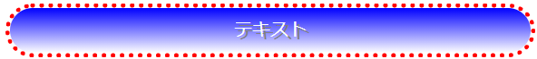
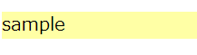
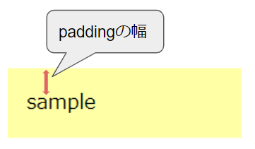

# CSSとは


## CSSとは  
CSS（Cascading Style Sheets）は、HTML要素が画面上でどのように表現されるかを定義する為の言語です。  
幅・高さ・色など、見た目のデザインに関する様々な情報を指定できます。

例えば、ある要素の背景色を青にする場合は以下のように指定します。
```html
<h1 style="background-color:blue;">見出しです</h1>
```  

上記のHtmlは以下のように描画されます。  


この例の`background-color:blue;`の部分で「背景色を青にする」という指定をしています。  
他にも見た目に関する様々な指定を行うことができます。   


## CSSの構文
cssの構文は以下になります。  
`プロパティ名: プロパティ値;`  

`background-color:blue;`の場合、`background-color`の部分がプロパティ名、`blue`の部分がプロパティ値になります。  
プロパティ名は何に関する指定をするかを表し、プロパティ値は実際に指定する値を表します。  

プロパティ名に指定できる文字(`background-color`など)はCSSの[仕様](https://www.w3.org/Style/CSS/specs.en.html)で決まっています。  
またプロパティ名に対して指定可能なプロパティ値(`blue`など)も仕様で決まっています。  

`background-color`以外にも様々なプロパティが仕様で定義されています。  
例えば以下のプロパティがあります。

- width、height  
要素のサイズを指定します。  

- border  
要素の枠線の見た目を定義します。  

- padding、margin  
要素の間隔を定義します。  
よく使うので詳細は後述します。  


複数のプロパティを同時にしたい場合は、続けて記述できます。  
例）  
```html
<h1 style="background-color:blue;color:white;width:120px;height:120px;">見出しです</h1>
```


プロパティを組み合わせることで様々なデザインを定義できます。  
例えば、枠が赤の点線で角が丸く、文字は白で影を付けて中央寄せされており、背景は青のグラデーション、という要素を表示したい場合は以下のCSSを指定することで実現できます。  
```css
.Sample {
  background:linear-gradient(blue, white);  /* BOXの背景色をグラデーションに */
  background-clip:padding-box;  /* 背景が枠線と重ならないように指定 */
  color: white; /* 文字色 */
  text-shadow: 3px 2px gray; /* 影の指定*/
  text-align: center;  /* 文字を中央寄せ*/

  border        : 4px dotted red;   /* 枠線の指定  */
  border-radius : 43px;                /* 角丸の指定  */
  padding: 8px; /* 余白 */
}
～
<div class="Sample">テキスト</div>
```

上記のコードはブラウザ上では以下のように描画されます。

   

あるプロパティが指定された際、ブラウザ画面にどう描画されるべきかも仕様により決まっています。  
各ブラウザはこの仕様に従って画面を描画しています。  

## CSSの適用方法
CSSをHTMLに適用する方法は3つあります。  

### タグの`style`属性に直接指定する  
Htmlの全てのタグには`style`という属性を指定出来ます。  
そこにCSSを記述できます。  

```html
<h1 style="backgroundcolor:red;">見出しです</h1>
```  


### `<style>`タグの内部に定義する  
HTMLの`<style>`タグ内に定義します。  
`<style>`タグは`<header>`タグ内に定義します。

定義する際、**セレクタ**にてどの要素にスタイルを適用するかを指定します。  
（セレクタについては後述します。）   

```html
<style>
  h1 {
    background-color: blue;
  }
</style>

～～略～～

<h1>見出しです。</h1>
```

### 外部ファイルに記載し、`<link>`タグで読み込む  
HTMLとは別のファイルにcssを定義し、HTTPでアクセス出来る場所に配置しておきます。  
HTMLの`<link>`タグの`href`属性でそのファイルのURLを指定すると、ブラウザがそのファイルを読み込み、セレクタにマッチする属性に定義を適用してくれます。  

例えばサーバー上のmycss.cssというファイルにCSS定義を記述している場合、以下のように読み込めます。  

・外部CSS  
mycss.css
```css
h1 {
  background-color: blue;
}

button {
  color: red;
}
```

・HTML
```html
<link href="http://サーバーのドメイン or IP/mycss.css" rel="stylesheet"/>
<!-- hrefで指定した外部CSSが読み込まれ、ここに展開されるイメージ。 -->`

～

<h1>見出しです。</h1>
```
※Htmlファイルと同じサーバー上にCSSファイルがある場合は、[相対URL](1_2.URLとは.md#絶対urlと相対url)で指定可能です。  

直接記述する方法だと記述箇所が増えた際に管理が大変になり、定義の再利用もしにくい為、外部ファイルとして定義する事が多いです。  
styleタグ、外部ファイルに記述する場合は、**セレクタ**でどの要素に定義を適用するかを指定します。  


## セレクタ
要素外にCSSを定義する場合、どの要素にCSSを適用するかを**セレクタ**で指定する必要があります。   

セレクタとは、CSS定義を適応する対象の要素を指定するための書式です。  
セレクタを利用する際は書き方は以下になります。  

```
セレクタ {
  プロパティ名: プロパティ値;
}
```

例えば、全てのh1要素の背景色と高さを変更する場合は以下のように指定します。  
```css
h1 {
  background-color: blue;
  height: 20px;
}
```

このような定義をHTMLの`<style>`タグ内に記述するか、外部ファイルに記述し`<link>`タグで参照することで、セレクタの条件に合致する全ての要素にCSSの定義が適用されます。  


### セレクタの指定方法
セレクタでは様々な条件で要素を指定できます。  
主なものは以下になります。  
(以下の例では`<style>`タグなどは省略しています。)

#### 要素名での指定
CSSを適用したい要素名を指定します。  
```css
div {
  background-color: blue;
}

～
<div id="myid"></div>
```

#### idでの指定
CSSを適用したい要素のid属性を指定します。  
`#id名`という指定になります。  
（id名の前に#をつける。）
  
```css
#myid {
  background-color: blue;
}

～
<div id="myid"></div>
```

#### クラス名での指定
`.クラス名`という書式で記述します。  
（クラス名の前に.をつける。）  
class属性にそのクラス名が指定されている要素に定義が適用されます。  

```css
.myClass {
  background-color: blue;
}

～
<div class="myClass"></div>
```

#### 特定の属性値での指定
`[属性名="値"]`という書式で記述します。  
例えばname属性に「myname」という値が設定されている要素に適用したい場合は、以下のように指定します。  

```css
[name="myname"] {
  background-color: blue;
}

～
<div name="myname"></div>
```

#### 複数指定の組み合わせ
複数の指定を組み合わせることも出来ます。  

mynameというname属性を持ったdiv要素に適用する場合
```css
div[name="myname"] {
  background-color: blue;
}

～
<div name="myname">テキスト</div>
```

#### 子孫要素の指定
半角スペースでつなげて記述することで子孫要素を指定できます。  

例）myidというid属性を持った要素の子孫要素のdivを指定　　
```css
#myid div {
  background-color: blue;
}

～
<div id="myid">
  /* 以下の2つのdivの両方に適用される */
  <div>
    <div>テキスト2</div>
  </div>
  /* これは要素が違うので適用されない。 */
  <p>テキスト3</p>
</div>
```

直下の子要素に限定する場合は、` > `でつなげて記述します。  
```css
#myid > div {
  background-color: blue;
}

～
<div id="myid">
  /* 1つめのdivにのみ適用される */
  <div>
    <div>テキスト2</div>
  </div>
</div>
```

**クラス名で指定する方法が扱いやすくよく使われます。**   

その他の指定は参考資料を確認ください。  
[MDN セレクタ](https://developer.mozilla.org/ja/docs/Web/CSS/CSS_Selectors)

### セレクタの優先順位
ある要素に対し複数のセレクタが定義されていた場合、「より明示的に要素を指定しているセレクタ」が優先されます。  
セレクタを優先度が高い順に並べると以下になります。  

1. styleタグに直接指定 
1. idセレクタ
1. クラス・属性セレクタ
1. 要素セレクタ

複数の条件がある場合は「詳細度」というものを計算し優先順位付けしています。  
詳細は以下を参照ください。  
参考：[MDN 詳細度](https://developer.mozilla.org/ja/docs/Web/CSS/Specificity)

## padding、margin
要素自体や要素間の間隔を指定するpadding、marginというCSSプロパティがあります。  
非常によく使われるのでここで概要を説明します。  

### padding
要素の枠と要素内容との間隔を指定します。  

例えば以下のCSS定義とHTML要素があるとします。  
（分かりやすいように背景色を付けています。）  
```css
div {
  background-color: yellow;
}

<div>sample</div>
```
  

この場合、要素内の文字と要素の枠との間隔はあまりありません。  
ここでpaddingを指定することで、要素の枠とテキストの間隔を空けることができます。  
```css
div {
  background-color: yellow;
  padding: 16px;
}

<div>sample</div>
```
  

上記のように、paddingに指定されたサイズ分、要素の外枠と要素内容（ここではsampleというテキスト）の間隔が広がりました。  


間隔を適用する方向（上下左右）を指定する事も可能です。
以下のプロパティで指定します。    
`padding-right`、`padding-left`、`padding-top`、`padding-bottom`

`padding: 8px;`のようにpaddingだけを指定すると、上下左右全てに指定した間隔が適用されます。  
この例の場合は4方向全てのpaddingが8pxとなります。

### margin
要素間の間隔を指定します。 

例えば以下のCSS定義とHTML要素があるとします。  
（分かりやすいように背景色を付けています。）  
```css
#div1 {
  background-color: yellow;
}

#div2 {
  background-color: pink;
}

<div id="div1">sample1</div>
<div id="div2">sample2</div>
```
  

この場合、2つの要素の間隔はありません。  
ここでmarginを指定することで要素間の間隔を空けることが出来ます。  
```css
#div1 {
  background-color: yellow;
}

#div2 {
  background-color: pink;
  margin-top: 16px;
}

<div id="div1">sample1</div>
<div id="div2">sample2</div>
```

  

上記のように、margin-topに指定されたサイズ分、要素間の間隔が広がりました。  
(上の要素の`margin-bottom`を指定しても同じことが出来ます。)  

marginもpaddingと同様に、間隔を適用する方向（上下左右）を指定する事も出来ます。  
`margin-right`、`margin-left`、`margin-top`、`margin-bottom`

`margin: 8px;`のようにmarginだけを指定すると、上下左右全てに指定した間隔が適用されます。  
この例の場合は4方向全てのmarginが8pxとなります。  

## CSSの仕様文書  
CSSの仕様はW3Cという団体によって[策定](https://www.w3.org/Style/CSS/specs.en.html)されています。   
仕様では「あるプロパティが指定された際に画面にどう描画されるか」などが定義されており、ブラウザはこの仕様に従って画面を描画します。  


## 参考資料
[MDN CSSの学習](https://developer.mozilla.org/ja/docs/Learn/CSS)  

[MDN CSSについて](https://developer.mozilla.org/ja/docs/Glossary/CSS_Selector)

[MDN ボックスモデル](https://developer.mozilla.org/ja/docs/Learn/CSS/Building_blocks/The_box_model#what_is_the_css_box_model)

[MDN セレクタ](https://developer.mozilla.org/ja/docs/Web/CSS/CSS_Selectors)  


