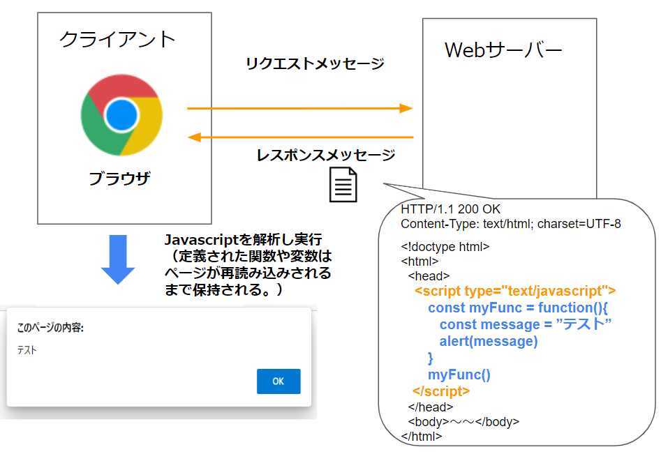
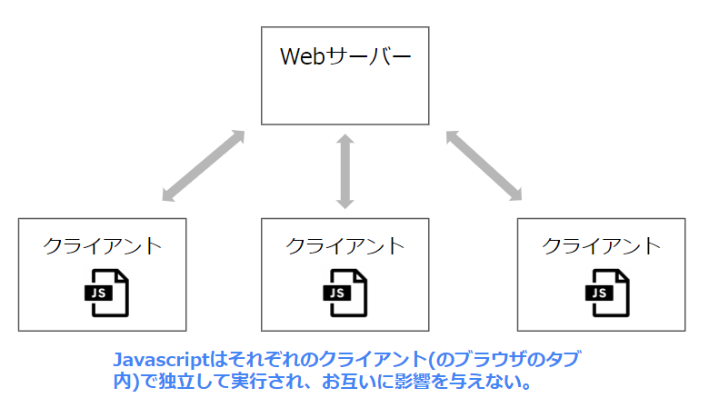
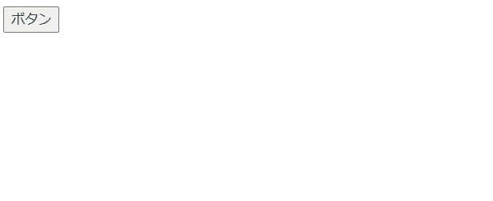
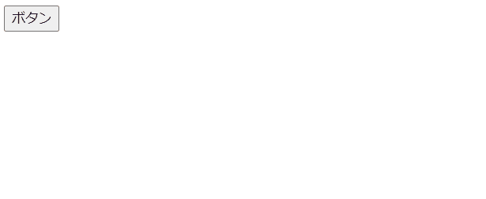

# Javascriptとは

## Javascriptとは
JavaScriptは第一級関数を持つ軽量、インタプリタ方式、オブジェクト指向の言語です。  
(よくJSと略されます。)   
ブラウザ上で動作でき、Webページがどのようにふるまうかをプログラム出来ます。  

ブラウザ上で動作する際は、HTML要素を操作することが可能です。  
ボタンをクリックした、などの出来事(イベントといいます)に応じて処理を実行することが多いです。  

以下の例では、ボタンクリック時に画面上のカウントを増やす処理をJavascriptで記述しています。    
```html
<script>
  let count = 0;

  function countUp () {
    count += 1;
    document.getElementById("count").textContent = count;
  }
</script>

～中略～

<button onclick="countUp()">ボタン</button>
<label id="count">0</label>
```

   

JavascriptもHTML、CSSと同じく標準化団体によって仕様が定められています。  
その為、どのブラウザでも同じようにJavascriptは実行されます。  

*ちなみに、Javascriptは[Java](https://www.java.com/ja/download/help/whatis_java.html)とは全く関係のない別の言語です。  
（名前にjavaとついていて構文も似ていますが全くの別物です。）  
  

## Javascriptの仕様 
Javascriptの仕様も標準化団体によって定められているのですが、以下の2つの仕様があります。  

1. Javascript自体の言語仕様  
   例えば変数やメソッドの定義の仕方などの、基本的な文法の定義です。  
   TC39という団体により定義されており、その仕様は[ECMAScript](https://tc39.es/ecma262/)と呼ばれています。  


1. Webブラウザ環境で実行する場合特有の機能の仕様  
   HTML要素の操作など、ブラウザ環境で実行される場合にだけ利用できるオブジェクトやメソッドがあります。  
   これらは**Web API**と呼ばれ、HTMLと同じ[Living Standard](https://html.spec.whatwg.org/)の一部として仕様が定義されています。  
  
   Javascriptをサーバーサイドで動かす場合もあるのですが(node.jsなどを利用)、その場合ブラウザ特有の機能(Web API)は利用できません。    

**Javascript自体の言語仕様については範囲が広すぎるのでここでは説明しません。**  
以下のサイトなどを参照下さい。  
[JavaScript Primer](https://jsprimer.net/)

以下ではブラウザ上で動作する場合のJavascriptの動作について説明していきます。  
（Javascriptの基本的な文法は分かっている前提で進めます。）  

## ブラウザでのJavascriptの実行
HTMLファイルに記載されたJavascriptは、ブラウザ上で実行されます。   
主要なブラウザはJavascriptの実行エンジンを持っており、HTML内のJavascriptを解析して実行します。  
サーバー側はJavascriptの文字列を返却しているだけです。 

  

※JavascriptはHTMLに記載されている場合と、別ファイルに定義されている場合があります。  詳しくは後述します。  

Javascriptに定義された関数や変数は、別ページを表示する、またはページが再読み込みされるまで保持されます。  
違うURLへの遷移やページリフレッシュなどで画面全体が再読み込みされた場合、読み込んだJavascriptの情報(定義されていた変数や関数など)はクリアされます。  

また、Javascirptが実行された結果は、そのブラウザのタブのみで起こっていることです。  
他のクライアントや、ブラウザの他のタブには影響しません。 

  

## Javascriptの記載場所
JavascriptはHTMLファイルに記載することが出来ます。 
記載方法は３つあります。  

### 要素のイベント属性に直接指定する  
HTMLのイベントハンドラ属性(後述)に直接設定します。  
例  
```html
<button onClick="alert(`サンプルです`)">クリック</button>
```

この方法は改行なども出来ず、記述が色々な箇所に散らばってしまうため推奨されません。  

### `<script>`タグの内部に記載する  
HTMLの`<script>`タグ内に記載します。  
そこで定義した関数を、イベント発生時に呼び出すなどします。   

例  
```html
<script>
  function myOnClick(){
    alert("サンプルです。")
  }
</script>

～～略～～

<button onClick="myOnClick()">クリック</button>
```


### 外部ファイルに記載し、`<script>`タグから参照する
CSSと同じように、JavascriptもHTMLと別のファイルに定義できます。  
HTMLの`<script>`タグの`src`属性でそのファイルのURLを指定すると、ブラウザがそのファイルを読み込み適用してくれます。 

・外部Javascript
myscript.js
```js
function myOnClick(){
  alert("サンプルです。")
}
```

・HTML
```html
<!-- srcに指定したパスから取得した外部JSがここに埋め込まれるイメージ。 -->`
<script src="http://～/myscript.js"></script>

～

<button onClick="myOnClick()">クリック</button>
```


複数のページで使われる共通の処理は外部ファイルとして定義します。  
そのページ(HTML)内でのみ利用される処理もキャッシュなどを考えると基本外部ファイルにした方がいいのですが、実装の都合上scriptタグに書く場合もあります。 


## Javascriptが実行されるタイミング
Javascriptはブラウザに解析された際にすぐに実行されます。  
HTMLは上から順にタグを解析していくのですが、`<script>`タグが現れたタイミングでそこに記載されたJavascriptが実行されます。  

その際に関数・変数の定義やイベントハンドラの登録を行っておき、実際の処理は**イベント**が発生した際に実行されることが多いです。  
（この記事先頭のサンプルのようなイメージです）  

### scriptタグを記載する位置
上述した通り`<script>`タグが現れたタイミングで、そこに記載されたJavascriptはすぐに実行されます。  
ただそのタイミングでHTMLの解析が終わっていない場合、HTML要素に関する処理を実行しても反映されないことがあります。  
例えば「ある要素の値を変える」という処理を書いても、その要素が`<script>`タグより下にあった場合、まだブラウザに認識されていないため何も起こりません。  

```html
<script>
  //ある要素のテキストを変更しようとしているが、
  //対象要素がscriptタグより下にありまだ読み込まれてない為、処理に失敗する。
  document.getElementById("mytext").textContent = "bbb";
</script>

<label id="mytext">aaa</label>
```

その為、HTML要素に関する処理を含む`<script>`タグは、`<body>`タグの末尾に書くことが多いです。  
```html
<body>
  <label id="mytext">aaa</label>

  <script>
    //既に出現している要素のため処理が可能。
    document.getElementById("mytext").textContent = "bbb";
  </script>
</body>
```

もしくは後述する`window.load`、`document.DOMContentLoaded `などのイベントに処理を設定します。  

## イベント 
イベントとは、ある要素に対して行った動作や、起きた出来事の事です。  
(クリックされた、キーが押された、要素が読み込まれた、など)

HTMLはこのようなイベントが発生した際に特定のJavascriptを実行することが出来ます。  
イベントが発生した際に実行される処理を**イベントハンドラ**と呼びます。 

### イベントハンドラの登録
イベントハンドラを登録する方法はイベント毎に用意されており、HTML要素の属性として指定できます。  
例えばクリックされた際のイベントには`onclick`、テキストボックスなどフォームコントロールの値が変更された場合は`onchange`という属性が用意されています。  

イベントハンドラを設定したい要素のそれらの属性に、実行したいJavascriptを設定します。  
例えばあるボタンのクリックイベントのハンドラを登録する際は以下のように記載します。    
```html
<button onclick="alert('テスト')">ボタン</button>
```
この場合、このボタン要素がクリックされると`alert('テスト')`が実行されます。  

  

（この例ではHTMLの属性に直接Javascriptを記述していますが、この方法は推奨されていません。  
動きをイメージしやすい為、説明の為に利用しています。    
イベントハンドラの指定方法は複数あり、後ほど説明します。）      

他にも例えば以下のようなイベントがあります。 

- onkeypress  
要素がフォーカスされている時にキーボードのキーが押された際に実行されます。   

- ondblclick   
要素がダブルクリックされた際に実行されます。    

また、Webページ全体や、HTML全体に対するイベントも存在します。  

- window.load  
ページ全体が、スタイルシートや画像などのすべての依存するリソースを含めて全て読み込まれたときに発生します。

- document.DOMContentLoaded  
HTMLの初期文書が完全に読み込まれ解釈された時点で発生します。  
スタイルシート、画像、サブフレームの読み込みが完了するのは待ちません。

(window、documentが何かは後ほど説明します。)  

その他にも様々なイベントが定義されています。  
[イベント一覧](https://developer.mozilla.org/ja/docs/Web/Events#%E3%82%A4%E3%83%99%E3%83%B3%E3%83%88%E3%81%AE%E4%B8%80%E8%A6%A7)

### イベントハンドラの登録方法
イベントハンドラの登録方法は３つあります。  

- インラインイベントハンドラー  
例で紹介したように、HTML要素の属性として実行するJavascriptを記述する方法です。  

   ```html
   <button onclick="var message='テスト';alert(message)">ボタン</button>
   ```
   scriptタグで定義した関数を指定する事も出来ます。  
   ```html
   <script>
     function showMessage()  {
       alert("テスト")
     }
   </script>

   <button onclick="showMessage();">ボタン</button>
   ```

  この方法だと文字列のダブルクォートなどを気にしないといけなくなり、改行なども記載できません。  
  また要素数が増えるとどこにイベントが書かれているか分かりにくくなります。  
  その為、使用は推奨されません。  
  (ただ動作をイメージしやすい為、この記事のサンプルはこの登録方法で記載しています。)  

- DOM APIで取得した要素に指定  
後述するDOM APIを利用して要素を表すオブジェクトを取得出来ます。 
その要素オブジェクトにイベントを指定できます。  

   ```html
   <button id="mybutton">ボタン</button>

   <script>
     function showMessage(e)  {
       alert("テスト")
     }
     
     //イベントハンドラ登録対象の要素を取得
     const button = document.getElementById('mybutton');
     //イベントハンドラを登録
     button.onclick = showMessage;
   </script>
   ```

- addEventListenerでの指定  
DOM APIで取得した要素オブジェクトには、`addEventListener`という関数が用意されています。  
この関数経由で設定すると、1つのイベントに複数のハンドラを指定できます。  
（イベント発生時に登録した順にハンドラが実行されます。）  

   ```html
   <button id="mybutton">ボタン</button>

   <script>
     function showMessage1()  {
       alert("テスト1")
     }
     
     function showMessage2()  {
       alert("テスト2")
     }
     
     //イベントハンドラ登録対象の要素を取得
     const button = document.getElementById('mybutton');
     //イベントハンドラを登録
     button.addEventListener('click', showMessage1);
     button.addEventListener('click', showMessage2);
   </script>
   ```


addEventListenerで登録することが多いです。  

イベントハンドラに指定した関数には、イベントに関する情報を保持するイベントオブジェクトが引数として渡されます。  
イベントオブジェクトは、イベントが発生した要素の情報や、イベントをキャンセルする為の関数などを持ちます。  
[MDN イベントオブジェクト](https://developer.mozilla.org/ja/docs/Web/API/Event)
 
イベントに関する詳しい情報は以下のページを参照ください。  
[MDN イベントへの入門](https://developer.mozilla.org/ja/docs/Learn/JavaScript/Building_blocks/Events)   

## WebAPI
ブラウザ環境で実行されるJavascriptには、ブラウザやWebページを操作する為の、様々なオブジェクトやメソッドが用意されています
。  
これをWebAPIと呼びます。  

WebAPIには例えば以下のようなものがあります。  

- windowオブジェクト  
  Webページを表示しているウィンドウの情報や、それを操作する為の関数を保持します。  
  (タブ自体の情報を持つオブジェクトというイメージです）  
  タブブラウザーでは、それぞれのタブが個々のwindowオブジェクトで表されます。  
  
  コード例にあった、メッセージダイアログを表示する`alert`という関数もwindowオブジェクトが持つ関数の一つです。  
  windowのもつ関数は`window.`の部分を省略して呼び出すことが可能です。  
  例えば`alert()`は`window.alert()`を省略したものです。  

  ウィンドウ全体に関するイベントはこのオブジェクトに対して登録します。  
  例：onloadイベントの登録
  ```js
  window.addEventListener('load', function(){
    alert('ページが読み込まれました。');
  });
  ```
  
  参考：[MDN windowAPI](https://developer.mozilla.org/ja/docs/Web/API/Window)

- Documentオブジェクト  
  HTMLを解析した結果である[DOM](1_4.HTMLとは.md#dom)を表すオブジェクトです。  
  HTML要素に関する操作はこのオブジェクトを起点に行います。  

  HTML全体に関するイベントはこのオブジェクトに対して登録します。  
  例：DOMContentLoadedイベントの登録
  ```js
  window.addEventListener('DOMContentLoaded', function(){
    console.log('HTMLが読み込まれました。');
  });
  ```
    
  HTMLを操作する処理は**DOM API**と呼ばれます。  
  よく利用される為、次の項で解説します。 

  参考：[MDN documentAPI](https://developer.mozilla.org/ja/docs/Web/API/Document)

- historyオブジェクト  
  ブラウザの戻る・進むに関する処理を行う関数を保持しています。  
  参考：[MDN HistoryAPI](https://developer.mozilla.org/ja/docs/Web/API/History)

- fetch関数  
  Javascript上からHTTPリクエストを送る為の関数です。  
  fetchの使用例は[別記事](3_1.ブラウザがHTTP通信を行うタイミング.md#http通信処理の実装方法)で解説しています。  

  参考：[MDN FetchAPI](https://developer.mozilla.org/ja/docs/Web/API/Fetch_API)


他にも様々なAPIが用意されています。  
[Web API 一覧](https://developer.mozilla.org/ja/docs/Web/API)  

これらのAPIを利用し、JavascriptからWebページを操作します。  

## DOM API
ブラウザが読み込んだHTML要素を操作する為の関数です。  
`document`オブジェクトを利用しHTML要素を表すオブジェクトを取得し、要素の情報を変更することが出来ます。  
またHTML要素の追加・削除なども行えます。  

それぞれのやり方をいくつか紹介します。  

### 要素の取得
要素を取得する主な方法は以下になります。  
(以下のサンプルコードでは`<script>`タグは省略しています。)

#### idで取得
```js
 const element = document.getElementById("myid");

 ～
 <label id="myid"></label>
```

#### class名で取得
```js
 const element = document.getElementsByClassName("myclass");

 ～
 <label class="myclass"></label>
```

#### CSSセレクタで取得
```js
 const element = document.querySelector('#myid');

 ～
 <label id="myid"></label>
```

他にもタグ名やname属性からも取得できます。  

### 要素の情報の変更
`getElementById`などの戻り値は、`Element`オブジェクトです。  
`Element`オブジェクトとは要素を表現するオブジェクトのことで、これを通して要素の値を変更するなどが出来ます。 
```js
 const element = document.getElementById("myid");

 //表示されるテキストを変更
 element.text = "ボタンB";

 //属性の取得（要素ノード.属性名 で取得可能）
 const id = element.id; 

 //属性の追加(属性名、値)
 element.setAttribute('name', 'myButtonName');

 //イベントを設定
 element.addEventListener('click', function(){ alert("test"); }); 

 ～
 <button id="myButton">ボタンA</button>
```

他にも様々な操作を行えます。  
[MDN Element](https://developer.mozilla.org/ja/docs/Web/API/Element)

### 要素の追加
動的に要素を追加することも可能です。  
`document.createElement`という関数を利用します。  

```html
<button id="mybutton">ボタン</button>
<div id="container"><div>

<script>
  let i = 0

  //イベントに設定する関数
  function addElement()  {

    //新しいボタン要素を作成する。
    const newBtn = document.createElement("button"); //要素を作成
    newBtn.textContent = "ボタン" + i; //作成した要素の属性を設定
    newBtn.name = "button" + i; //name属性を設定

    //作成したボタン要素にイベントを設定
    newBtn.addEventListener('click', (e) => {
      alert(e.target.name) //クリックされたボタン要素のname属性の値をalertで表示
    });

    //特定の要素の下に作成したボタン要素を追加
    const container = document.getElementById("container");
    container.appendChild(newBtn); 

    i++;
  }
  
  //元から表示されているボタンのクリックイベントに、新しいボタンを作成する関数を設定
  const button = document.getElementById('mybutton');
  button.addEventListener('click', addElement);
</script>
```

  

他にも要素の削除など、様々な操作を行えます。  
[DOM API一覧](https://developer.mozilla.org/ja/docs/Web/API/Document_Object_Model)  

※DOM APIは、[Ajax](3_1.ブラウザがHTTP通信を行うタイミング.md#ajaxの実装)と呼ばれる処理でもよく利用されます。  
また、HTMLをheadやbodyのみの最低限の構造とし、DOM APIでページを構築することもあります。  
そのような作りのWebシステムはSPAと呼ばれます。  
（詳しくは[別記事](3_4.SPAとは.md)で解説します。）

## 参考情報

[JavaScript Primer](https://jsprimer.net/)  
Javascriptの基本的な文法が解説されています。  

[MDN JavaScriptの学習](https://developer.mozilla.org/ja/docs/Learn/JavaScript)  

[イベントへの入門](https://developer.mozilla.org/ja/docs/Learn/JavaScript/Building_blocks/Events)   

[WEB API](https://developer.mozilla.org/ja/docs/Learn/JavaScript/Client-side_web_APIs/Introduction)

[Web APIとは](https://developer.mozilla.org/ja/docs/Learn/JavaScript/Client-side_web_APIs/Introduction)

[Web API 一覧](https://developer.mozilla.org/ja/docs/Web/API)

[DOMとは](https://developer.mozilla.org/ja/docs/Web/API/Document_Object_Model/Introduction)

[DOM API一覧](https://developer.mozilla.org/ja/docs/Web/API/Document_Object_Model)  
