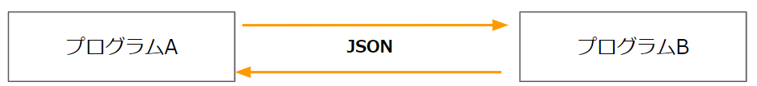
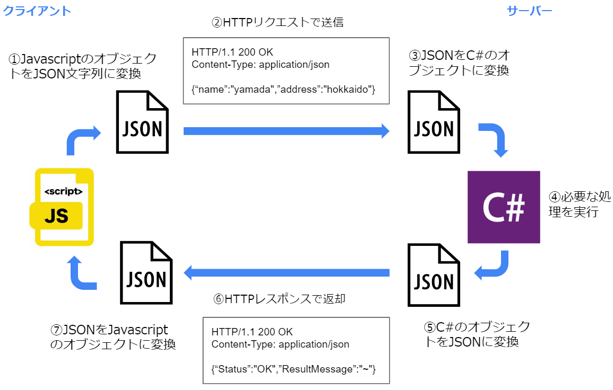

## Json
JSONとは「JavaScript Object Notation」の略で、「JavaScriptのオブジェクトの書き方を元にした、テキスト・ベースのデータ交換フォーマット」のことです。  

クライアント・サーバー間など、異なる環境・言語間でデータをやり取りする際のフォーマットとしてよく利用されます。  

以下のように、Javascriptでオブジェクトを定義するのと似た文法で記載します。  
```json
{"id" : "1", "name" : "suzuki"},
```  

また、配列やネストしたデータも表現できます。  
例  
```json
{
  "order_no" : 100,
  "name": "yamada",
  "shipTo": { "name": "takeda", "address": "hokkaido" },
  "products": [
                  {"name": "shohin1", "count": 1},
                  {"name": "shohin2", "count": 2},
                  {"name": "shohin3", "count": 3},
              ]
}

```

Jsonはシンプルなフォーマットの為、Javascriptに限らず様々な言語で利用されています。    

### Jsonの仕様
jsonの仕様はECMAとIETFという標準化団体により定義されています。  
仕様文書は以下となります。  
[原文](https://www.rfc-editor.org/rfc/rfc8259)  
[日本語訳](https://www.asahi-net.or.jp/~ax2s-kmtn/internet/rfc8259j.html)  


## Jsonの利用方法
異なる言語・環境で動作するプログラム間でデータをやりとりする際によく使われます。  
（クライアント・サーバー間など）  

  

異なる言語・環境で動作するプログラム間でやり取りするデータは、お互いのプログラムが認識できるものでなくてはいけません。  
そこでよく利用されるのが文字列です。    
言語問わずほとんどのプログラムは文字列を認識できるので、送りたいデータを文字列に変換して送信し、受け取った側は文字列からデータを復元することでデータを受け渡せます。  

この際の文字列は何らかのルール（フォーマット）に沿ったものでないとプログラムが解析できません。  
そのフォーマットとしてよく利用されているのがJsonです。  
（以前はxmlというフォーマットがよく利用されていましたが、2022年現在は文法がシンプルなJsonが利用されることが多いです。）  


### Jsonを介したクライアント・サーバー間でのデータのやり取り
クライアントプログラム・サーバープログラム間でデータをやり取りする際にもJsonはよく利用されます。  
ここではクライアントのJavascriptとサーバーのC#(ASP.NET)でデータをやり取りする際の例を説明します。  

処理の流れは以下になります。  

  

1. （Javascript）サーバーに送信したい値を持ったオブジェクトを作成し、Json文字列に変換  
大半の言語には、オブジェクトをJson文字列にしたり、Json文字列からオブジェクトを作る為のライブラリが存在します。  
Javascriptでは標準の関数として用意されています。  

1. （Javascript）Json文字列をリクエストボディに記載してサーバーに送信。  
  
1. （C#）リクエストボディからJson文字列を取得し、C#のオブジェクトに変換  
C#側にもJsonを変換する為のクラスが存在します。  
Jsonのプロパティと同名のメンバをもったクラスを定義しておき、それに変換します。   

1. （C#）そのオブジェクトを元に必要な処理を行う。   
DBへのSQLの発行など、必要に応じた処理を行います。  

1. （C#）クライアントに返却する値を持ったオブジェクトを作成し、Json文字列に変換

1. （C#）Json文字列をレスポンスボディに記載してクライアントに返却

1. （Javascript）レスポンスのJson文字列をJavascriptのオブジェクトに変換

コードだと以下のようになります。  

- Javascript側  
```javascript
const search = async () => {
        
    //サーバーに送信したい値を保持したオブジェクト
    const data = {name: "yamada",address: "hokkaido"};

    //fetchAPI経由でサーバーにHTTPリクエストを送信
    const response = await fetch('/Home/Search', {
        method: 'POST',
        headers: {
          'content-type': 'application/json'
        },
        //オブジェクトをJson文字列に変換してリクエストボディに設定
        body: JSON.stringify(data) 
    });

    //レスポンスボディのJsonをJavascriptのオブジェクトに変換
    const result = await response.json(); 

    console.log(result.Status); //OK
    console.log(result.ResultMessage); //処理が成功しました。
}
```

- C#側  
```C#
public IActionResult Search()
{
    //リクエストメッセージを表すクラスのインスタンスを取得
    HttpRequest request = HttpContext.Request;

    //リクエストボディを取得しJsonに変換
    string bodyString = new StreamReader(request.Body).ReadToEnd();

    //JsonをC#のオブジェクトに変換
    MyParameter parameter = JsonSerializer.Deserialize<MyParameter>(bodyString);

    //色々な処理
    //クライアントに返却する値を持ったオブジェクト
    MyResult result = new MyResult("OK", "処理が成功しました。");

    //Javascriptに返却する値をJson文字列に変換
    string resultString = JsonSerializer.Serialize(result);

    //レスポンスボディにJson文字列を書き込み
    HttpResponse response = HttpContext.Response;
    response.Headers.Add("content-type", "application/json");
    response.WriteAsync(resultString);
    return new EmptyResult();
}

～以下のパラメータ用のクラスを定義しておく

 //HTTPリクエストのJsonの変換先
public class MyParameter
{
   public string name { get; set; }
   public string address { get; set; }
}

//HTTPレスポンスに書き込む内容を保持したオブジェクト
public class MyResult
{
    public MyResult() { }
    public MyResult(string status, string resultMessage)
    {
        Status = status;
        ResultMessage = resultMessage;
    }
    public string Status { get; set; }
    public string ResultMessage { get; set; }
}
```

※ 実際にはC#側でこの例のようなコードを記述することはほとんどありません。  
(Jsonとの変換処理を自動的に行ってくれるフレームワークを利用する事が多いです。)  
処理がイメージしやすいようあえてこのように書いています。    


## 参照
[MDN JSON](https://developer.mozilla.org/ja/docs/Web/JavaScript/Reference/Global_Objects/JSON)
