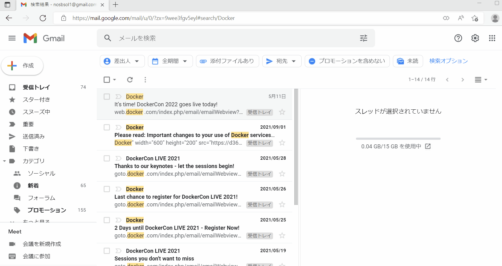
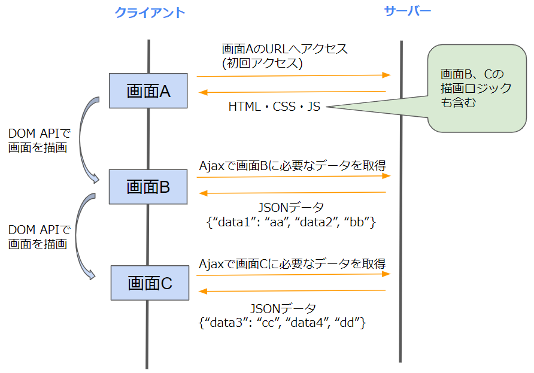

# SPA（シングルページアプリケーション）とは  


## 従来の画面遷移 
ブラウザでリンクを遷移した場合やWebページをリフレッシュした際、タブの横にロード中のマークが表示され、画面が一瞬真っ白になった後に画面が再描画されます。  
   
この際、ブラウザはWebサーバーからHTMLなどのリソースを取得しなおし、画面を再描画しています。  
（この記事では以降、このような動作を**ページ全体の再読み込み**と呼ぶことにします。）  

このようにページ全体が再読み込みされると、画面の表示に1秒程掛かります。  
そのため、再読み込みが頻繁に発生するとユーザーのストレスとなってしまいます。  

## SPA（シングルページアプリケーション） とは
これに対し、**大部分の処理にAjaxを利用し、従来の画面全体を遷移する処理を極力する無くしたWebサイトをSPAと呼びます。**    
（[Ajax](2_4.SPAとは.md#サーバーからの情報をもとに画面の一部を書き換える)とはJavascriptでHTTPリクエストを発行し画面の一部を置き換える処理のことです。）  

ブラウザ版のOutlookやGmailはSPAといえます。  
メールをクリックすると、ページの再読み込み無しで右側のパネルにメールの本文が表示されます。  

 


#### MPA（Multiple Page Application）
SPAの対義語は**MPA**（Multiple Page Application）と呼ばれます。  
(あまり使ってる人を見ないですが)  

最初に説明した、Webページ全体を再読み込みしながら遷移するWebサイトのことで、  
例えばyahooニュースのようなサイトです。  
（ニュースのリンクをクリックするとリンク先に遷移しページが再読み込みされます。）  

## SPAの特徴
SPAの特徴としては、別画面への遷移もAjaxで行う事です。  
1枚のHTMLに対してJavaScriptで動的に画面を作成していきます。 

処理の順序としては、最初にHTMLと各画面を作成する処理が記載されたJavascriptを取得し、以降の画面遷移はJavascriptのDOM APIで行います。  
必要なデータがあれば都度Ajax通信で取得します。  

MPAと比較した処理手順は以下になります。  

- MPA  
画面を遷移するたびにHTMLやjsなどのリソースを取得し、画面を再描画します。  
  

- SPA  
他画面の描画ロジックも含むjsを最初に取得し、以降の画面描画はjsのDOM APIで行います。  
  

SPAで読み込むJavascriptにはDOM APIでHTML要素を作成するロジックが含まれますが、表示するデータまでは含まれません。  
データは都度Ajax通信でサーバーから取得します。  

例えばマイページを描画する場合、画面描画のタイミングでログインユーザーの名前や住所などのデータをAjaxでサーバーから取得し、
それをHTML要素作成ロジックに渡して画面を描画する流れになります。  

  

### SPA利用時に初回に読み込むファイル
SPAを利用する場合は、HTMLは必要最小限の要素しかありません。  
大半の要素はJavascriptから動的に作成されます。  
最初に読み込まれるのは以下のようなHTMLになります。  
（Javascriptの読み込むタグと、画面を表示する為のdivがあるだけのHTML）

```html
<!DOCTYPE html> 
<html ja>
  <head>
    <meta charset="UTF-8">
  </head>
  <body>
     <div id="app"></div>

     <script src="/mySpa.js"></script>
  </body>
<html>
```

対してJavascriptには各画面を描画する為の処理が記述されます。  
その為、Javascriptのファイルサイズが大きくなりがちです。  


## SPAのメリット  
SPAにする主なメリットは以下になります。  

### 表示速度が速く、操作性が良い   
SPAを利用するメリットは、なにより表示速度が早くなりユーザーストレスが軽減することです。   
ページ上の必要な部分だけを更新するため軽快に動作させることができ、ネイティブアプリに近い表示・操作感を実現することができます。  

### サーバー側の処理が（比較的）シンプルになる  
サーバー側はJSPなどを使ってHTMLを作成する必要がなくなり、JSONなどでデータを返す処理に専念する形になります。  
そのため、サーバーサイドの処理がシンプルになります。  


## SPAのデメリット  
SPAにする主なデメリットは以下になります。  

### 初回読み込みの遅延  
Javascriptに各画面を描画する処理が含まれるため、Javascriptのファイルサイズが大きくなります。  
その為、Javascriptが取得される、最初の画面表示時に従来より時間が掛かってしまいます。   
（たとえばトップページを開く際に、検索ページやマイページを描画するロジックを含んだJavascriptを読み込むことになります。）  

読み込み速度を早めるために、javascriptファイルの圧縮やキャッシュの利用などの工夫をする必要があります。    

### クライアント側の処理が複雑になる
クライアント側で動的に画面を生成するため、クライアント側の処理が複雑になります。  
素のJavascriptだけでコーディングするのは大変な為、後述するReactなどのライブラリを使って実装していくことが多いです。  

### 戻る・進む履歴、ページリフレッシュへの対応
DOM APIでページを切り替えてもブラウザの戻る・進む履歴には表示されません。  
Ajax通信でサーバーにHTTPリクエストを送信しても同様に履歴には表示されません。  
そのため、そのままだとブラウザの戻る・進む機能が使えないサイトになってしまいます。  

また画面がリフレッシュされた場合、保持しているJavascriptなどの変数が初期化されてしまいます。  
その場合でも画面を表示できるよう、リフレッシュ時に再度サーバーからデータを取得する処理を実装する必要があります。  

このような戻る・進む、ページリフレッシュへの対応を行う必要がある分、クライアント側の処理に工数が掛かってしまいます。  

#### 対応方法
対応する場合、JavascriptのHistoryAPIというWebAPIを利用します。  
historyAPIを利用するとページの再読み込み無しでブラウザのURL欄を変更でき、変更前のURLは戻る履歴に追加されます。  
また戻る・進む履歴からhistoryAPIで追加したURLを開いた際、ページの再読み込みは発生しません。  

これを利用し以下のような処理を実装します。

1. 画面遷移時にHistoryAPIでURLを変更。その際必要なデータを取得する為のパラメータ（開いているメールのidなど）をURLに含んでおく。  
1. URL変更時のイベントで、URLのパラメータをもとにサーバーからデータを取得する処理を実行。  

実装時はこのような動作を行うためのライブラリを利用する事が多いです。  
（react-routerなど）
  
### 検索エンジン最適化 (SEO)
上述した通り、SPAで読み込まれるHTMLファイルにほぼなにも記述されない為、Googleなどの検索エンジンのクローラに空のサイトと判断されてしまいます。  
そうなると、Googleなどの検索サイトで検索してもサイトがヒットしなくなってしまいます。  

一般向けのサイト（企業のホームページなど）ではこれが問題になります。  
社内で使う業務アプリのように、そもそも検索エンジンに表示される必要がないサイトの場合は気にする必要はありません。  

これに対応するためにサーバーサイドレンダリングなどの技術があります。  


## SPAの実装方法
SPAを実装する為のフレームワークを利用する事が多いです。  
2022年時点で著名なライブラリは以下になります。  

### React
Facebookが主体で開発しているライブラリです。  
コンポーネントを組み合わせることで画面を構築していきます。  
世界的にシェアが高いです。  

### vue.js
Reactと同じくコンポーネントを組み合わせることで画面を構築していきます。  
日本でのシェアが高いです。  

### anguler
３つのフレームワークの中で最も古くGoogleによって開発されています。  
他2つに比べるとシェアは高くありません。  

## 参考

[MDN SPA](https://developer.mozilla.org/ja/docs/Glossary/SPA)

