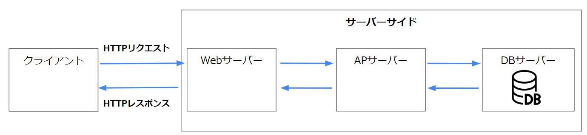
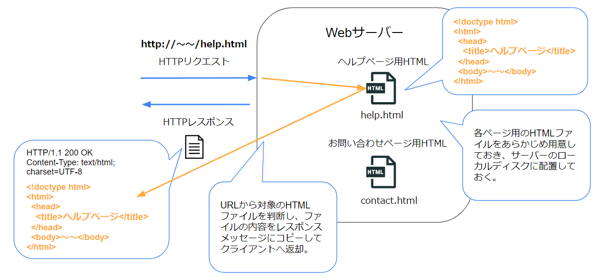
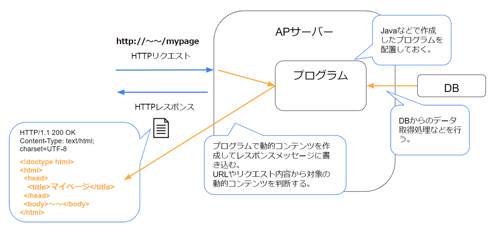
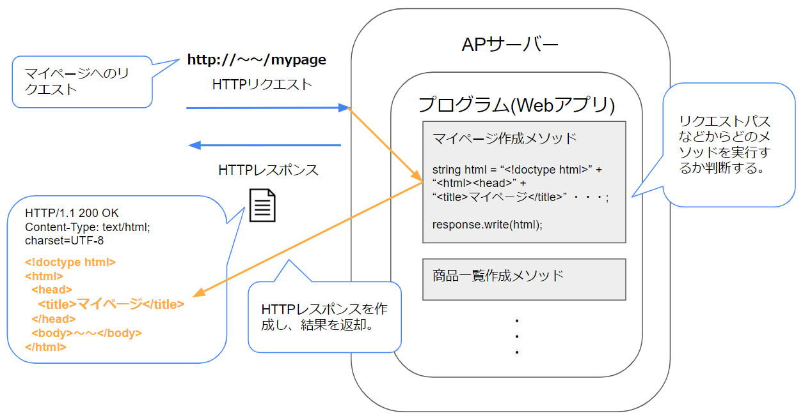
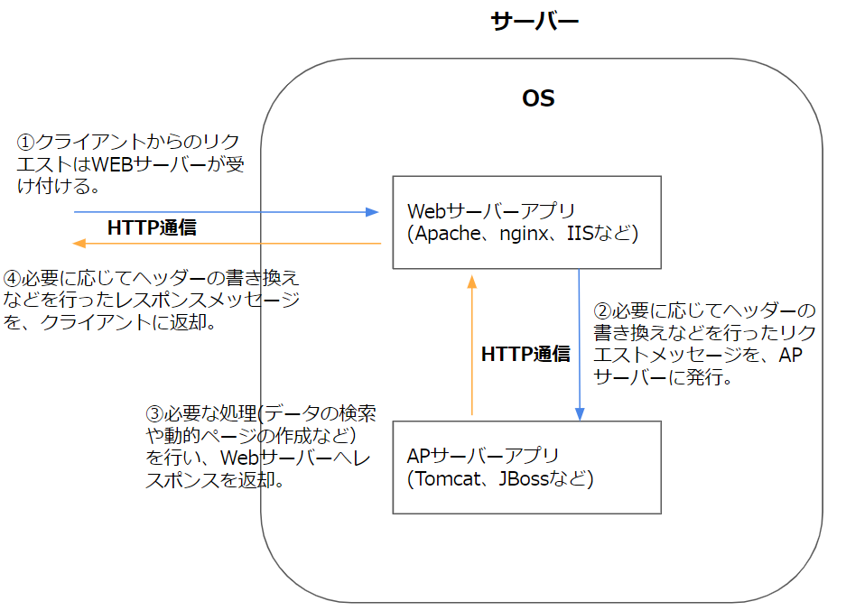
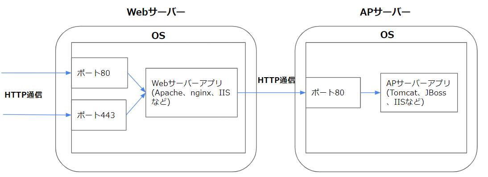
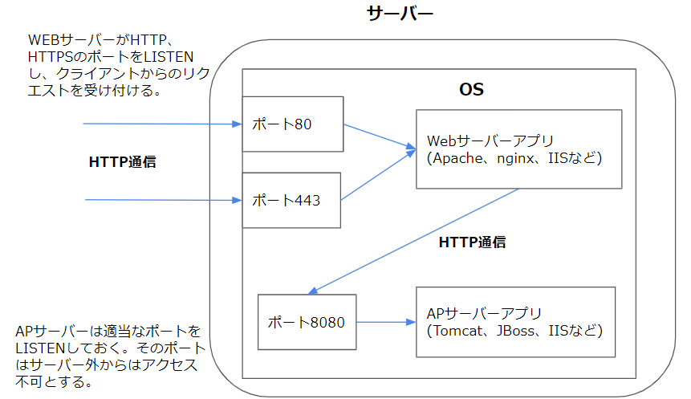
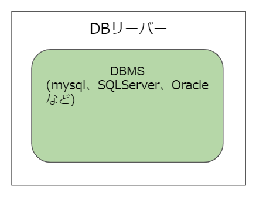
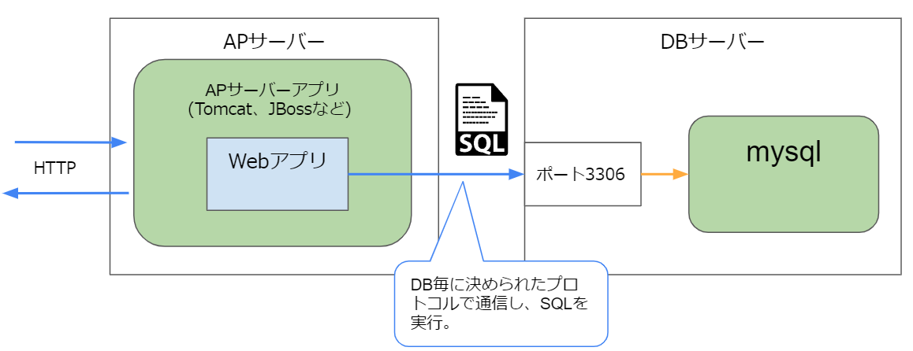

# Webサーバーの構成  

## なにこれ？  
Webページの表示の流れを説明した[記事](1_1.Webページを表示する仕組み.md)では、Webサーバーを１つの箱で表していました。  
ただ実際にはWebサーバーだけで動作することは少なく、APサーバーやDBサーバーというサーバーと協調して動作することが多いです。  

  

この記事ではそれぞれのサーバーの役割について説明していきます。  

## Webサーバーとは  
まずはWebサーバーの主な機能について説明します。  
※この記事ではWebサーバーアプリ（Apacheやnginxなど）のことを、省略してWebサーバーと記載します。  

### Webサーバーの主な機能
Webサーバーアプリの主な機能は、クライアントからのHTTPリクエストを受け取り、**静的コンテンツ**（HTMLなど）を応答することです。   

**静的コンテンツ**とは、閲覧する条件によって内容が変わらないコンテンツのことです。    
例えばヘルプページや利用規約ページなどのHTMLや、画像ファイル、外部ファイルとして定義したCSS・Javascriptなどです。  

静的ファイルは、あらかじめWebサーバー内の特定のディレクトリに配置しておきます。  
リクエストが来た際は、リクエスト内容に応じてどのファイルを返却するか判断し、HTTPレスポンスで返却します。   
（ファイルの中身をHTTPレスポンスのレスポンスボディにコピーして返却します。）    

例）静的なHTMLファイルの返却  
  


> ・返却する静的ファイルの判定  
一般的なWebサーバーは、特定のディレクトリ名の後ろにURLのパスを付け加えた場所にある静的ファイルを返却対象とします。  
このディレクトリはドキュメントルートなどと呼ばれ、Webサーバーで設定できます。  
例えば、ドキュメントルートが`C:\root`、 リクエストURLが`http://ホスト名/view/mypage.html` だった場合、   
返却されるファイルは`C:\root\view\mypage.html`になります。

### その他の機能
Webサーバーは、静的ファイルの返却だけではなく、HTTP通信に関する様々な機能も持っています。  
例えば以下のような機能を持ちます。  

- 特定IPアドレスの場合フィルタ（リクエストを許可/拒否）する  
- 特定URLの場合リダイレクトさせる  
- 特定URLの拒否  
- SSL化による通信の暗号化  
- リクエストに応じて特定のサーバへ処理を振り分ける  
- リクエスト・レスポンスヘッダーの書き換え  
- gzip圧縮・解凍
- HTTP認証（Basic認証など）

このように、Webサーバーは、静的コンテンツの返却や、HTTP通信に関する機能を豊富に持っています。  
参考：[nginxというWebサーバーの機能一覧](https://nginx.org/en/)  


### 代表的なWebサーバー

- nginx  
	2004に初版がリリースされた、比較的新しいWebサーバーです。  
  設定ファイルがApacheに比べ記述しやすいです。  
  イベント駆動アプローチを採用しており、高負荷下においてパフォーマンスが安定しています。  

- Apache Http Server  
  1995年に初版がリリースされた、古くから使われているWebサーバーです。  
  歴史が長いだけあり導入事例も多く、スキルを持った人も多いです。  

  省略して単に「Apache」と呼ばれることも多いです。  
  (この記事でも以下Apacheと呼びます。)  
  
  nginxと比べると設定の記述方法がやや複雑です。  
  リクエストの処理にデフォルトでスレッドやプロセス指向をもちいており、高負荷下時のパフォーマンスが少し劣ると言われています。  

- IIS  
  Windowsでのみ動作するWebサーバーです。  
  WindowsServerには最初からバンドルされています。  
  また、サーバー側のプログラムが.NETの場合、APサーバーとしても動作します。  
  （APサーバーの説明は後ほど行います。）  
  

### Webサーバーで出来ないこと（動的コンテンツの作成）

Webサーバーアプリだけでもクライアントからのリクエストに応答できるのですが、Webサーバーアプリだけでは実現しにくい機能があります。  
それが**動的コンテンツ**の作成です。   

**動的コンテンツ**とは閲覧する条件によって内容が変わるコンテンツのことです。  
例えば、ユーザーによって内容が変わるマイページ画面や、検索条件によって内容が変わる商品一覧画面のHTMLなどです。    

静的コンテンツの場合は、返却すべき内容を記載したファイル(.htmlなど)をあらかじめ用意していました。  
それに対し動的コンテンツを返却する場合は、動的に変わる箇所の情報（ユーザー名など）をDBなどから取得し、それをもとに返却するコンテンツ（HTMLなど）を作成する、という処理を行う必要があります。  

Webサーバーではこのような複雑な処理は出来ない為、**そのような処理を行うプログラムを開発者が作成する必要があります。**  

※このようなサーバー側で動作するプログラムは**Webアプリケーション、Webアプリ、サーバーサイドプログラム**、などと呼ばれ、JavaやC#などの言語で実装されます。   
色々な呼ばれ方がありますがこの記事では**Webアプリ**と呼びます。   

ただ、WebサーバーにはWebアプリを動作させるための機能がありません。  
そのため、Webアプリを動作させるためのアプリケーションが別途必要になります。  
それが**アプリケーションサーバー**（APサーバー）です。 

例）動的なHTMLファイルの返却   
  

※Webサーバーと言語の組み合わせによってはWebサーバーでWebアプリを動作させることも出来ます。  
たとえばApacheにPHP用のプラグインを追加すると、PHPのWebアプリを動作させることが出来ます。  
（この場合ApacheはWebサーバー兼APサーバーになります。）  


## アプリケーションサーバーとは
アプリケーションサーバーとは、サーバーサイドで動作するプログラム（Webアプリ）を実行する為のアプリケーションです。  

※この記事では表記の短縮の為、アプリケーションサーバーアプリ（Tomcatなど）のことをアプリケーションサーバーと呼び、**APサーバー**と表記します。  

### APサーバーの主な機能
APサーバーの主な機能は**動的コンテンツの返却** です。   
**Webサーバーと同じくHTTPリクエストを受け取り**、リクエストの内容に応じてWebアプリ内の特定の処理(メソッド)を実行して動的コンテンツを作成し、結果をHTTPレスポンスで返却します。  

以下処理の流れを説明します。  

例）マイページを表示する為のリクエストが来た場合  　　
  

1. HTTPリクエストを受け取る  

1. リクエスト内容に応じたメソッドを実行する  
DBとのやり取りやブラウザに返却するコンテンツ(HTMLなど)の作成を行います。    
（メソッドを呼び出すルールはWebアプリを作成する言語やフレームワークにより異なります。）  

1. HTTPレスポンスを作成し、クライアントに返却  
作成した動的コンテンツをレスポンスメッセージのメッセージボディに書き込み、返却します。  

このように、APサーバーはHTTPサーバーとしての機能を持ちます。  
その為、HTTPクライアント（ブラウザなど）とAPサーバーで通信する事も可能です。  
また、Webサーバーと同じように静的コンテンツを返すことも可能です。  
(Webサーバーとの比較は後ほど説明します。)  

以下APサーバーについてもう少し詳しく説明していきます。  

### Webアプリの言語とAPサーバー
APサーバー毎に、配置できるWebアプリの言語は決まっています。  
例えばTomcatというAPサーバーには、Javaで実装したプログラムしか配置できません。  
(正確にはJavaサーブレットという仕様に準拠したJavaプログラムしか配置できません。詳しくは[別記事](3_2.Webアプリケーションの実装.md)で説明します。)  

またIISには.NETのアプリケーションしか配置できません。  

その他の言語にも、その言語のWebアプリ用のAPサーバーが存在します。  

### 代表的なAPサーバー
言語ごとの代表的なAPサーバーは以下になります。  

|  言語  |  APサーバー  |
| ---- | ---- |
|  Java  |  Tomcat、JBoss、Glass Fish  |
|  C#  |  IIS（Webサーバー兼APサーバーとなる）  |
|  Ruby  |  Unicorn、Rainbows  |
|  PHP  | apache HTTP Serverのプラグイン（Webサーバー兼APサーバーとなる）  |


### アプリケーションサーバーの実行環境
Webアプリを実行させるためには、APサーバーアプリだけではなく、Webアプリの実装言語の実行環境(SDK)も必要になります。  
例えばTomcat（JavaのWebアプリを実行する為のAPサーバー）を利用する場合、JDKのインストールや環境変数（JAVA_HOME）の設定などの作業が必要になります。  
（SDKがAPサーバーにバンドルされており、それらの処理が不要な場合もあります。）  

### APサーバーで動作するプログラムのコード例
主要な開発言語にはWebアプリを作成するためのライブラリやフレームワークが用意されています。  
Webアプリを作る際は、それらのライブラリのフレームワークのルールに則ってコードを実装していきます。  
ここでは Javaサーブレットという仕組みを利用した場合の例を記載します。  
```java
import java.io.IOException;
import java.io.PrintWriter;
import javax.servlet.ServletException;
import javax.servlet.annotation.WebServlet;
import javax.servlet.http.HttpServlet;
import javax.servlet.http.HttpServletRequest;
import javax.servlet.http.HttpServletResponse;
 
//～/SampleというURLの場合にHTMLを作成して返却する。

@WebServlet("/Sample")
public class HelloWorld extends HttpServlet {
    protected void doGet(HttpServletRequest request, HttpServletResponse response) 
           throws ServletException, IOException {
        response.setContentType("text/html");
        response.getWriter()
          .append("<html><head></head><body>")
          .append("<p>Sample</p>")
          .append("<p>Hello World!</p>")
          .append("</body></html>");
    }
}
```
>※これはあくまでサンプルの為のコードです。  
>実際にはこのようにHTMLを直接文字列として出力することは少なく、JSPなどのHTML出力処理を記述しやすくするための仕組みを用いることが多いです。  

このように作成したWebアプリをAPサーバーに配置します。   
詳細については[別記事](3_2.Webアプリケーションの実装.md)で解説します。  

<!--
### APサーバーへのプログラムの配置  
WebアプリをAPサーバー上に配置することを**デプロイ**と呼びます。  
(deploy=配備する)

  

プログラムのデプロイ方法は、APサーバーにより異なります。  
例えば、Tomcatは以下のようなデプロイ用のWebページを持っており、そこからアプリをデプロイ出来ます。  

  
-->

## WebサーバーとAPサーバーの違い   
上述のようにAPサーバーはHTTPサーバーとしての機能を持ちます。  
また、静的コンテンツを返すことも可能です。  
このようにAPサーバーはWebサーバーと同じような機能を持っています。  

実際、Webサイトの運営は、（動的コンテンツが無ければ）Webサーバーだけでも可能ですし、APサーバーだけでも可能です。  

それではこの２つの違いは何でしょうか。   
**それは、役割の専門性の違いです。**  

APサーバーもHTTPリクエストを受け付けることが出来ますが、WebサーバーのようなHTTP関連の様々な処理（特定のサーバへ処理を振り分けなど）を行うことは苦手です。  
（出来たとしてもWebサーバーより実装が大変なことが多いです。）  

WebサーバーはHTTP関連の処理は得意ですが、前述したとおりJavaなどのプログラムを動作させることは出来ません。  

このように出来ることは似ていても、得意な処理が異なっています。  

- Webサーバー  
静的コンテンツの返却やHTTP周りの処理が得意。  

- APサーバー  
プログラムを稼働させ動的コンテンツを返却する処理が得意。  

それぞれの違いをまとめると以下になります。  

|   |  Webサーバー  |  APサーバー  |
| ---- | ---- | ---- |
|  HTTP通信に関わる処理  |  得意  |  必要最低限  |
|  動的コンテンツの作成  |  不可 <br/>（Webサーバーと言語の組合せ<br/>によっては可能）  |  可能  |
|  静的コンテンツの配布  |  可能  |  可能  |

## WebサーバーとAPサーバーの使い分け  
ではWebサーバーとAPサーバーはどのように使い分けるのでしょうか。  
結論から言うと、**両方を同時に使うことが多いです。**    
それぞれが得意な処理を担当するイメージです。  

- Webサーバー  
クライアントとの窓口となります。  
クライアントからのリクエストを受付けてAPサーバーを呼び出し、APサーバーの処理結果をクライアントに返却します。  
APサーバーの呼び出しはHTTPリクエストにより行います。  

- APサーバー  
WebサーバーからのHTTPリクエストを受け、対応する処理（HTML文字列の作成など）を実行します。  
処理結果（作成したHTML文字列など）はHTTPレスポンスでWebサーバーに返却します。  

  

もう少し細かく説明すると以下の流れになります。  

1. （Webサーバー）クライアントからのリクエストを受け取る  

1. （Webサーバー）必要に応じた処理を実行（ヘッダーの書き換えなど）  

1. （Webサーバー）APサーバーにHTTPリクエストを転送  
クライアントからのリクエストメッセージに必要な変更を加えたものを、APサーバーに発行する。  
（WebサーバーがクライアントになりAPサーバーとHTTP通信を行う。)   

1. （APサーバー）Webサーバーから転送されたリクエストを受け取り、リクエストに応じてプログラムを実行  

1. （APサーバー）WebサーバーにHTTPレスポンスで結果を返却

1. （Webサーバー）APサーバーから受け取ったHTTPレスポンスに対し、必要に応じた処理（ヘッダーの書き換えなど）を実行  

1. （Webサーバー）クライアントにHTTPレスポンスを返却  

※IISはWEBサーバー・APサーバー両方の機能を持っている為、IISを1つだけ立てて兼任することも多いです。  

### 同時に使うメリット  
このようにWebサーバーとAPサーバーを同時に使うことで以下のメリットがあります。  
- 機能の拡張  
両方のアプリの機能を利用できるため、単純にどちらか１つを利用する場合より出来ることが増えます。  

- 負荷分散  
静的ファイルはWebサーバー、動的ファイルはAPサーバーと役割を分けることが可能になり、負荷を分散出来ます。   

- 保守性の向上  
なんらかの理由でAPサーバーを停止する場合に、Webサーバーの方でメンテンナンス中ページを返す、といったことも可能になります。 


案件で開発するようなシステムでは、APサーバーだけではなくWebサーバーも使うケースが大半です。  
ただ社内の数人しか使わないサイトや、開発中のページを確認したいだけの場合などは、APサーバーだけを利用する事もあります。  

### WebサーバーとAPサーバーの組み合わせ
WebサーバーとAPサーバー間では、HTTPリクエストをやり取りしているだけです。    
(WEBサーバーがクライアントからのリクエストをAPサーバーに転送し、APサーバーはそれに対するレスポンスを返すだけ)  
サーバーアプリ同士は密接にかかわっていません。  
その為、どのWebサーバー × APサーバー の組み合わせでも利用できます。  

例えばWebサーバーにApache Http Serverを利用し、APサーバーとしてIISを利用したり、WebサーバーとしてIISを利用し、APサーバーにTomcatを利用する事も出来ます。  


## WebサーバーとAPサーバーの構成  
WebサーバーとAPサーバーを同時に利用する場合、それぞれを別々のサーバーマシンに分ける場合と、1台のサーバーに同居させる場合があります。  

### 別々のサーバーマシンに分ける場合
WebサーバーとAPサーバーを別のサーバーホストに配置します。  

  

Webサーバーアプリにはリクエストを転送する為の設定を記述できるので、そこに転送先のAPサーバーのアドレスとポートを記載します。   
例えばnginxの場合、設定ファイルに以下のような記述を追加します。   
```nginx
# リクエストの転送設定
location / {
    # リクエストを転送する先（APサーバー）のURLを指定
    proxy_pass http://myAPServer:80; 

    # リクエストヘッダーの追加なども可能
    proxy_set_header host $host;
    ～
}
```

この構成には以下のメリット・デメリットがあります。  
- メリット  
負荷分散  
保守性の向上  

- デメリット  
サーバー台数の増加によるコスト増加。


アクセス数が多い場合などは、別々のサーバーとすることを検討します。    

### 1台のサーバーに同居させる場合  
WebサーバーとAPサーバーを1台のサーバーホストに配置します。  

この場合、Webサーバーは80(HTTP)、443(HTTPS)ポートをリッスンし、APサーバーは空いている適当なポートをリッスンします。  
(8080や8443が使われることが多いです)  
Webサーバーはlocalhostに対してリクエストを転送します。  

  


上で例に挙げたnginxの設定ファイルは以下のようになります。    
```nginx
# リクエストの転送設定
location / {
    # リクエスト転送先（APサーバー）をlocalhostで指定
    proxy_pass http://localhost:8080/; 

    # リクエストヘッダーの追加なども可能
    proxy_set_header host $host;
    ～
}
```

この構成には以下のメリット・デメリットがあります。  
- メリット  
サーバー台数が少ない為コストが低い。  

- デメリット  
負荷が分散出来ない。  
保守性の低い（例えばサーバー自体を再起動するとどちらにもアクセス出来なくなる。）  


アクセス数がそこまで多くない場合など、1台のサーバーに同居させる場合があります。  

## DB（データベース）サーバー

データベースとは、検索や蓄積が容易にできるよう整理された情報の集まりのことです。  
データベースを作成、管理する為のソフトウエアをデータベース管理システム（DBMS）と呼びます。  
DBサーバーとは、DBMSが稼働しているサーバーのことを指します。  

  

DBMSについて代表的なものは以下になります。  
（以下DBMSをDBと呼びます。）  

- mysql
- SQLServer
- Oracle
- Postgres
- DB2

DBは外部からの接続を受け付けることが出来ます。     
各DB毎に以下のポートをデフォルトでリッスンしています。  

|  DB  |  デフォルトポート  |
| ---- | ---- |
|  mysql  |  3306  |
|  SQLServer  |  1433  |
|  Oracle  |  1521  |
|  Postgres  |  5432  |


DBはSQLという言語で操作します。  
(INSERT文でデータ登録、SELECT文でデータ検索など)   
SQLについては別記事で解説します。    


## APサーバーからDBサーバーへのアクセス  
Webアプリでは、データベースから取得したデータをもとに処理を行うことが多いです。  
（DBからユーザー情報を取得してマイページのHTMLを作成　など）  

WebアプリはDBサーバーと通信し、実行したいSQLを送信し、結果を受け取ります。  
例えばDBとしてmysqlを使う場合は以下のようになります。  
  

### DBとの通信方法
DBサーバーとの通信時は、HTTPではなく、各DBMSが定めたプロトコルにしたがってデータをやり取りします。  
例えばmysqlと通信するには[mysqlプロトコル](https://dev.mysql.com/doc/dev/mysql-server/latest/PAGE_PROTOCOL.html)というプロトコルに従って通信する必要があります。  
（プロトコルでは認証の方法や、どのような形式でデータを送るかが定義されています。）  
このプロトコルはDB毎に異なります。  

### DBとの通信処理の実装方法
DBとの通信はTomcatなどのAPサーバーが行うのではなく、その上に配置するWebアプリが行います。  
つまり開発者がDBとの通信部分を実装する必要があります。  
ただ、DBのプロトコルに従って通信する処理を1から実装するのは非常に大変です。  
またDB毎にプロトコルが異なるので、DBが変わると通信処理を実装しなおさなくてはいけません。  
 
それを避けるため、実際の開発時には、それらの処理をまとめたライブラリを利用します。  

### DBとの接続処理を行うライブラリ
各DBMSの開発元は、DBとやりとりする部分の処理を実装したライブラリを配布しています。  
（ドライバ、コネクタなどとも呼ばれます。)  

どのDBMSも主要な言語向けのライブラリを用意してます。  
例：[mysqlの各言語向けのドライバ一覧](https://www.mysql.com/jp/products/connector/)  

ライブラリを介すことで、WebアプリはDBMSのプロトコルを意識せずにDBとやり取りを行えます。  

  

### コード例 
mysqlのC#用のドライバを用いたコード例を記載します。  

- 接続開始処理  
   まずはDBに対して認証処理を行い、通信可能な状態にする必要があります。  
   DBサーバーのアドレス、認証用のユーザー名、パスワードなどをまとめた**接続文字列**と呼ばれる文字列を渡すと、DBとの間にコネクションを張ってくれます。  
   
   C#でmysqlに接続する際の例  
   ```C#
   //接続文字列
   string connectionString = "server=localhost;port=3306;userid=sample;password=sample;database=sample";
   
   //MySqlConnectionはmysqlが提供するC#用のライブラリに含まれるクラスです。
   MySqlConnection connection = new MySqlConnection(connectionString);
   
   //接続
   connection.Open();
   ```

- SQLの発行  
   接続後に実行したいSQLを渡すと、そのSQLを実行し、結果を返却してくれます。  
   SQLに埋め込むパラメータの渡し方や、結果の取り出し方はライブラリによって異なります。 
   
   C#でmysqlにSQLを発行する場合の例（CloseやDisposeなどの処理は省略しています。)） 
   ```C#
   //MySqlConnection、MySqlCommandはmysqlが提供するC#用のライブラリに含まれるクラスで   す。
   MySqlConnection connection = new MySqlConnection("略");
   connection.Open();
   
   //SQLの実行
   string sql = "SELECT * FROM MyTable";
   MySqlCommand command = new MySqlCommand(sql, connection);

   //SQLの実行結果を読み取る
   var reader = command.ExecuteReader():
   while (reader.Read())
   {
       Console.WriteLine($"ID:{reader["id"]} 名前:{reader["name"]}　年齢:{reader   ["age"]}");
   }
   ```

※DBライブラリをそのまま使うと上記の例のように記述が冗長になるため為、実際の開発時では**ORマッパー**と呼ばれるライブラリを使用することが多いです。  


## まとめ
以上説明した、Webサーバー、APサーバー、DBサーバーを使用する構成をまとめると以下になります。  
  

このような構成は「Web3層構成」などと呼ばれ、この構成を元にしたサーバー構成となることが多いです。  


