# ブラウザがHTTP通信を行うタイミング

## なにこれ？
Webページを表示する仕組みを説明した[記事](1_1.Webページを表示する仕組み.md)では、ブラウザにURLを入力してWebページを表示する場合を例にしました。  
それ以外にも、ブラウザがHTTP通信を行うタイミングがいくつかあります。  

本記事ではそのタイミングについて説明します。  

## ブラウザがHTTP通信を行うタイミング
ブラウザがHTTP通信を行うタイミングは以下になります。   

- ブラウザにURLを直接入力した場合
- ブラウザのリフレッシュを行った場合
- ページ上のリンクから遷移した際 
- フォームのサブミット時  
- JavascriptからHTTP通信を行った場合

以下それぞれについて説明していきます。  

## ブラウザにURLを直接入力した場合  
ブラウザのURL欄にURLを入力した場合です。  
入力されたURL（のホスト名のIP）に対してHTTPリクエストを送信し、レスポンスとして返却されたHTMLを描画します。  
この際、Webページ全体が再読み込みされ、Javascriptの変数などの情報は全てクリアされます。 

送信するHTTPのメソッドはGETメソッドとなります。  


### ページ全体の再読み込み  
この記事では、ブラウザのタブに読み込みマークが表示され、画面が切り替わる遷移のことを「ページ全体の再読み込み」と呼ぶことにします。  
以下のような動作の事です。  
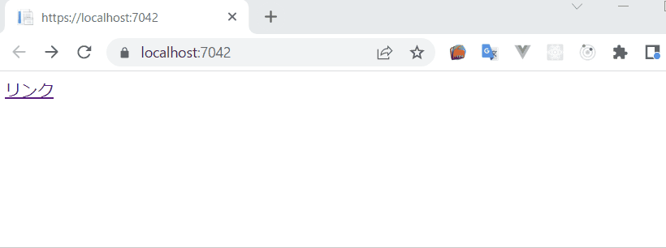    

この際、ブラウザは以下の動作をしています。  
- 今表示しているページの情報をクリア  
- 遷移先の画面のリソース(HTMLなど)をHTTPで取得  
- 画面を描画  

遷移前のページで設定した、Javascriptの変数などの情報はクリアされます。  

## ブラウザのリフレッシュを行った場合
ブラウザ上でF5を押すか、以下のリフレッシュボタン押した際の動作です。  
    

今いるURLに対し、ページ全体を再読み込みを行います。  
（再度HTTPリクエストを発行してHTMLなどのリソースを取得しなおし、画面を再描画します。）    


## ページ上のリンクから遷移した際  
画面上のリンクからWebページを表示した場合です。  
例えばyahooのニュースクリックした際などの動作です。  
リンクはHTML上は`<a>`タグで作成されており、その`href`属性に指定されたURLにHTTPリクエストを発行します。  

URLを直接入力したときと動きは同じで、GETメソッドでリクエストが発行され、ページ全体が再読み込みされます。  

```html
<a href="https://google.com">リンク</a>
```
<!-- 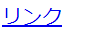-->   


## フォームのサブミット時  
フォームとはHTMLの`<form>`タグで囲まれた部分の事で、ユーザーが入力した情報をサーバーに送信する際などに利用します。  
例えばユーザー登録画面で、入力したユーザー情報をサーバーに送る場合などです。  

```html
<form action="http://www.foo.com" method="GET">
  名前<input name="name"/>
  住所<input name="address"/>
  <button type="submit">送信</button>
</form>
```

上記HTMLは、ブラウザ上では以下のように表示されます。  
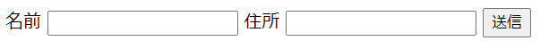  

以下`<form>`タグについて説明します。  

### `<form>`タグの仕様
`<form>`タグの中にある、`type="submit"`属性が指定された`<button>`をクリックすると、formタグのaction属性に指定されたURLにHTTPリクエストが送信されます。  
（この動作を「フォームをサブミットする」などと言います。）    
リクエスト先のURLに遷移し、Webページ全体が再読み込みされます。  

リクエストの際のHTTPメソッドは`method`属性で指定されたものになります。  
`method`属性には`GET`、もしくは`POST`が指定できます。     

以下のように、methodにGETが指定されている場合、
```html
<form action="http://www.foo.com" method="GET">
    <button type="submit">送信</button>
</form>
```

送信ボタンを押した際のリクエストは以下になります。  
```
GET http://www.foo.com
```

登録・更新・削除などの、データ変更処理を伴うURLを呼び出す際によく利用されます。  

例)  登録画面からフォームをサブミットして登録結果画面を表示する  
  
actionで指定したURLのレスポンスとして、登録結果画面のHTMLを返却しています。  


フォームのサブミット時は、**フォームコントロールに入力されたデータがリクエストに記載されます。**  

### フォームコントロールとは
人が値を入力・選択できるHTML要素のことです。  
（テキストボックスやチェックボックスなど）  

主なフォームコントロールは以下になります。  

#### ・text  
テキストボックスを表示します。  
`input`タグで`type`属性に`text`を指定します。  

```html
テキスト<input type="text" name="myText">
```

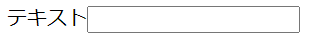    


入力された値は`value`属性に設定されます。   
```html
テキスト<input type="text" name="myText" value="textVal">
```  

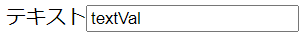    

#### ・select  
セレクトリストを表示します。  
`select`タグの中に`option`タグを複数記述します。  
`option`タグが選択肢を表します。  
```html
  <select name="mySelect">
    <option value="selectVal1">値1</option>
    <option value="selectVal2">値2</option>
  </select>
```  

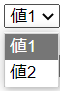  

選択された`option`要素に`selected`属性が付きます。  
```html
  <select name="mySelect">
    <option value="selectVal1">値1</option>
    <option value="selectVal2" selected>値2</option>
  </select>
```   
  

#### ・checkbox
チェックボックスを表示します。 
`input`タグで`type`属性に`checkbox`を指定します。  
```html
<input type="checkbox" name="myCheck">チェックボックス
```
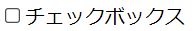  


チェックされた場合は`checked`属性が付きます。  
```html
<input type="checkbox" name="myCheck" checked>チェックボックス
```
  

#### ・radio
ラジオボタンを表示します。  
`input`タグで`type`属性に`radio`を指定します。  
同じname属性のものがグループ化され、グループ内で一つしか同時に選択できません。  

```html
値1<input type="radio" name="myRadio" value="radioVal1">
値2<input type="radio" name="myRadio" value="radioVal2">
値3<input type="radio" name="myRadio" value="radioVal3">
```
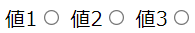  

選択された要素に`checked`属性が付きます。   

```html
値1<input type="radio" name="myRadio" value="radioVal1">
値2<input type="radio" name="myRadio" value="radioVal2">
値3<input type="radio" name="myRadio" value="radioVal3" checked>
```

  

### リクエストに記載される値
`form`タグ内のフォームコントロールに入力・選択された値は、フォームサブミット時にHTTPリクエストに記載されます。  

記載される形式は`パラメータ名=値`です。  
複数のフォームコントロールがある場合は `&`で連結されます。  

フォームコントロール毎に以下のルールでパラメータ名と値が設定されます。  

- text  
`name`属性の値=`value`属性の値

- select  
`name`属性の値=`selected`属性のついた`option`タグの`value属性`の値

- checkbox  
（`checked`属性が付いたもののみ送信される） 
  - value属性がある場合  
  `name`属性の値=`value`属性の値
  - value属性が無い場合  
  `name`属性の値=on

- radio  
`name`属性の値=`checked`属性のついたタグの`value属性`の値


例えば以下のHTMLがあった場合、

```html
<form action="http://example.com" method="">
 <div>
   テキスト<input type="text" name="myText" value="textVal">
 </div>
 
 <div>
   <select name="mySelect">
      <option value="selectVal1">値1</option>
      <option value="selectVal2" selected>値2</option>
   </select>
 </div>
 
 <div>
   <input type="checkbox" name="myCheck" value="checkVal" checked>チェックボックス
 </div>
 <div>
    値1<input type="radio" name="myRadio" value="radioVal1">
    値2<input type="radio" name="myRadio" value="radioVal2">
    値3<input type="radio" name="myRadio" value="radioVal3" checked>
   </div>

   <button type="submit">送信</button>
</form>
```

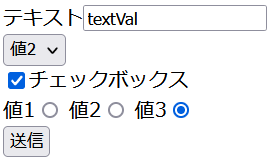  

リクエストに記載される値は以下になります。  
```
myText=textVal&mySelect=selectVal2&myCheck=checkVal&myRadio=radioVal3
```

### HTTPメソッド毎の記載方法の違い
フォームコントロールの値がリクエストメッセージのどこに記載されるかは、`method`に指定したHTTPメソッド(GET or POST)によって異なります。  


#### methodにGETを指定した場合 
**URLのクエリストリングに値が記載されます。**  

上の例のformをsubmitした場合、クエリストリングは以下になります。  
```url
http://example.com?myText=textVal&mySelect=selectVal2&myCheck=checkVal&myRadio=radioVal3
```

#### methodにPOSTを指定した場合  
**HTTPリクエストのリクエストボディに値が記載されます。**  

上の例のformをsubmitした場合、HTTPリクエストは以下になります。 
```
POST / HTTP/1.1
host: example.com
content-type: application/x-www-form-urlencoded
content-length: 69

myText=textVal&mySelect=selectVal2&myCheck=checkVal&myRadio=radioVal3
```

content-typeヘッダーには、`application/x-www-form-urlencoded`が設定されます。  


※どちらの場合も、全角文字はURLエンコードという処理がされたものが送信されます。  
URLエンコードについては[別記事](1_2.URLとは.md#urlエンコーディング)で解説します。  

#### GETとPOSTのどちらを選ぶか  
GETとPOSTで以下のような特徴があります。 
 
- GET  
  URLさえあれば同じパラメータを送信できます。  
  その為、ブックマークして後からアクセスした場合などでも、同じパラメータをもとにページを開くことが可能です。  
  リクエストパラメータのある参照系の画面によく使用されます。  
  （検索ワードがパラメータの検索結果画面など）    

  ただ、パラメータがURLとして見えてしまうため、機密情報や個人情報がパラメータに含まれているとセキュリティ的に問題があります。  
  
  また送信する値が多い場合、ブラウザによるURLの文字列制限に引っかかる可能性があります。  
  その場合は参照系の画面であっても、文字数制限のないPOSTを利用する事になります。  

- POST  
  URLにパラメータが含まれない為、URLだけをコピーしても同じリクエストにはなりません。  
  その為、再度リクエストを送られたくない処理によく利用されます。  
  （登録、削除などのデータ変更処理を伴うURLなど）  
  
  パラメータがURLとして見えない為、パラメータに個人情報や機密情報が含まれる場合は、POSTを利用します。  
  
  リクエストボディには文字数の制限がない為、パラメータ数が多くなる場合は参照系の画面でも利用されます。  


## JavascriptからHTTP通信を行った場合
上の3つの方法は、HTTPリクエストの作成・送信と、レスポンスに対する処理（HTMLの描画）をブラウザが自動で行ってくれました。  
それとは別に、ブラウザ上に読み込まれたJavascriptから任意のタイミングでHTTP通信を行う事も出来ます。  
この場合、HTTPメッセージの作成処理や、レスポンスに対する処理を自分でコーディングすることになります。  

### Javascriptから行うHTTP通信の特徴  
Javascriptから行うHTTP通信には、以下の特徴があります。  

- ページの再読み込みが行われない  
JavascriptからHTTP通信を行っても、ブラウザ上は何も変化しません。  
URLを入力してページを開いた時のような、ページの再読み込みや画面の再描画は行いません。

- 画面上のURLが変化しない  
ブラウザ上のURLも変更されません。  
戻る・進むの履歴も変化しません。 

- サーバーからのレスポンスを待たない   
ページ全体を再読み込みする際は、サーバーからのレスポンスが来て画面が再描画されるまで、画面上で操作を行えません。  
Javascriptからのリクエストの場合は、Javascriptがレスポンスを待っている間も画面上で操作が可能です。  
その為、ブラウザを操作しているユーザーに気付かれずにリクエストを発行することが出来ます。  
この特性から、Javascriptから行うHTTP通信は**非同期通信**とも呼ばれます。  

- レスポンスに対する処理を記述する必要がある  
レスポンスに対してどのような処理を行うかをJavascriptのコードで記述する必要があります。  
（逆に言うとレスポンスに対しどのような処理を行うか開発者が自由に定義できます。）  
  
### 主な用途
Javascriptからのリクエスト発行は主に以下の用途で使われます。  

#### ログの送信  
ユーザーの行動ログをサーバーに送る際に利用します。  
（ボタンがクリックされたタイミングなどを記録する。）  

前述した通りリクエストを発行してもブラウザ上は何の変化も無い為、ユーザーに影響を与えずログを送信できます。  


#### サーバーからの情報を取得し、画面の一部を書き換える  
ブラウザで動作するJavascriptには、表示中のHTMLを書き変える為のAPIが用意されています。  
(**DOM API**といいます。詳しくは[別記事](1_6.Javascriptとは.md#dom-api)で解説しています。)      

サーバーから受けとった情報をもとに、DOM APIで画面を書き換えることが出来ます。  
例えば検索ボタンが押された際、HTTPリクエストを発行してサーバーから検索結果を取得し、それを元にDOM APIで検索結果の`<tabel>`タグを作成する、などです。  

イメージ  
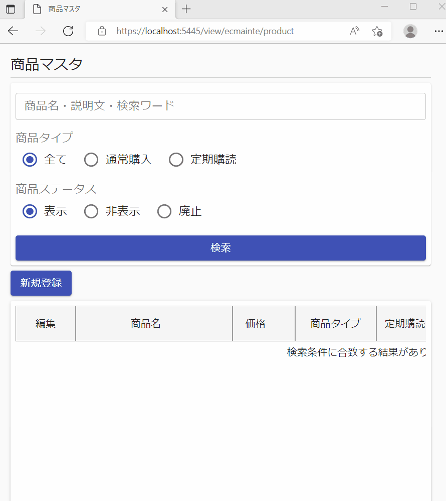    

※検索をするたびにHTTPリクエストを発行してサーバーからデータを取得し、一覧部分を変更しています。  
HTTPリクエストを発行していますが、タブに画面を読み込む際のマーク（クルクル回ってるアイコン）が表示されておらず、URLも変わっていません。  

このような、JavascriptでHTTPリクエストを発行し、画面の一部を置き換える仕組みを**Ajax**と呼びます。  
Ajaxには以下のメリットがあります。  

- 画面表示速度が早い  
ページ全体の再読み込みが発生しない為、表示速度が早いです。   

- サーバーの負荷や通信量を削減できる  
ページ全体の再読み込みすると、変更したい箇所以外の情報も再取得することになります。  
Ajaxでは変更箇所の箇所の情報のみを取得するため、最低限の処理量で済みます。  


ページ全体を再読み込みすると、ページを1から描画しなおすため画面表示に1～2秒掛かることがあり、ユーザーのストレスとなる可能性があります。  
要所でAjaxを用いた画面変更を行うことで、ユーザーの使い勝手が向上します。  

Ajaxの実装例は後ほど説明します。  

### HTTP通信処理の実装方法

JavascriptでHTTP通信処理を実装する場合、以下の2通りの実装方法があります。  

- **XMLRequest**オブジェクトを利用する  
- **Fetch**メソッドを利用する  

両方ともWebAPIの仕様で定められており、各ブラウザに実装されています。  
(ただしIE11はFetchを実装していません。)  

以下それぞれについて説明していきます。  

- XMLRequest  
  古くからある方法で、IEでも動作します。  
  
  記述例  
    ```js
    //XMLHttpRequestを作成
    const xmlHttpRequest = new XMLHttpRequest();

    //HTTPメソッドと送信先のURLを指定
    xmlHttpRequest.open('POST', 'http://example.com', false);
 
    //ヘッダーを指定 
    xmlHttpRequest.setRequestHeader('content-type', 'application/json');

    //レスポンスが返ってきた際の処理をコールバック関数で記述
    xmlHttpRequest.onreadystatechange = () => {
      // readyStateが4: リクエストが終了して準備が完了
      if (xhr.readyState == 4 && xhr.status == 200) {
        // レスポンスボディのjson文字列をJavascriptのオブジェクトに変換
        const result = JSON.parse(xhr.responseText);      
        
        //以下取得した値を使った処理を記述       
      }
    }  
 
   
    // 送信したいデータ
    const data = {id: 1, name: "yamada"}
    // 送信したデータをリクエストボディに含め、リクエストを送信する
    xmlHttpRequest.send( JSON.stringify(data) );

    ```  

    ただコードが冗長になる為、IEのサポートが切れる2022/7以降は後述のFetchを使った方がいいです。  
    (レスポンスに対する処理をコールバック関数として記述する為、コードが冗長になりがちです。)   

- Fetch  
こちらの方が新しい方法で、IE以外のブラウザなら対応しています。  
XMLRequestと比べてコードもきれいに書けるため、IE対応が必要なければこちらを利用する方がいいです。  
(Promiseという仕組みを利用しており、async、awaitという構文が使えます。)  
  
  記述例  
   ```js
   //送信したいデータ
   const data = {id: 1, name: "yamada"}

   //URLを指定しリクエストを発行
   const response = await fetch('http://example.com', {
       method: 'POST', //HTTPメソッドを指定
     
       headers: {
         'content-type': 'application/json'
       },  //ヘッダーを指定 
   
       body: JSON.stringify(data) // JavascriptのオブジェクトをJson文字列に変換してボディに設定
    })

    // レスポンスボディのjsonをJavaScriptオブジェクトに変換
    const result = await response.json();
   ```
  
どちらの場合も、サンプルコードから送信されるリクエストメッセージは以下になります。  
```http
POST / HTTP/1.1
host: example.com
content-type: application/json
content-length: 24

{"id": 1, "name": "yamada"}
```

Webサーバーへ送るパラメータ、Webサーバーから返ってくるレスポンスのどちらも、プログラムで解釈しやすい**Json**という形式の文字列にすることが多いです。  
Jsonについては[別記事](3_3.JSONとは.md)で説明します。   
（サーバー側を含めた実装例も説明しています。）  


#### Ajaxの実装
上で説明したように、JavascriptでHTTPリクエストを発行し、画面の一部を置き換える仕組みを**Ajax**と呼びます。  
ユーザーエクスペリエンス向上のため、今時のWebサイトではよく使われています。  

Ajaxの実際のコードのイメージは以下になります。    
（ユーザーの入力した検索ワードをもとにサーバーから値を取得し、画面に表示しています。）  
```js
const search = async () => {
     //画面の入力情報からサーバーに送信する値を持ったオブジェクトを作成
     const searchTextElement = document.getElementById("searchText");
     const data = { searchText: searchTextElement.value};
 
     //fetchAPIでサーバーとHTTP通信を行う。
     const response = await fetch('/Home/AjaxRequest', {
         method: 'POST',
         headers: {
           'content-type': 'application/json'
         },
         body: JSON.stringify(data) //検索フィールドの値を送信
     });
 
     //レスポンスとして、{"resultText": "TEST"}という文字列が返ってきたとする
     const result = await response.json(); 
 
     //DOM APIでラベル要素のテキストを変更
     const resultElement = document.getElementById("result");
     resultElement.textContent = result.resultText;
 }
```
ボタンクリックなどのイベントから実行することが多いです。  
```html
<input type="text" id="searchText" value="test">
<button onclick="search()">検索</button>

<div><label id="result" style="color:red;"></label></div>
```

この例の場合、ボタンをクリックすると`<label>`タグの箇所にサーバーから返却された文字列が表示されます。  
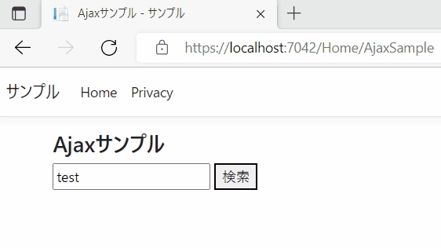   


このようなAjaxによる画面の変更を、サイト全体の規模で行う場合もあります。  
（画面の一部では無く画面全体をAjaxで変更するイメージ）  
そのようなWebページをSPAと呼びます。  
SPAについては[別記事](3_4.SPAとは.md)で解説します。  

## まとめ  

以下、それぞれの呼び出し方の特徴をまとめました。  

|    |  HTTPメソッド  |  HTTPレスポンスへの対応  |  ページ全体の再読み込み  |  URL  |
| ---- | ---- | ---- | ---- | ---- |
|  URLを直接入力   |  GET  | ブラウザが行う  | 発生する  | 遷移先のURLになる  |
|  ブラウザリフレッシュ  |  GET  | ブラウザが行う  | 発生する  | 変化しない  |
|  リンクから遷移  |  GET  | ブラウザが行う  | 発生する  | 遷移先のURLになる  |
|  フォームのサブミット  |  GET or POST <br>(formタグのmethod属性で指定する)  | ブラウザが行う  | 発生する  |  遷移先のURLになる |
|  javascriptから送信  |  自由<br>（Javascriptで指定する。）  | javascriptでコーディング  | 発生しない  | 変化しない  |


## 参考

・[MDN HTMLフォーム](https://developer.mozilla.org/ja/docs/Learn/Forms)

・[MDN Ajax](https://developer.mozilla.org/ja/docs/Web/Guide/AJAX)

・[MDN XMLHttpRequestの使用](https://developer.mozilla.org/ja/docs/Web/API/XMLHttpRequest/Using_XMLHttpRequest)  

・[MDN Fetchの使用](https://developer.mozilla.org/ja/docs/Web/API/Fetch_API/Using_Fetch)


