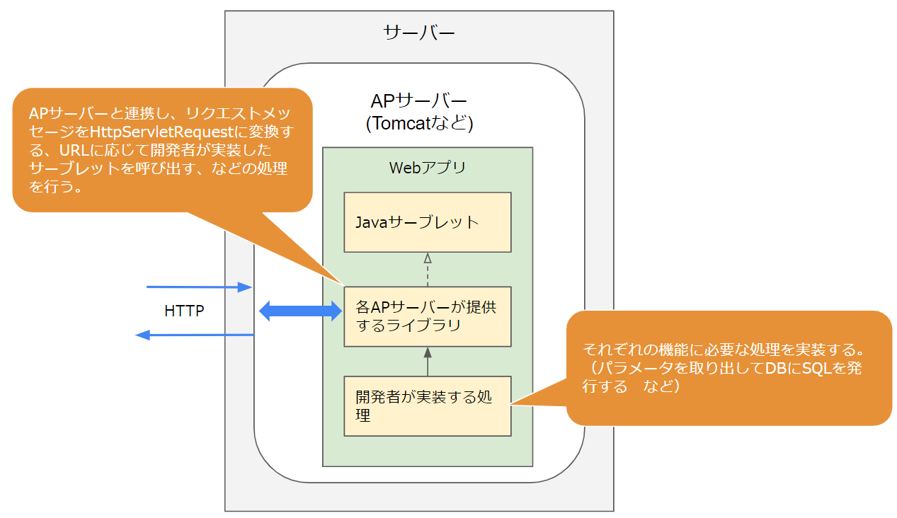
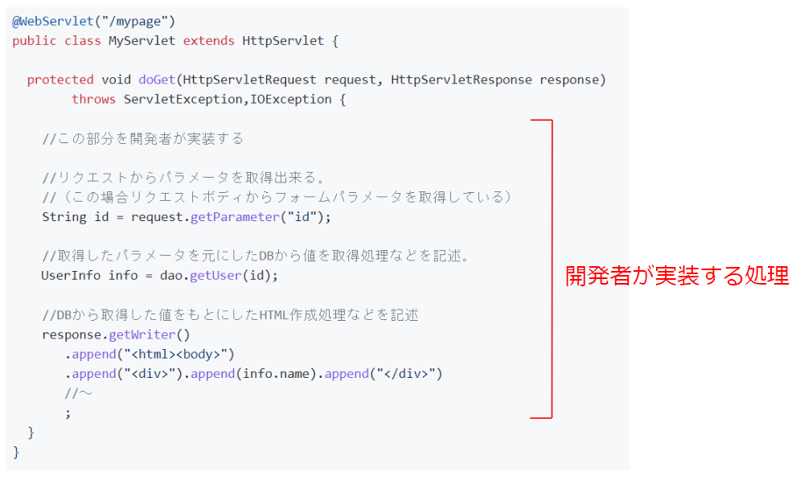
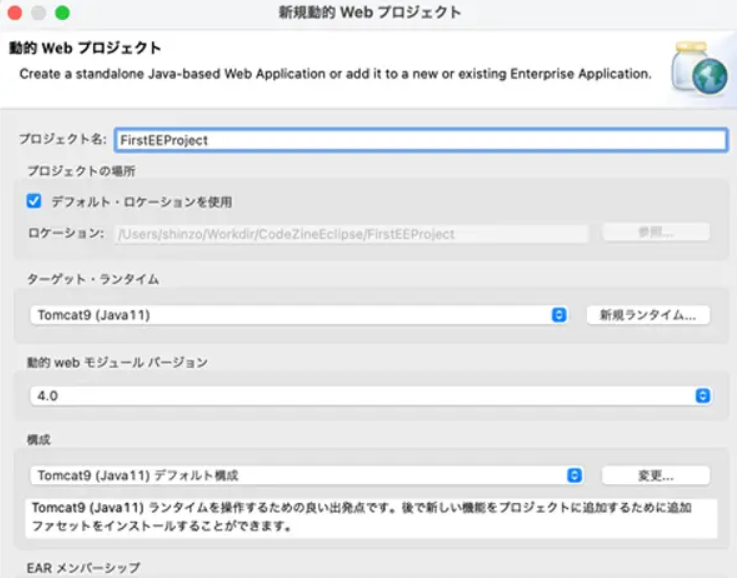
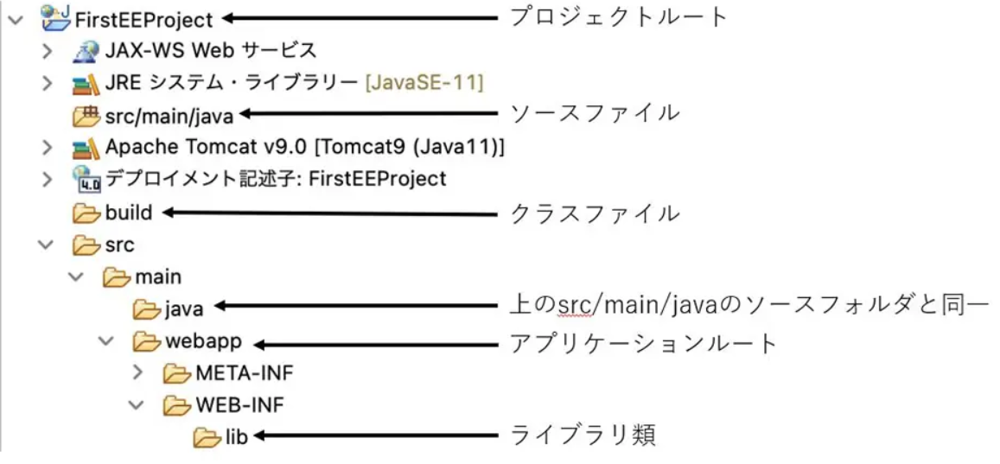
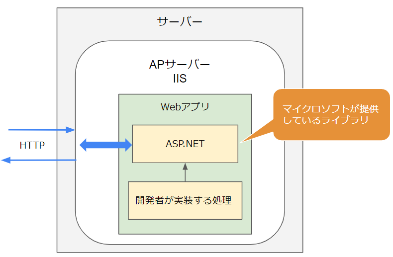
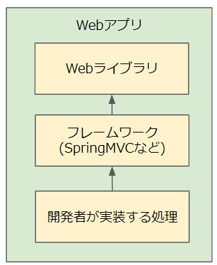
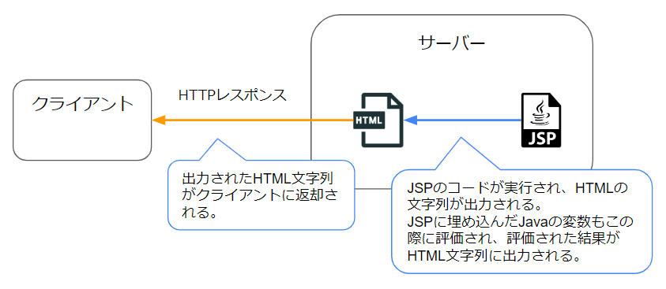
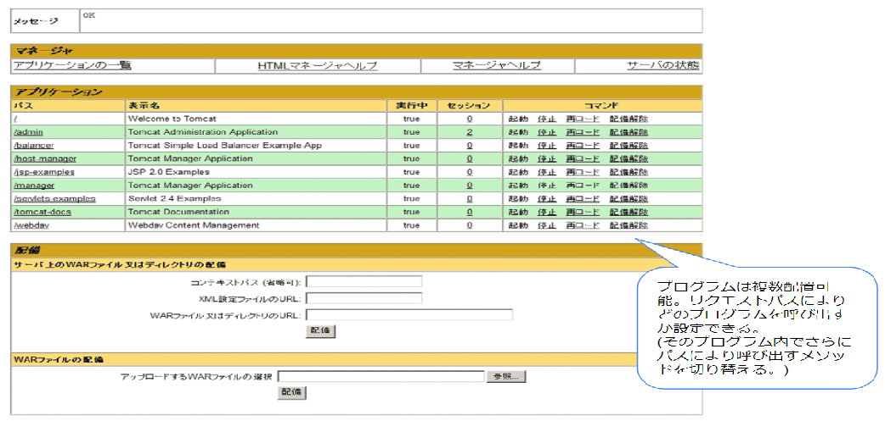

# Webアプリケーションの実装

## なにこれ？ 
Webアプリケーション(以下Webアプリ)とはアプリケーションサーバー上で動作するプログラムのことです。  
ここでは、Webアプリをどのように実装するかについて説明します。  

## アプリケーションサーバーに配置できるプログラム
APサーバーにはどんなプログラムでも配置できるわけではありません。  
例えば、Mainメソッドでコンソール画面にHelloWorldと出力するだけのプログラムは配置できません。  

**APサーバーに配置できるのは、APサーバーが想定する仕様にそって実装されたプログラムだけです。**  
この仕様は言語やAPサーバーごとに決められています。  

たとえばJavaには「**Java Servlet**(サーブレット)」というWebアプリの為の仕様があり、Java系のAPサーバー（TomcatやJBossなど）には、この仕様に沿ったプログラムしか配置できません。    
（その為これらのAPサーバーは「サーブレットコンテナ」とも呼ばれます。） 

それらのAPサーバーに配置するWebアプリを開発する場合、開発者はJavaサーブレットの仕様に沿ってプログラムを実装していくことになります。  

以降ではJavaでWebアプリ開発する場合を例に、具体的な実装方法について説明していきます。  
(他の言語も大体似たような仕組みのはずです)  

## JavaでのWebアプリ開発
Javaには「**Java Servlet**」というWebアプリの為の仕様があると説明しました。  
以降ではJava Servletを用いた開発方法について説明していきます。  

### Java Servletとは
JavaSerletとは、Webアプリが実装すべきクラス・メソッド・インターフェースなどを定義した仕様です。  
(以降では省略して**サーブレット**と呼びます)

サーブレットの[定義書](https://github.megascus.dev/servlet-spec/docs/apidocs/)を見ると、様々なクラスやインターフェースが定義されています。  
例えばリクエストメッセージを表す「```HttpServletRequest```インタフェース」や、レスポンスメッセージを表す「```HttpServletResponse```インタフェース」などが定義されています。

```HttpServletRequest```の[定義](https://github.megascus.dev/servlet-spec/docs/apidocs/javax/servlet/http/HttpServletRequest.html)をみると、以下のように記載されています。  
> 「サーブレットコンテナはHttpServletRequestを作成してサーブレットのservice(doGet、doPost、など)メソッドの引数として渡します。」

また、```HttpServletRequest```で定義されている各メソッドについても説明されています。  
例えば以下のようなメソッドが定義されています。  

> String getHeader(String name)
> 
> リクエストヘッダーの指定された値をStringとして返します。 リクエストが指定された名前のヘッダーを含まない場合はnullを返します。 もしヘッダーに同じ名前で複数の値が含まれていた場合、このメソッドはリクエストの最初のヘッダーを返します。 ヘッダー名は大文字小文字を区別しません。 このメソッドは任意のリクエストヘッダーに対して使用できます。
> 
> パラメータ:
> name - ヘッダー名を指定する名前のString
> 戻り値:
> リクエストのヘッダーの値を含むString、リクエストのヘッダーがその名前を持たない場合はnull

このように、サーブレットでは以下の仕様が定義されています。  
- ある情報をどのクラス、インターフェースで表現するか  
例えばリクエストメッセージの情報は「```HttpServletRequest```」で表現される。  

- その情報はどのように作成されるか  
「サーブレットコンテナはHttpServletRequestを作成してサーブレットのservice(doGet、doPost、など)メソッドの引数として渡します。」など

- そのクラス、インターフェースはどのようなメソッドを持ち、そのメソッドはどのような処理を行うべきか  
「getHeaderメソッドはヘッダーの値を返却する」など

- そのメソッドはどのようなシグニチャか

※ シグニチャとは、メソッド名、引数の数とそれぞれの型、返り値の型の定義の事です。  

重要なのは、サーブレットはあくまで「こういったクラスやメソッドを実装する必要がある」という仕様を定義しているだけで、**実装は提供していない**ということです。  

### JavaServletの実装
開発者がサーブレットの仕様に沿った実装を開発することは難しいです。  
例えば```HttpServletRequest```の```getHeader```メソッドは、そもそもAPサーバーがどのようにリクエストメッセージを保持しているか分からないと実装できません。   

ではサーブレットの実装はどのように提供されるのでしょうか？  
**サーブレットの実装は、各APサーバーにより提供されます。**  

例えばtomcatでは「servlet-api.jar」という、サーブレットの実装クラスをまとめたライブラリをjarファイルとして提供しています。  
他のAPサーバーでは、JBossは「jboss-servlet-api*.jar」、WebSphereで「j2ee.jar」という名前でjarファイルを提供しています。  
これらのjarファイルは名前は違いますが、中身はJavaServletの仕様どおりに実装されているので、jar内に含まれるクラス名やメソッドのシグニチャは同じです。  
（その為、どのjarを参照したとしても、開発者が実装するプログラムは同じになります。）  

HttpServletRequestを実装したクラスや、リクエストメッセージからそれを作成する処理などは、このjarファイル内に実装されています。  
開発者はこのjarファイル内のクラス・メソッドを利用してプログラムを開発していきます。  


### 開発者が実装する部分
上述した通り、JavaServletの実装は各APサーバーが提供しているライブラリの中で行われます。  
開発者は、それを利用した具体的な処理を実装していきます。  

例えば、マイページのHTMLを作成する、という処理の場合、DBからユーザーデータを取得したり、それをもとにHTMLを作成する部分を実装します。  

  

### 実装方法
サーブレットの場合、ライブラリが提供する「```HttpServlet```」を継承したクラスを作成し、その中に処理を記述していきます。  
例えば以下のようなコードを記述します。  

```java
//URLのパスが/mypageだった場合に呼ばれる処理
@WebServlet("/mypage")
public class MyServlet extends HttpServlet {

  protected void doGet(HttpServletRequest request, HttpServletResponse response)
        throws ServletException,IOException {

    //この部分を開発者が実装する

    //リクエストからパラメータを取得出来る。
    //（この場合リクエストボディからフォームパラメータを取得している）
    String id = request.getParameter("id"); 

    //取得したパラメータを元にしたDBから値を取得処理などを記述。
　　UserInfo info = dao.getUser(id);

    //DBから取得した値をもとにしたHTML作成処理などを記述
    response.getWriter()
       .append("<html><body>")
       .append("<div>").append(info.name).append("</div>")
       //～
       ;
  }
}
```
※DBにアクセスするためのdaoの初期化処理などは省略しています。  

URLのパスが```@WebServlet```で指定したパスと一致し、GETメソッドだった場合にサンプルの```doGet```メソッドが呼び出されます。  
(doGetメソッドはHttpServletに定義されているメソッドをオーバーライドしたものです)    

パスが一致するかの判断や、サーブレットクラスのインスタンス化、メソッドへ渡す引数（HttpServletRequest、HttpServletResponse）の作成、メソッドの呼び出しなどの処理はライブラリ側が行ってくれています。  
開発者が実装するのはその後の部分になります。  
  


### Webアプリの作成方法
主要なIDE（Eclipseなどの統合開発環境）には、Webアプリのプロジェクトを簡単に作成する為のメニューが用意されています。  

例えばEclipseの場合、以下の画面に必要項目を記述すると、Webアプリのプロジェクトを作成してくれます。  
  

設定ファイルやフォルダ構成、必要な処理が定義などが設定された状態のプロジェクトが作成されますので、そのまま利用してもいいですし、必要な箇所は変更しながら利用できます。  

  


### ここまでのまとめ

- APサーバーに配置できるのは、APサーバーが想定する仕様にそって実装されたプログラムだけ
- Javaではその仕様は「Java Servlet」と呼ばれる
- Java Servletの実装は各APサーバーがjarとして提供している。
- そのjar内のクラス・メソッドを適切に利用したプログラムがWebアプリ
- Webアプリのひな形はEclipseなどのIDEから簡単に作成できる。


### .NETのWebアプリ
他の言語として、マイクロソフトの.NET(C#、VB)でWebアプリを作成する場合についても簡単に説明します。  

マイクロソフトはWebアプリを構築するためのツールとライブラリ群を提供しており、これは「ASP.NET」と呼ばれます。    
（ライブラリ群はdll形式で提供されており、javaで各APサーバーが提供しているjarにあたるものです。）  

ASP.NETのライブラリ群はマイクロソフトが提供しているもの以外存在せず、それを利用して作成したWebアプリは同じくマイクロソフト製のAPサーバーである「IIS」にしか配置できません。  

  

その為、Javaのように様々なAPサーバーが存在し、各APサーバーがサーブレットの実装を提供している状態とは異なります。  

このように、言語によって少し状況は違います。  
ただどの場合も、提供されているWebアプリ用のライブラリを利用して開発を行っていくという点で変わりはありません。  

以下Webアプリ用のライブラリを「Webライブラリ」と表現します。  
(Servletの各APサーバーが提供するjarや、ASP.NETのライブラリなど)  

※ IISにしか配置できないのはASP.NET4.xまでです。  
ASP.NET5.x以降は、ライブラリ自体がAPサーバーの機能を内包するようになっており、APサーバーに配置しなくてもそれ自体で独立して動作するようになりました。  
その為、LinuxなどのIISが無い環境でも動作させることが出来ます。    

## Webフレームワーク
上述した通り、WebアプリはWebライブラリを利用して開発していきます。   

ただWebライブラリだけを利用すると、記述が冗長になりがちです。   
たとえばJavaサーブレットでは、パス毎、GETやPOSTのメソッド毎にしか処理を記述できず、複数のパスに対する処理を1つのクラスにまとめることが出来ません。  
またリクエストパラメータをリクエストから取り出す処理も自分で実装する必要があります。    

その為、Webライブラリをより使いやすくするためのフレームワークを利用する場合が多いです。  
たとえばJavaの場合はSpringMVCなどが有名です。  
※MVCはModel-View-Controllerの略で、UIとロジックを分離するための設計手法のこと。


例えばSpringMVCを利用した場合としなかった場合を比較すると、以下のようにコードが変化します。  

SpringMVCを利用しなかった場合  
```java
@WebServlet("/user")
public class MyServlet extends HttpServlet {

  protected void doGet(HttpServletRequest request, HttpServletResponse response)
        throws ServletException,IOException {

	//リクエストパラメータを取り出し。
    String id = request.getParameter("id");

	//データ取得処理など。
    UserInfo info = dao.getUser(id);

    //結果をJsonで返却
    response.setContentType("application/json");
    response.getWriter()
       .append("{\"name\" : \"" + info.getName() + "\",")
       .append("\"age\" : \"" + info.getAge() + "\",")
	    .append("\"address\" : \"" + info.getAddress() + "\"}");
  }
}
```

SpringMVCを利用した場合  
```java
@Controller
@Scope("request") 
public class StudentSelectController extends CommonController {

	@RequestMapping(value="/user", method = RequestMethod.GET)
	@ResponseBody
	public UserInfo GetUserInfo(String id) {
		UserInfo user = dao.GetUser(id);  //パラメータが自動的に引数に変換される。
		return user; //フレームワークでJson文字列に変換される。
	}
}
```

SpringMVCを使った場合は、リクエストパラメータの取り出しや、戻り値の記述などが簡略化されています。  
その他にも、Webライブラリそのものに比べ様々な機能が利用できます。  
（依存性注入、aop、国際化とローカリゼーション、UIとロジックを分離して記述しやすい、など）  

このようなフレームワークを利用する場合、サーブレットなどのWebライブラリはフレームワークの裏側に隠ぺいされ、直接触ることは少なくなります。  
    

フレームワークはサードパーティー製の場合もありますし、言語の自体の開発元が作成している場合もあります。  
例えば、.NETのWebフレームワークである「ASP.NET MVC」はMicrosoftが開発しています。  

各言語ごとによく使われるWebフレームワークは以下になります。  

|  言語  |  フレームワーク  | 
|  ----  |  ----  | 
| Java | Spring MVC <br/>（昔はStrutsなども使われていました） | 
| .NET |  ASP.NET MVC <br/> （ASP.NET.NET5以降はASP.NET自体がASP.NET MVCの機能を持っています。）  | 
| Ruby | Ruby on Rails | 


## HTMLを作成しやすくする機能
Webアプリは処理の結果として、動的に作成したHTMLの文字列を返すことも多いです。  

ただ、HTMLは文字数も多くなる為、Stringを連結して作るのは大変です。  
Stringを連結すると以下のようなコードになってしまいます。  
```java
public class HelloWorld extends HttpServlet {
   public void doGet(HttpServletRequest request, HttpServletResponse response)
         throws ServletException,IOException {

      response.setContentType("text/html;charset=Shift_JIS");

      String message = "Hello,World!!";
      
      //HTMLをレスポンスに出力
      PrintWriter out = response.getWriter()
        .append("<html><head>")
        .append("<title>Hello, World!!</title>")
        .append("</head><body>")
        .append("<p>" + message + "</p>")
        .append("</body></html>");
   }
}
```

これだと開始タグと終了タグの関連も分かりにくくなりますし、ダブルクオーテーションなどをエスケープする必要もあります。  

これを解消する為、大半のWebライブラリは、HTML作成をサポートする為の仕組みを持っています。  
例えばJavaサーブレットであれば、**JSP**という仕組みを持っています。  
（Webフレームワーク側で仕組みを持っている場合もあります。  
SpringMVCの「Thymeleaf」や、ASP.NET MVCの「Razor」など）      

以下ではJSPについて説明します。  
（他の方法も大体同じような仕組みです。）   

JSPは .jspという拡張子の外部ファイルに、HTMLのように文字列を記述します。  
Stringを連結した時のような、ダブルクオーテーションや改行文字の挿入処理は必要ありません。  

JSPのコード例
```jsp
<html>
  <head>
    <title>Hello, World!!</title>
  </head>
  <body>
    <% 
    String message = "Hello,World!!";
    out.println("<p>" + message + "</p>"); 
    %>
  </body>
</html>
```

このようにHTMLと同じ感覚で記述でき、コードの書きやすさ、読みやすさが向上します。  
`<body>`部分で行っているように、Javaの変数を埋め込む事も可能です。  

jspはビルドした際に、内部的にサーブレットで文字列を出力するコードに置き換えられます。  
内部的に1つ目の例のコードに変換されるイメージです。    
埋め込んだサーバー側の変数もこの時評価されます。  

そうして出力された文字列が、クライアントへのレスポンスメッセージに記載されることになります。  
ASP.NETの「Razor」なども同じような仕組みです。  

  


## AppサーバーへのWebアプリのデプロイ方法 
デプロイとは「配置する」、「展開する」という意味で、作成したプログラムをサーバーに配置する際によく使われる言葉です。  
Webアプリのデプロイ方法として、以下の2パターンがあります。  

### インストール済みのAPサーバーにデプロイする
TomcatやIISなどを事前にサーバーにインストールしておき、そこにWebアプリを配置します。  
デプロイ方法は、APサーバーにより異なりますが、基本的には以下の作業を行います。  
- ビルドしたプログラムをAPサーバー上の特定のフォルダに配置  
- APサーバーでパス・ポートとプログラム配置フォルダを対応付ける  

APサーバー側でデプロイの為のメニューが用意されている場合が多いです。  
例えばTomcatは、以下のようなデプロイ用のWebページを持っており、そこからアプリをデプロイ出来ます。  
  

### Webアプリ自体にAPサーバーの機能を内包させる
Webライブラリやフレームワークによっては、Webアプリ自体にAPサーバーの機能を内包させることが出来ます。  
この場合、ビルドしたアプリ単体で動作する事が可能な為、配置先にAPサーバーがインストールされている必要はありません。  

APサーバーを内包可能な主なライブラリ・フレームワークは以下になります。  

- .NET5以降のASP.NET  

- 「SpringBoot」  
SpringMVCをさらに拡張したもの。  
Tomcat内包した形でプログラムをビルドすることが可能です。  

※これらのライブラリを用いたプロジェクトをIDEから作成すると、mainメソッドにAPサーバーを実行するコードが記載されており、プログラムを実行するとAPサーバーが立ち上がります。  
Listenするポートなどは設定ファイルで指定可能な場合が多いです。  


## 参考
[MDN サーバサイド Web サイトプログラミング](https://developer.mozilla.org/ja/docs/Learn/Server-side)  

[サーブレット仕様](https://github.megascus.dev/servlet-spec/docs/apidocs/)

[Spring mvc](https://spring.pleiades.io/spring-framework/docs/current/reference/html/web.html)  

[Spring Boot](https://spring.pleiades.io/spring-boot/docs/current/reference/html/getting-started.html)  

[ASP.NET](https://dotnet.microsoft.com/ja-jp/apps/aspnet)

