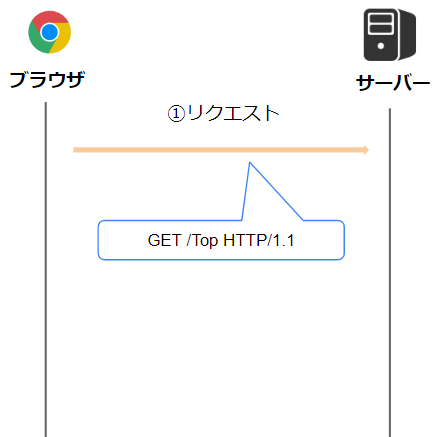
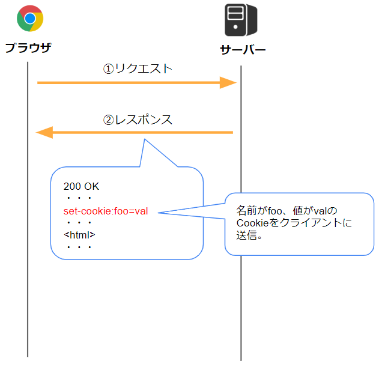
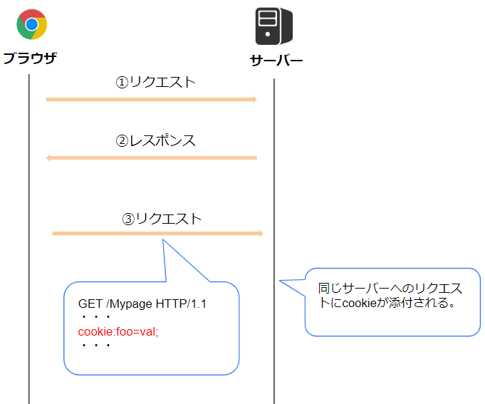
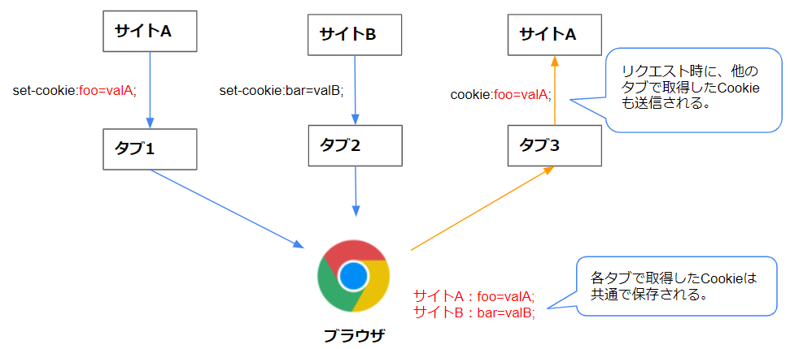
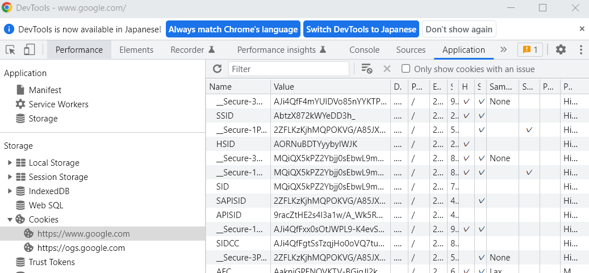

# Cookieとは 


## Cookieとは  
Cookieとは、Webサーバーからブラウザに対して送信され、ブラウザ内で保存される小さな文字列データのことです。  
ブラウザは次回以降同じWebサーバーにリクエストを送る際、保存されたCookieを自動的にHTTPヘッダーに記載します。  

## Cookieの受け渡し手順  
Cookieをやり取りする手順は以下になります。  

1. ブラウザがHTTPリクエストを送信します。  
  Cookieが付与されていない状態の最初のリクエストです。   
    
  
1. WebサーバーがCookieを返却します。    
  Cookieはレスポンスヘッダーに記載され返却されます。    
    
  
1. ブラウザは返却されたCookieを内部で保持します。  
  それ以降同じWebサーバーへリクエストを送信する際、リクエストヘッダーにCookieの値が記載されます。  
  （ブラウザが自動的にCookieヘッダーを設定してくれます。）  
  URLのホスト名が同一の場合に、同じWebサーバーと判断します。   
     
  


## リクエスト・レスポンスヘッダーへの記述ルール
上で説明した通り、Cookieはレスポンス・リクエストメッセージのヘッダーに記載されます。  

### レスポンスヘッダー
Webサーバーから返却されるCookieはレスポンスヘッダーに記述されます。  
ヘッダー名は`set-cookie`で、`set-cookie: Cookie名=値`という形式で記載されます。    
`set-cookie`ヘッダーは複数指定可能です。  

例  

```http
HTTP/1.1 200 OK
content-type: text/html
set-cookie: my_cookie1=aaaaa
set-cookie: my_cookie2=bbbbb
```

上の例では以下の2つのCookieが返却されています。  
Cookie名：my_cookie1、値：aaaaa   
Cookie名：my_cookie2、値：bbbbb  

ブラウザはレスポンスメッセージの`set-cookie`ヘッダーに記載されたCookieを内部的に保持します。  
（リクエストURLのホスト名と紐付けて保存します。)  

2度目以降のレスポンスで同じCookie名が返ってきた場合は、保持している情報を上書きします。  


### リクエストヘッダー
以降、同じホスト名のURLにリクエストを送信する際、Cookieがリクエストヘッダーに記述されます。  
ヘッダー名は`Cookie`で、`Cookie: Cookie名=値`という形式で指定します。   
`set-cookie`ヘッダーと違いヘッダーの複数指定は出来ず、複数のCookieを送る場合は`;`（セミコロン）で区切って1行に記載します。  

例  

```http
GET /sample_page.html HTTP/2.0
host: www.example.org
Cookie: my_cookie1=aaaaa; my_cookie2=bbbbb
```

### Cookieの属性
レスポンスヘッダーでCookieを返却する際、いくつかの属性を指定する事が可能です。  
属性はCookieの後ろに`;`で区切って指定します。  

`set-cookie: Cookie名=値;属性名=属性値;属性名=属性値;・・`

以下`set-cookie`ヘッダで指定可能な属性について説明していきます。  

#### 有効期限を指定する属性  
Cookieの有効期限（保存期間）を指定する為の属性です。  

有効期限を指定できる属性は`Expires`と`Max-Age`の２つがあり、両方指定された場合は`Max-Age`が優先されます。  

- Expiresの例  
指定した日時までが有効期限となります。  
   ```http
   Set-Cookie: my_cookie1=aaaaa; Expires=Thu, 31 Oct 2022 07:28:00 GMT;
   ``` 
- Max-Ageの例  
いつまで有効かを秒数で指定します。  
   ```http
   Set-Cookie: my_cookie1=aaaaa; Max-Age=3600;
   ``` 

有効期限が指定されていないものは、ブラウザを閉じると削除されます。  
指定されていればローカルディスクに保存され、ブラウザを閉じても削除されません。  
ブラウザは有効期限が切れていないCookieのみを送信します。  

Webサイトを利用する際、ブラウザを閉じるとログアウトしてる場合や、ブラウザを閉じてもログインが継続している場合があると思います。  
この動作の違いはCookieの有効期限の違いにより起こっていることが多いです。  
(後述しますがログイン状態をCookieに記録することが多いです。)  

#### セキュリティ関連の属性
セキュリティを高めるための属性です。  

- Secure属性  
この属性を指定すると、HTTPS通信の場合のみCookieが送信されます。  
Secure属性には値は不要です。  
   ```http
   Set-Cookie: my_cookie1=aaaaa; Secure
   ``` 
- HttpOnly属性  
JavascriptにはCookieを操作するAPIがあるのですが、この属性を指定すると、JavascriptからCookieにアクセス出来なくなります。  
Secure属性と同様、値は不要です。  
   ```http
   Set-Cookie: my_cookie1=aaaaa; HttpOnly
   ``` 

- Same-Site属性  
リクエストの送信元ドメインと送信先ドメインが異なる場合の動作を制御します。  
例えば、http\:\/\/**domainA**.comというURLで開いたページから、http\:\/\/**domainB**.comというURLにリクエストを送信する場合です。  
以下の値を指定できます。  
  - None  
  ドメインが異なっていてもCookieを送信する。    
  - Lax  
  Getリクエストの場合のみCookieを送信する。  
  - Strict  
  ドメインが異なっている場合、Cookieを送信しない。  
   ```http
   Set-Cookie: my_cookie1=aaaaa; Same-site=Lax;
   ``` 
   この設定はリクエストされる側（例だと**domainB**側）のcookieに指定します。  

- domain属性  
  Cookieを送信するドメインを指定します。   
  指定したドメインとそのサブドメインへのリクエスト時のみ、Cookieが送信されます。   

  省略した場合は、Cookieを取得したURLのドメインが設定されます。  
  それで十分なことが多い為、**基本的に省略されます。**  
  省略した場合、サブドメインへは送信されません。  
  [参考](https://blog.tokumaru.org/2011/10/cookiedomain.html)

## Cookieの利点
ブラウザが自動的にCookieを送信してくれるため、Cookieに記載した値について、クライアント側でパラメータを送信する実装が不要になります。  
その為、常に必要なパラメータを送信する際に利用する事が多いです。  

例えば、ログイン済みであることを識別する為のパラメータは、ログイン後のほぼすべてのリクエストに必要になります。  
そのようなパラメータを毎回クエリ文字列などに設定するのは実装が大変ですが、Cookieとして持っていればブラウザが自動的に送信してくれます。  

## Cookieの問題点
Cookieには以下の問題点があります。  

- Cookieの値がローカルディスクに保存されるため、機密情報が個人情報が含まれる場合セキュリティ的に問題がある。  
- 1つのCookie当たりのサイズに制限がある為、長いパラメータを送れない。  
(ブラウザにもよりますが、4096バイトくらいが制限です。)
- Cookie数が増えるとリクエストのサイズが増大していく。  
- 配列やネストしたデータを表現しにくい。  


## Cookieの主な用途
Cookieは主に以下の用途で利用されます。  

- 識別用文字列の受け渡し  
セッションIDや、認証済みであることを識別する為の認証IDなどの、識別用文字列の受け渡しに利用されます。  
セッションについては[別記事](3_4.セッションとは.md)で解説します。  

- アクセス解析・ユーザー分析  
セッション数やページ遷移などを分析する為の情報の受け渡しに利用される場合があります。    

基本的には、常に送信したパラメータの受け渡しによく利用されます。  

## ブラウザタブとCookie
Cookieはタブごとに保存されているのではなく、ブラウザ自体に保存されます。  
あるタブで取得したCookieは、別のタブでリクエストを発行する際にも添付されます。  

   

## Cookieの確認方法
ブラウザの開発者ツールからCookieを確認可能です。  
Chromeだと、F12で開く開発者ツールの「Netword」タブで各リクエスト・レスポンスに付与されるCookieを確認できます。  
   


また、「Application」タブの「Cookies」タブから、ブラウザに保存されているCookieを確認可能です。  
   

## Cookieの仕様
CookieはHTTPの仕様の一部として定義されています。  

[仕様文書](https://triple-underscore.github.io/http-cookie-ja.html)

## 参考

[MDN Cookieとは](https://developer.mozilla.org/ja/docs/Web/HTTP/Cookies)

