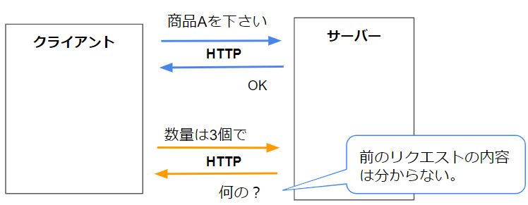
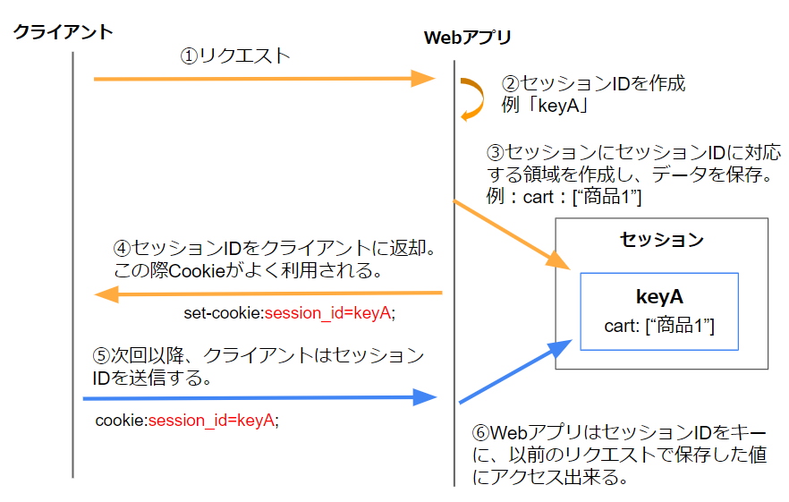
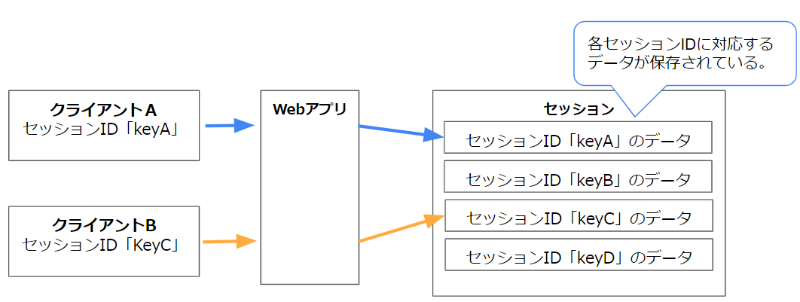

# セッションとは  

## なにこれ
業務アプリを作るうえでは必須の知識である「セッション」について解説します。  

## HTTPはステートレスなプロトコル    
HTTPは１つのリクエスト・レスポンスで処理が完結しており、連続的に実行される2つのリクエスト間に関係性はありません。 
このような特性をステートレスといいます。  

ステートレスとは状態を持たないということなので、過去の状態を保存してないという意味になります。  
  

この特性のおかげでHTTPはシンプルなプロトコルとなったのですが、実際には過去のリクエストをもとに処理を行いたい場合もよくあります。  

例えばECサイトなどで以下の処理をする場合です。  

1. 商品Aをカートに入れる  
（カート一覧画面に商品Aが表示される）  

1. 商品Bをカートに入れる  
（カート一覧画面に商品Aと商品Bが表示される）  

1. 注文する  
（商品Aと商品Bの注文が完了した旨が表示される）  

前述したとおり、各リクエストは単独で完結しており前後のリクエストとは関連しません。  
（前のリクエストの情報を覚えてません）  

その為、このような処理を実現する為には以下のいずれかの方法を取らなくてはいけません。  

- リクエスト毎に全ての情報を送信する。  
  前述の例だと以下のイメージになります。  
  1. 商品Aをカートに入れる  
  1. 商品Aと商品Bをカートに入れる  
  1. 商品Aと商品Bをカートに入れて注文する  

  この方法は実装も大変ですし、リクエスト量も増えていってしまうため現実的ではありません。

- サーバー側に状態を保存しておき、リクエスト間で状態を共有できるようにする。  
この方法は**セッション**と呼ばれ、よく使われています。  
以降はこのセッションについて説明していきます。  


## セッションとは
セッションとは、「サーバ内にデータを保存し、リクエスト間で共有する」仕組みのことです。  
サーバ内にデータを保存し、クライアントにその情報にアクセスする為のキーを渡します。  
(このキーはCookieで渡すことが多いです。)  

セッションはWebアプリライブラリ（Java Servletなど）で実装されています。  


## セッションの処理の流れ  
セッションの処理の流れは以下になります。  

  

1. （クライアント）最初にリクエストを発行する

1. （サーバー）セッション情報にアクセスするためのキーを作成する。  
このキーを**セッションID**と呼びます。  

1. （サーバー）セッションにセッションIDに対応する領域を作成し、データを保存。  


1. （サーバー）セッションIDをクライアントに返却
この際にcookieをがよく利用します。  
(他にも返却方法はありますが、広く使われているのはcookieを利用する方法です。)  

1. （クライアント）2度目以降のリクエストでセッションIDを送信  
Cookieを利用していればブラウザが自動でリクエストヘッダーを追加してくれます。  

1. （サーバー）セッションIDをキーに、セッションに保存した情報にアクセスする。  
必要に応じてセッションにデータを保存したり、取り出したりします。  

### セッションIDの作成タイミング
大半のWebライブラリは、セッションIDの無いリクエストが来て、かつサーバー側プログラムでセッションに値を保存しようとしたタイミングでセッションIDを作成します。  

セッションIDをCookieで返却する場合、Cookieはブラウザ毎に保管されるため、ブラウザが異なるとセッションIDを送信できずに新規セッションIDが発行されます。  

## セッション内のデータ
セッション内のデータはセッションID毎に保管されています。  
  

また、各セッションIDのデータ内部も「キー：値」の形式でデータを保持します。  
  

### クライアント
セッションIDをCookieで返却する場合、Cookieはブラウザ毎に保管されるため、ブラウザが異なるとセッションIDを送信できずに新規セッションIDが発行されます。  

## よくある使い方
ログインしたユーザーの情報などを保管することが多いです。  
例えば以下のような処理を行います。  

1. ログイン時のリクエストで、ID、passwordが正しければセッションにログインしたユーザーの情報を保存  
1. 以降のリクエスト（例えばマイページの表示）では、セッションからユーザー情報を取り出し、それをもとにページを表示  

この場合、セッションにユーザー情報が登録されているかをログイン済みかの判定に用いることもあります。
（セッションにユーザー情報が登録されていいなければ未ログインと判定し、エラーなりログイン画面にリダイレクトさせるなりの処理を行います。）  


図  

ただし、この方法だけでログイン判定すると以下の脆弱性があります。

その為、他の方法と組み合わせて認証を行う必要があります。  
詳しくはセキュリティについての記事で説明します。  

セッションはログイン判定のために利用されることが多い為、セッション = ログイン後にしか利用できないもの、と勘違いしてしまう場合がありますが、そんなことはありません。  

例えばECサイトで、ログインしなくてもカートに商品を入れることもあるかと思います。  
そのように、ログイン前にもセッションを利用するケースもよくあります。  

コード例の箇所で説明したように、セッションを管理するWebライブラリでは、単に最初にセッション領域に値を保存すればセッションIDは発行してくれます。  
ログイン状態などはWebライブラリにとっては関係ありません。    


## セッション情報の保存先
セッション情報は主に以下に保存されます。  

- サーバーのメモリ  
- DB  
- DB以外の高速なデータストア(Redisなど)  

サーバーのメモリが一番手軽ですが、サーバーを（負荷分散の為などで）複数台構成にした場合に同期がとれません。  
またサーバーアプリを再起動した場合にセッション情報がクリアされてしまいます。  

その為、DBなどのAppサーバー外にセッション情報を保持する事も多いです。  
ただセッション情報は頻繁にアクセスされる事が多いため、DBよりも処理が高速なデータストア(Redisなど)が利用されることも多いです。  


## セッション情報の持ち方
セッションはセッションIDをキーにしたキーバリュー型の変数に保存されるイメージです。  
（JavaのmapやC#のDictionary的なもの）
これはWebアプリのフレームワークやライブラリによって管理されています。  

図  


セッションIDはそれぞれのクライアント毎に発行される事になるので、別のクライアントのセッション情報が見れてしまうことはありません。  

図  

セッションIDは既に使用済みのキーとは重複せず、かつ推測出来ないような十分な長さの文字列出なくてはいけません。  
主要なWebシステムのライブラリにはそのようなセッションキーを作成する為の関数が用意されており、自動で生成してくれます。  


それぞれのセッションID毎に保存するデータの形式は様々です。  
これはデータの保存先によって保存可能なデータがことなります。  

- メモリ上の場合
プログラムで利用している変数などをそのまま保存できます。  

文字列を保存する

そしてその変数を、システムが用意しているセッション全体を管理する為のさらに大きなキーバリュー型の変数に設定します。  
(システムが用意した1つの大きなキーバリュー型の入れ物に、各セッション情報を保持するキーバリュー側の入れ物を設定するイメージです。)  


### セッションを利用するサーバー側のコード例

セッション全体を管理する領域からセッションIDに対応するセッション情報を取得する処理は、フレームワーク側でやってくれることが多いです。  

それを利用する場合は以下のようなコードを記述します。  
```


```


### セッションの有効期限
セッションの有効期限には２つの側面があります。  

- サーバーのセッション変数の有効期限

- クライアントに返却したセッションIDのCookieの有効期限  

この２つの情報のいずれかが欠けると、いままでセッションに保存したデータが利用できなくなります。  
（新しいセッションとして認識されます。）  

Cookieの有効期限を長くしても、サーバー側のセッション情報が無くなった場合（メモリ上に保持しているケースでサーバーを再起動した場合など）は、そのセッションは利用できなくなります。  

またサーバー側のセッション情報が残っていても、セッションIDのCookieの有効期限が切れていると、セッションIDが送られてこない為そのセッション情報にアクセスすることが出来なくなります。 


これらの場合新しい空のセッション情報が作成され、新しいセッションIDが返却されることになります。  


### 最初の例でセッションを使うと

最初の例でセッションを使うと以下のような処理になります。  

1. 商品Aをカートに入れる  

リクエスト 
``` 
POST /cart/A HTTP/2.0
host: www.example.org
```

サーバー側コード  
```


```

レスポンス  
```
HTTP/2.0 200 OK
Set-Cookie: SESSION_ID=KJfdafdfadDFJIa  
```


1. 商品Bをカートに入れる  

リクエスト 
``` 
POST /cart/B HTTP/2.0
host: www.example.org
Cookie: SESSION_ID=KJfdafdfadDFJIa  
```

サーバー側コード  
```


```

レスポンス  
```
HTTP/2.0 200 OK
```

1. 注文する  

リクエスト 
``` 
POST /order HTTP/2.0
host: www.example.org
Cookie: SESSION_ID=KJfdafdfadDFJIa 
```

サーバー側コード  
```


```

レスポンス  
```
HTTP/2.0 200 OK
```

図  


###　セッションの仕様
セッションの仕組みは標準化団体に定義されたものではなく、各Webアプリのライブラリが実装しているものです。
ただよく使われる機能であり、ほとんどのWebアプリライブラリで同じ仕組みで利用できます。  


## 参考


