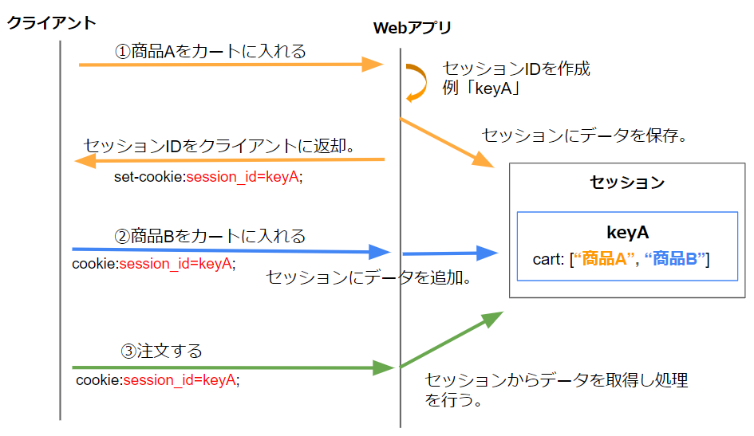
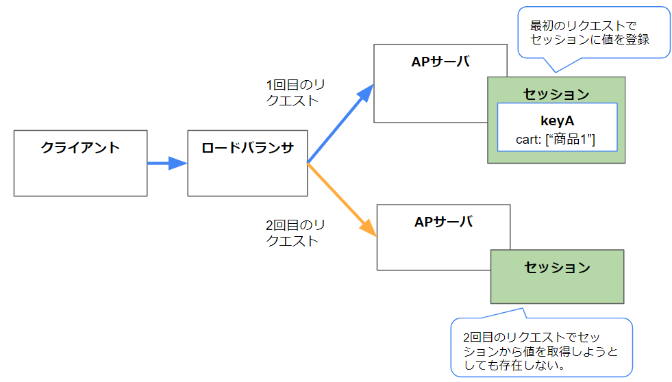
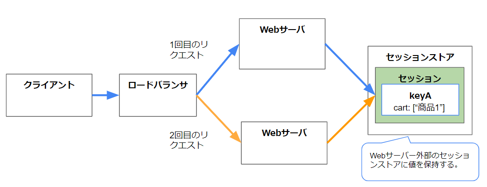
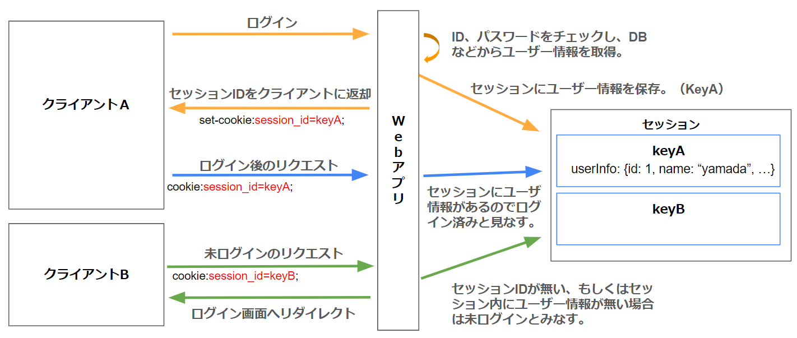

# セッションとは  

## なにこれ
業務アプリを作るうえでは必須の知識である「セッション」について解説します。  

## HTTPはステートレスなプロトコル    
HTTPは１つのリクエスト・レスポンスで処理が完結しており、連続的に実行される2つのリクエスト間に関係性はありません。 
このような特性をステートレスといいます。  

ステートレスとは状態を持たないということなので、過去の状態を保存してないという意味になります。  
  

この特性のおかげでHTTPはシンプルなプロトコルとなったのですが、実際には過去のリクエストをもとに処理を行いたい場合もよくあります。  

例えばECサイトなどで以下の処理をする場合です。  

1. 商品Aをカートに入れる  
（カート一覧画面に商品Aが表示される）  

1. 商品Bをカートに入れる  
（カート一覧画面に商品Aと商品Bが表示される）  

1. 注文する  
（商品Aと商品Bの注文が完了した旨が表示される）  

前述したとおり、各リクエストは単独で完結しており前後のリクエストとは関連しません。  
（前のリクエストの情報を覚えてません）  

その為、このような処理を実現する為には以下のいずれかの方法を取らなくてはいけません。  

- リクエスト毎に全ての情報を送信する。  
  前述の例だと以下のイメージになります。  
  1. 商品Aをカートに入れる  
  1. 商品Aと商品Bをカートに入れる  
  1. 商品Aと商品Bをカートに入れて注文する  

  この方法は実装も大変ですし、リクエスト量も増えていってしまうため現実的ではありません。

- サーバー側に状態を保存しておき、リクエスト間で状態を共有できるようにする。  
この方法は**セッション**と呼ばれ、よく使われています。  
以降はこのセッションについて説明していきます。  


## セッションとは
セッションとは、「サーバ内にデータを保存し、リクエスト間で共有する」仕組みのことです。  
サーバ内にデータを保存し、クライアントにその情報にアクセスする為のキーを渡します。  
(このキーはCookieで渡すことが多いです。)  

セッションはWebアプリライブラリ（Java Servletなど）で実装されています。  


## セッションの処理の流れ  
セッションの処理の流れは以下になります。  

  

1. （クライアント）最初にリクエストを発行する

1. （サーバー）セッション情報にアクセスするためのキーを作成する。  
このキーを**セッションID**と呼びます。  

1. （サーバー）セッションにセッションIDに対応する領域を作成し、データを保存。  


1. （サーバー）セッションIDをクライアントに返却
この際にcookieをがよく利用します。  
(他にも返却方法はありますが、広く使われているのはcookieを利用する方法です。)  

1. （クライアント）2度目以降のリクエストでセッションIDを送信  
Cookieを利用していればブラウザが自動でリクエストヘッダーを追加してくれます。  

1. （サーバー）セッションIDをキーに、セッションに保存した情報にアクセスする。  
必要に応じてセッションにデータを保存したり、取り出したりします。  


### 最初の例でセッションを使うと

最初の例でセッションを使うと以下のような処理になります。  

1. 商品Aをカートに入れる  
セッションに情報を保存し、セッションIDをクライアントに返却します。  

1. 商品Bをカートに入れる  
セッションIDをキーに最初のリクエストで作成したセッションに情報を追加します。  

1. 注文する  
セッションIDをキーにセッションから情報を取り出し、処理を行います。  

  

このように、サーバー側で保存したデータ(セッション)にアクセスするためのキー（セッションID）をクライアントが保持し、各リクエストで送信することで、以前のリクエストと状態を共有出来ます。  

## セッションID
セッションIDは既に使用済みのキーとは重複せず、かつ推測出来ないような十分な長さの文字列出なくてはいけません。  
(セッションIDを推測出来てしまうと別ユーザーの情報が見えてしまう可能性があり、セキュリティ的に問題がある為。)   
主要なWebライブラリ・フレームワークではそのようなセッションキーを自動で生成してくれます。  

ただし、本記事の図やサンプルでは見やすさの為、短いセッションIDを使用しています。  

### セッションIDの作成タイミング
大半のWebライブラリは、セッションIDの無いリクエストが来て、かつサーバー側プログラムでセッションに値を保存しようとしたタイミングでセッションIDを作成します。  
セッションIDを返却した後も、Cookieの有効期限が切れた場合はセッションIDが送信されず、新たにセッションIDが発行されます。  


## セッション情報の持ち方
セッション内のデータはセッションID毎に保管されています。  
セッションIDをキーにしたキーバリュー型の変数に保存されるイメージです。  
（JavaのmapやC#のDictionary的なもの）  
これはWebライブラリによって管理されています。   
  


また、各セッションID毎のデータも同じく「キー：値」の形式でデータを保持します。  
  

- システムが用意した1つの大きなキーバリュー型の入れ物があり、セッションIDがキーとなっている。  
- セッションIDキーに対応するの値もキーバリュー側の入れ物となっており、開発者が任意のキーと値を設定できる。  
といったイメージです。  


## セッション情報の保存先
セッション情報の保存先はいくつかあります。

- サーバーのメモリ上  
- DB  
- DB以外の高速なデータストア(Redisなど)  

サーバーのメモリが一番手軽ですが、サーバーを（負荷分散の為などで）複数台構成にした場合に同期がとれません。  
   
またサーバーアプリを再起動した場合にセッション情報がクリアされてしまいます。  

※ロードバランサとはリクエストを振り分ける役割のサーバー・機器の事です。  

その為、APサーバー外のセッションストアにセッション情報を保持する事が多いです。  
そうすると、どのサーバーにアクセスされた場合でも同じセッション情報を参照できます。  

   

セッション情報は頻繁にアクセスされる事が多いため、外部ストアの中でも処理が高速なデータストア(Redisなど)が利用されることが多いです。  


## ログイン判定としての利用
ログイン済みかを判定する為に、セッションを利用する事も多いです。  
「セッションにログインユーザーの情報があればログイン状態とみなす」という処理を行います。  

1. ログインリクエストのID、passwordが正しければセッションにログインユーザーの情報を保存  
1. 以降のリクエストでは、セッションからユーザー情報を取り出す。  
ユーザー情報が無ければ未ログインと判定し、ログイン画面にリダイレクトさせるなどの処理を行います。

     


ただし、この方法だけでログイン判定すると、「セッションIDの固定化」や「CSRF（クロスサイト・リクエスト・フォージェリ）」という脆弱性が発生してしまいます。  
参考：[IPA セッション管理の不備](https://www.ipa.go.jp/security/vuln/websecurity-HTML-1_4.html)、[IPA CSRF](https://www.ipa.go.jp/security/vuln/websecurity-HTML-1_6.html)   
その為、ログイン後にセッションIDを変更する、もしくは認証したことを表す別のID（認証ID）を発行する、Cookieに加えリクエストパラメータでトークンを送信する、などの処理を行う必要があります。    
詳しくはセキュリティについての記事で説明します。  

※セッションはこのようなログイン判定のために利用されることが多い為、セッション = ログイン後にしか利用できないもの、と勘違いしてしまう場合がありますが、そんなことはありません。  
例えばECサイトで、ログインしなくてもカートに商品を入れる場合など、ログイン前にセッションを利用するケースもよくあります。  


## セッションを利用するサーバー側のコード例
Webライブラリにもよりますが、セッション情報を表すクラスが用意されていることが多いです。  
そのクラスを利用しセッション情報への値の書き込み・読み取り処理を記述します。  

リクエストからセッションIDの取得と、セッションIDに対応するセッション情報を取得する処理は、ライブラリフレームワーク側でやってくれることが多いです。  
取得したセッション情報からどのキーの情報を取得するか、またはどのキーの値を追加・更新するかを記述します。  

例) ASP.NETを利用した場合
```C#
//セッション情報を表すクラスのインスタンスを取得。
//セッションIDに対応するセッション情報が取得される。
//（リクエストからセッションIDの取得と、セッションIDに対応するセッション情報を取得する処理は、フレームワーク側で既に行われている。）  
ISession session = HttpContext.Session;

//セッションから値を取得
UserInfo info = session.Get<UserInfo>("userInfo");

//セッションに値を設定
session.Set<string>("myKey", "myValue");
```

セッションIDを渡す際のCookie名や、Cookieの有効期限なども設定できることが多いです。  

## セッションの有効期限
セッションの有効期限には２つの側面があります。  

- サーバーのセッション変数の有効期限
- クライアントに返却したセッションIDのCookieの有効期限  

この２つの情報のいずれかが欠けると、いままでセッションに保存したデータが利用できなくなります。  
（新しいセッションとして認識されます。）  

Cookieの有効期限を長くしても、サーバー側のセッション情報が無くなった場合（メモリ上に保持しているケースでサーバーを再起動した場合など）は、そのセッションは利用できなくなります。  
またサーバー側のセッション情報が残っていても、セッションIDのCookieの有効期限が切れていると、セッションIDが送られてこない為そのセッション情報にアクセスすることが出来なくなります。 
この場合新しい空のセッション情報が作成され、新しいセッションIDが返却されることになります。  

どちらの有効期限もコード上で変更できます。  
（Webライブラリ・フレームワークに有効期限を設定する為のメソッド・プロパティが用意されているはずです。）  

## セッションの仕様
セッションの仕組みは標準化団体に定義されたものではなく、各Webアプリのライブラリが実装しているものです。  
ただよく使われる機能であり、ほとんどのWebアプリライブラリで同じ仕組みとなっています。  


## 開発時のテスト
開発時にセッションIDが発行されてない状態の動作テストを行いたい場合は、ブラウザに保存されているセッションCookieを削除する、もしくはサーバー側のセッション情報を削除する必要があります。  
サーバー側のセッション情報は、セッション情報をメモリ上に保持している場合はサーバー側のアプリを再実行することでクリア出来ます。  
（ローカルでデバッグしてる場合はデバッグを再実行する。）  

Cookieはブラウザの開発者ツールから確認・削除できます。    
[参考](3_3.Cookieとは.md#Cookieの確認方法)  
また、異なるブラウザ間ではCookieは共有されない為、セッションが発行された状態のブラウザと、未発行状態のブラウザを用意するとテストしやすくなります。    


## 参考

- [セキュア・プログラミング講座(Web アプリケーション編)ブートアップセミナー資料 ※PDF](https://www.ipa.go.jp/files/000030878.pdf)  
p34からセッションの基礎についての説明があります。  

- [IPA セッション管理の不備](https://www.ipa.go.jp/security/vuln/websecurity-HTML-1_4.html)   
- [IPA CSRF](https://www.ipa.go.jp/security/vuln/websecurity-HTML-1_6.html)   

