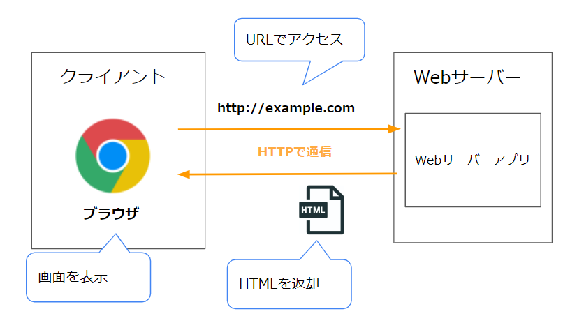
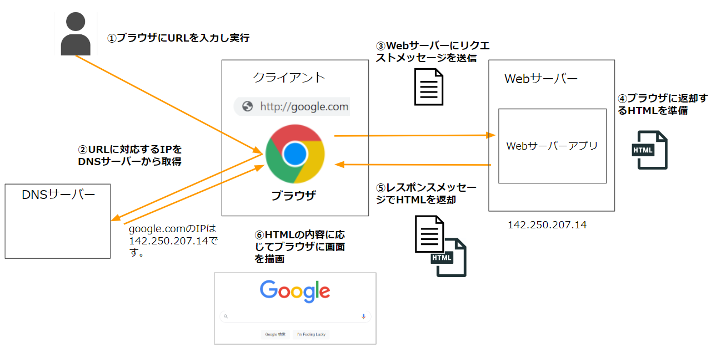
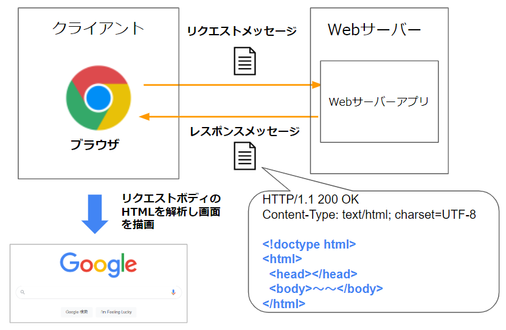
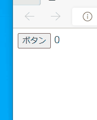
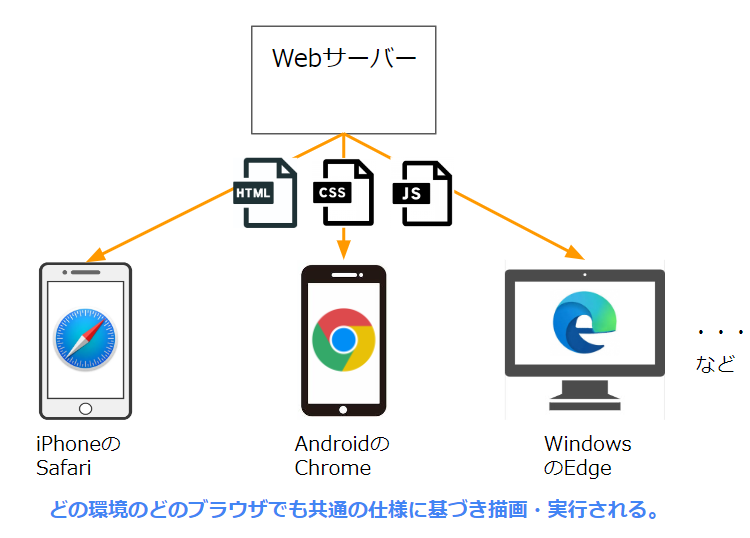

# Webサイトを表示する仕組み

## なにこれ？  
皆さんが普段見ているAmazonやYoutubeなどのWebサイトが、どのような仕組みでブラウザ上に表示されているかご存じでしょうか？  
何気なく見ているWebサイトですが、その裏ではWebに関する様々な技術が使われています。  

Webサイトはブラウザさえあれば閲覧でき便利な為、昨今のシステムはWebサイトの形で提供されることが多いです。  
（そのようなシステムはWebシステムなどとも呼ばれます。）  
弊社の開発案件でもWebシステムを開発することが多いため、Webサイトが表示される仕組みをしっかり理解しておく必要があります。  

この記事はWebサイトを表示する仕組みを理解することを目的としています。  

## 対象者
Webサイトを表示する仕組みがいまいちよく分からない人  

## 読み方
この記事は概要を説明しており、細かい内容は別の記事で説明しています。  
まずはこの記事を最後まで読んでもらい、その後に詳細の記事を読むのが読みやすいかと思います。  

## Webサイト表示の仕組み
ブラウザにWebサイトのURLを入力しEnterを押すと、そのWebサイトの画面がブラウザに表示されます。  
その際、ブラウザはどのようなやりとりが行っているのでしょうか？  
以降では、Webサイトが表示されるまでの仕組みについて説明していきます。  

まず、Webサイトの表示に関する重要なキーワードについて簡単に説明します。  

- クライアント（ブラウザ）  
URLを元にWebサーバーにアクセスし、Webページを表示します。  

- URL  
クライアントがアクセスするリソース（この場合はWebページのHTML）の場所（サーバーの場所とサーバー内での場所）を示します。  

- Webサーバー  
リクエストされたリソース（この場合はWebページのHTML）をブラウザに返却します。  

- HTTP  
クライアント・Webサーバー間の通信規約（プロトコル）です。  

- HTML  
ブラウザにどのような画面を描画するかを伝えるための文字列データです。  
これがWebページの実体となります。  




## クライアント・サーバー間の処理の流れ   
Webページを表示するまでの過程をもう少し詳しく見ていきましょう。   
大まかな流れは以下になります。  
（各用語については後ほど説明します。）  



1. （人）ブラウザ上にURLを入力

1. （ブラウザ）URLからWebサーバーのIPを取得  
通信先のWebサーバーのIPを、DNSという仕組みを利用して取得します。  

1. （ブラウザ）Webサーバーに対してリクエストメッセージを送信  
どのページを開きたいかなどの情報を含んだ、リクエストメッセージという文字列をWebサーバーに送信します。  

1. （Webサーバー）リクエストメッセージを受け取り、ブラウザに返却するHTMLを作成  
HTMLとは、ブラウザにどのような画面を描画するかを伝える為の文字列データです。  

1. （Webサーバー）レスポンスメッセージで用意したHTMLを返却  
レスポンスメッセージと呼ばれる形式のメッセージで、用意したHTMLを返却します。  

1. （ブラウザ）レスポンスメッセージからHTMLを取り出し、その内容に応じで画面を描画する。

以下それぞれの内容について説明していきます。

## 各部分の詳細

### 1.（ブラウザ）URLからWebサーバーのIPを取得  
ブラウザは最初にURLを解析し、リクエストを送る先のサーバーの場所（IP）を特定します。    
ここで、URLについて簡単に説明します。   

#### URLとは  
URLとは、ネットワーク上のリソースの場所を表すための識別子です。  
Webページや画像など、ネットワーク上にあるデータ（これを**リソース**といいます）の場所を一意に表します。  

Webページを開く際は、URLで対象リソース(Webページ)の場所を特定し、そのリソースをHTTPプロトコルで取得する、というのが基本的な流れになります。  
(HTTPについては後ほど解説します。)


#### URLの構文
URLはいくつかの要素で構成されています。  

例えば以下のURLがあった場合  
```http://example.com/user/mypage```  

以下のように分解できます。  


このうち、IPを取得する為に使うのは**ホスト名**になります。  

ホスト名には**ドメイン名**と呼ばれる文字列を指定されています。  
（正確にはFQDN(完全修飾ドメイン名)と呼ばれる文字列を指定します。）  

インターネットの世界では、**DNS**という仕組みでドメイン名とIPアドレスの対応付けを管理しています。  
ブラウザはDNSを管理しているDNSサーバーにドメイン名を問い合わせ、対応するIPを取得します。   

  

#### DNSサーバーからのIPの取得手順  
DNSサーバーからWebサーバーのIPを取得する手順は大まかに以下になります。  

1. URLからホスト名を取得

2. ホスト名に対するIPをDNSサーバーに問い合わせる  
ホスト名に対応するIPを取得する為には、DNSという仕組みを利用します。  
DNSとは、インターネット上でドメイン名を管理・運用するための仕組みで、
ドメイン名に対応するIPなどの情報を管理しています。  

ブラウザはDNSサーバーに対して、ドメインに対するIPを教えて下さいとリクエストすることになります。  
DNSに問い合わせる機能自体は実際はOSが持っており、ブラウザはOSが提供する機能を利用して問い合わせを行っています。  


DNSサーバーはOSに設定されています。  
例えばWindowsだと以下の画面から設定できます。  


DNS関連はネットワーク的な話になるので、概要だけの説明になります。  
詳しく知りたい方は以下の書籍を参照してください。  
[ネットワークはなぜつながるのか](https://www.amazon.co.jp/dp/4822283119)

また、URLについては、[別記事](1_2.URLとは.md)で詳しく解説します。  

### 2.（ブラウザ）Webサーバーに対してリクエストメッセージを送信  
ブラウザはリクエストメッセージというメッセージをWebサーバーに送信します。  
まずはHTTPとは何かについて簡単に説明します。  

### HTTPとは  
クライアント（ブラウザなど）とWebサーバーの間で、さまざまなデータを転送するために使用するプロトコル（通信規約）のことです。
（HTMLだけではなく、画像、動画、PDFなど、コンピュータで扱えるデータなら何でも転送出来ます。）  

HTTPでは、クライアントとサーバー間で**HTTPメッセージ**と呼ばれる文字列データをやり取りして必要な情報を伝え合います。    
まずはクライアントがメッセージを送り、それに応答するメッセージをサーバーが返します。  

それぞれのメッセージは次のように呼ばれます。  
- リクエストメッセージ  
クライアントが送信してサーバーにアクションを起こさせる為のHTTPメッセージ。  
HTTPリクエストや、HTTPリクエストメッセージとも呼ばれる。  

- レスポンスメッセージ  
HTTPリクエストに対するサーバーの回答であるHTTPメッセージ。  
HTTPレスポンスや、HTTPレスポンスメッセージとも呼ばれる。  


  

メッセージの形式（どこにどんな情報をどうやって記載するか）はHTTPプロトコルの仕様の1部として[規定](https://triple-underscore.github.io/rfc-others/RFC2616-ja.html#section-4)されています。  
以下それぞれのメッセージの形式について説明します。  

### リクエストメッセージ   
リクエストメッセージは以下のような文字列になります。  
例（http\//example.com/user/registerというURLにアクセスした場合）  

```
POST /user/register HTTP/1.1
Accept: text/html,application/xhtml+xml;q=0.9,*/*;q=0.8
Content-Length: 28
Content-Type: application/x-www-form-urlencoded
Host: example.com

name=yamada&tel=000-0000-000
```


リクエストメッセージは以下のブロックに分かれています。  


- リクエストライン（1行目）  
サーバーにリクエストの種類を伝えるために使用するHTTPメソッドや、URLのドメイン名以降の部分が入ります。 

- HTTPヘッダー（2行目～空行まで）   
サーバーに補助的な情報を伝える目的で使われます。  
例えばレスポンスの言語を指定したり、Cookie（[別記事で解説](3_3.Cookieとセッション.md)）の情報を記載できます。  

- 本文（空行から後ろ）  
ユーザーが入力した情報などを記載します。  

### レスポンストメッセージ
リクエストメッセージに対する応答として、Webサーバーはレスポンスメッセージをブラウザに送信します。  
レスポンストメッセージには、ブラウザ側に返却したいコンテンツ((HTMLなど)が含まれています。  

レスポンストメッセージは、以下のような文字列になります。  
例  
```
HTTP/1.1 200 OK
Content-Type: text/html; charset=UTF-8
Date: Tue, 31 May 2022 09:57:26 GMT
Last-Modified: Thu, 17 Oct 2019 07:18:26 GMT

<!doctype html>
<html>
  <head></head>～～<body></body>
</html>
```  
（ヘッダーは表示幅の関係で省略しています。）

リクエストメッセージと同じく、レスポンスメッセージの形式もHTTPの仕様の一部として定義されています。
以下レスポンスメッセージの構造を簡単に説明します。  


- ステータスライン （1行目）  
処理の結果を表すステータスコードなどが記載されます。

- レスポンスヘッダー（2行目～空行まで）    
リクエストメッセージと同じく、補助的な情報を伝える目的で使われます。  

- レスポンスボディ（空行から後ろ）  
ここに応答したい内容が入ります。  
HTMLファイルを返却したい場合は、HTMLファイルの内容が記述されています。  
応答によっては本文が無いものもあります。  

メッセージの形式を含むHTTPプロトコルの仕様は、IETFという標準化団体が[策定](https://triple-underscore.github.io/rfc-others/RFC2616-ja.html#section-4)しています。   

仕様としてメッセージの形式やヘッダーの意味が決められている為、クライアント・サーバーは相手からのメッセージを解析することが出来ます。  
(どこに何が書いてありどう意味かを機械的に判別できます。)  

HTTPについては、[別記事](1_3.HTTPとは.md)で詳しく解説します。  

#### Webサーバーに対してリクエストメッセージを送信  
元の話に戻ると、ブラウザはWebサーバーのIPを確認後、上記で説明したリクエストメッセージを生成し、Webサーバーに送信します。  
（レスポンスメッセージは、この後説明するWebサーバーが応答を返すタイミングで利用されます。）  

リクエストヘッダーはブラウザの実行状況（言語設定、cookieの状態、直前に見たURLなど）によりブラウザが自動的に設定します。  

例として、googleサイトを開いた際のリクエストを添付します。    

```HTTP
GET / HTTP/3
Host: www.google.com
User-Agent: Mozilla/5.0 (Windows NT 10.0; Win64; x64; rv:101.0) Gecko/20100101 Firefox/101.0
Accept: text/html,application/xhtml+xml,application/xml;q=0.9,image/avif,image/webp,*/*;q=0.8
Accept-Language: ja,en-US;q=0.7,en;q=0.3
Accept-Encoding: gzip, deflate, br
Connection: keep-alive

```

Webサイトを表示する際、このようなリクエストメッセージの作成・送信処理をブラウザがやってくれているわけです。  

### 3.（Webサーバー）リクエストメッセージを受け取り、返却すべきHTMLを用意  

ブラウザから送られてきたリクエストメッセージをWebサーバーが受け取り、Webサーバーアプリ(Tomcatなど)に受け渡されます。  
(以下WebサーバーアプリのことをWebサーバーと呼びます。)  

Webサーバーとは、クライアントから送られたHTTPリクエストに対し、クライアントが要求したコンテンツ（HTML、CSS、JavaScript、Jsonなど）を返す役割を持ったソフトウェアのことを指します。  

今回のような、ブラウザにURLが入力された際のリクエストに対しては、まず**HTML**という、Webページを表示する為の情報を記述した文字列データを返却します。  
(HTMLについては後ほど説明します。)  

どのようなHTMLを返すかは、URLのパスやパラメータによって判断します。  
例えばURLが/loginならログインページ表示用のHTMLを、/mypageならマイページ表示用のHtmlを返す、などです。  
このような、どのリクエストに対してどのコンテンツを返すかのルールは設計者・開発者が決めて実装します。  

Webサーバーはアプリケーションサーバー・データベースサーバーと連携しながら動作することが多いです。  
それらの解説は[別記事](3_1.Webサーバーの構成.md)で行います。  


### 4.（Webサーバー）コンテンツをレスポンスメッセージで返却
Webサーバーは返却したい情報（この場合はHTML）をレスポンスメッセージに記載してブラウザに送信します。  
上で説明したレスポンスメッセージの本文部分に、返却したい情報が記載されています。  
 
HTMLを返却する場合は以下のようなメッセージになります。   
```
HTTP/1.1 200 OK
Content-Type: text/html; charset=UTF-8
Date: Tue, 31 May 2022 09:57:26 GMT
Last-Modified: Thu, 17 Oct 2019 07:18:26 GMT

<!doctype html>
<html>
  <head></head>～～<body></body>
</html>
```

Webサーバーはリクエストに応じて、このようなレスポンスメッセージを返却します。  

### 5.（ブラウザ）レスポンスメッセージからHTMLを取り出し、その内容に応じで画面を描画する。

  

ブラウザはWebサーバーから返却されたレスポンスメッセージを解析し、そのレスポンスボディからHTMLを読み取ります。  
HTMLには画面のどこに何を描画すべきかが記載されており、ブラウザはその内容に従って画面を描画します。  

以下HTMLについて簡単に説明します。  

#### HTMLとは
HTML(Hypertext Markup Language) は、訪れたWebサイトの構成をブラウザに対して伝えるために使うマークアップ言語です。  
HTML言語で書かれた文字列をブラウザに渡すと、ブラウザはその内容に沿った画面を描画してくれます。  

例えば、`<button>ボタンです</button>`というHTMLの場合、画面には以下のようにボタンが描画されます。  

  

このように、`<></>`で囲まれた箇所を**タグ**と呼びます。  
タグには意味があり、タグで囲まれた部分が何かをブラウザに伝えます。   
（この例では`<button></button>`で囲んだ箇所がボタンである、とブラウザに伝えており、ブラウザはそれに従い画面にボタンを描画します。）  

HTMLはこのようにタグを組み合わせて文書を記述していきます。    
もう少し複雑なHTMLの例です。  
```
<!DOCTYPE html> 
<html>
  <head>
    <title>タイトルです</title>
  </head>
  <body>
    <h1>見出しです</h1>
    <a href="http://example.com">リンク</a>
    <button>ボタン</button>
  </body>
<html>
```
これは、ブラウザ上で以下のように描画されます。  
  


HTMLの仕様(文法やどのタグ何を表すか)は、WHATWGという標準化団体により[策定](https://html.spec.whatwg.org/)されています。   

主要なブラウザはこの仕様に従ってHTMLを解析し画面を描画します。  
あるWebページを開く際、どのブラウザでみても同じ画面が表示されるのは、各ブラウザがこの共通の仕様に従っているためです。  
(たまに特定のブラウザが対応していない仕様もありますが・・)

HTMLについては、[別記事](1_4.HTMLとは.md)で詳しく解説します。  

#### サーバー側の処理 

Webサーバー側は、ブラウザに表示する画面のHTMLを用意しておき(もしくは動的に作成し)、ブラウザ側に返却します。  
例えばログインページにリクエストが来た際は、ログイン画面を表示する為のHTMLを返却します。  

  

HTMLの解析・画面の描画はブラウザが行ってくれるため、Webサーバー側は画面描画の仕組みを持つ必要はありません。  
ブラウザに(正しいHTML言語で書かれた)文字列を返せばいいだけです。  
（後ほど説明するCSS、Javascriptにも同じことが言えます。）  
 

#### HTTPレスポンスからHTMLを取り出し、その内容に応じで画面を描画する。
元の話に戻ると、このようにブラウザはWebサーバーから返却されたHTMLを解析し、画面を描画してくれています。  

これでWebサイトを表示する際の流れの説明は完了です。   
みなさんがブラウザでWebサイトを見ている際は、このような処理をブラウザやWebサーバーが行ってくれています。  


### CSS、Javascriptについて 
HTMLだけでもブラウザは画面を描画できます。  
ただHTMLだけだと、見た目が質素で動きのないWebページになってしまいます。  

その為、デザインを指定する**CSS**と、振る舞いを定義する**Javascript**を同時に利用することが多いです。  

#### それぞれの役割 
CSS、JavascriptはHTMLとは別の仕様(言語)であり、異なる文法で記述されます。  
ただしお互いに関連は深く、Htmlの特定の箇所に直接CSSやJavascriptを記載することが可能です。  
（Htmlとは別のファイルとして定義することも可能です。）  

HTML、CSS、Javascriptの役割は以下になります。  
- HTML  
Webサイトの構造（どこに何を表示するか）を定義します。  

- CSS  
Webサイトのデザインを定義します。  

- Javascript  
Webサイトの振る舞いを定義します。  

以下それぞれの概要を説明します。  

### CSSとは  
CSS(Cascading Style Sheets)とは、
HTMLの要素のスタイルやレイアウトを、どのように表現するか指定する言語です。  
幅・高さ・色など、見た目のデザインに関する情報を指定できます。

例えば、ある要素の背景色を青にする場合以下のように指定します。
```
<h1 style="background-color:blue;">見出しです</h1>
```  

上記のHTMLは以下のように描画されます。  


他にも文字のサイズ・書体・色の変更や、各要素の間隔の幅の指定など、デザインに関する様々な設定が可能です。  

CSSの仕様はW3Cという団体によって[策定](https://www.w3.org/Style/CSS/specs.en.html)されています。 
HTMLと同じく、主要なブラウザはこの仕様に沿ってCSSを解析し画面に描画します。  

CSSについては、[別記事](1_5.CSSとは.md)で詳しく解説します。  


### Javascriptとは
Webサイトのふるまいを定義する為のプログラミング言語です。  

ボタンをクリックした、などの出来事(イベントといいます)に応じた処理を記述します。  
以下の例では、ボタンをクリックすると画面上のカウントが増えていきます。    
```html
<script>
  let count = 0;

  function countUp () {
    count += 1;
    document.getElementById("count").textContent = count;
  }
</script>

～中略～

<button onclick="countUp()">ボタン</button>
<label id="count">0</label>
```

   

JavascriptもHTML、CSSと同じく標準化団体によって仕様が定められています。  
その為、どのブラウザでも同じようにJavascriptは実行されます。  

Javascriptについて、詳しくは[別記事](1_6.Javascriptとは.md)で解説します。  

*ちなみに、[Java](https://www.java.com/ja/download/help/whatis_java.html)とは全く関係のない別の言語です。  
（名前にjavaとついていて構文も似ていますが全くの別物です。）  


## 標準化の意義
HTTPやHTMLなどの仕様は標準化団体によって策定されており、主要なアプリ（ブラウザやWebサーバーアプリ）はその仕様に準拠する形で実装されています。  

例えば、ブラウザはリクエストメッセージを送る際、HTTPの仕様通り先頭行に要求メソッドを記載します。  
Webサーバーアプリは要求メソッドを取得する際、仕様通り先頭行から取得します。    

このようにHTTPという共通の仕様を前提に各アプリが実装されている為、どのようなアプリの組合せでもHTTPのやり取りを行えるわけです。

   

もし共通の仕様が無ければ、特定のブラウザとWebアプリの組合せでしかやりとりが出来なくなってしまいます。  

HTML、CSS、Javascriptにも同じことが言えます。  
HTMLのタグやCSSの意味、Javascriptの構文なども、仕様で定義されています。  
各ブラウザはその仕様どおりに画面を描画するよう実装されているため、あるWebページをどのブラウザで見ても同じ画面が表示されます。  
(たまに見れないときはありますが。。)  

   

もしブラウザごとにそれらの解釈が異なるのなら、各ブラウザ向けに返却するHTMLを変えなくてはいけなくなります。  
そのような事態を避ける為に標準化団体が仕様を策定しており、各アプリの開発ベンダーはそれに従っています。  

*このように共通の仕様や規格を作るのは、Webシステムに限った話ではありません。  
TCP/IPのようなプロトコルもそうですし、USBの形状なども規格が決まっています。  
このように共通の規格を決めることで、仕様がバラバラで使いにくいといった事態を避けることが出来ます。  
参考：[標準化の意義](https://www.jsa.or.jp/datas/media/10000/md_2416.pdf)  

### IE（Internet Explorer）について
各アプリが共通の仕様に準拠していると書きましたが、MicrosoftのIEは共通の仕様にあまり対応していませんでした。  
（HTML・CSS・Javascript関連で、「IEでは動作しない」という機能が多かったです。）  

IEはWindows標準搭載で一定のシェアがあるため無視することは出来ず、IE用と他のブラウザ用の２つの実装をコーディングしなくてはいけない場合もありました。  
ネットで調べ物をした際にIEの場合はこうコーディングする、といった情報が書かれている場合があるのはこの為です。  

IEは2022/6月でサポートが終了しますが、古い業務アプリなどはIEでしか動かないものもあります。  
そのようなアプリを保守・改修する場合は、利用した構文・機能がIEでも動作するのか注意する必要があります。   

### 各ブラウザの仕様対応状況  
各アプリは共通仕様に対応しようとしていますが、一部の仕様に対応していないことがあります。  
特にブラウザはURI、HTTP、HTML、CSS、Javascript・・と対応しなければいけない仕様が多く、各ブラウザで対応状況に差があります。  

対応状況は以下のサイトなどで確認できます。  
[Can I Use](https://caniuse.com/)  


## 参考資料  
- Webサイト  
[MDN HTTPについて](https://developer.mozilla.org/ja/docs/Web/HTTP)  
[MDN URLとは何か](https://developer.mozilla.org/ja/docs/Learn/Common_questions/What_is_a_URL)  
[MDN CSS](https://developer.mozilla.org/ja/docs/Web/CSS)  
[MDN JavaScript](https://developer.mozilla.org/ja/docs/Web/JavaScript)    
[JavaScript Primer](https://jsprimer.net/)  

- 書籍  
[ネットワークはなぜつながるのか](https://www.amazon.co.jp/dp/4822283119)  
Webサイトが表示されるまでをネットワークの観点から説明している書籍です。  
