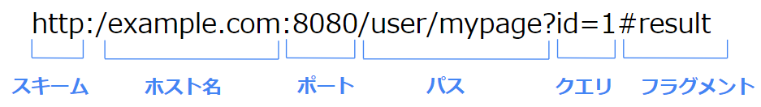

# URLとは  

## なにこれ？
インターネットを利用する際に重要なURLについての概要を説明します。  
URLはシンプルにみえて意外と多くの情報を含むことが出来ますし、    
その分いくつかの表記ルールがあります。  

この記事はそれらのルールを理解することを目的としています。  

## URLとは
URLとは、ネットワーク上のリソースの場所を表すための識別子です。  
Webページや画像など、ネットワーク上にあるデータ（これを**リソース**といいます）の位置を一意に表します。  

Webページを開く際は、URLで対象リソース(Webページ)の場所を特定し、そのリソースをHTTPプロトコルで取得する、というのが基本的な流れになります。  
(HTTPについては[別記事](1_3.HTTPとは.md)で解説します。)


## URLの構文
URLはいくつかの要素で構成されています。  

例えば以下のURLがあった場合  
```http://example.com/user/mypage```  
以下の要素に分けられます。  


- スキーム  
スキームはURLの種類を表しており、プロトコルを示すことが一般的です。    
Webページを表示する際は、**http**か**https**が指定されます。  


- ホスト名  
Webサーバーの場所（IP）が記載されます。  
以下の2つの指定方法があります。  
  - IPを直接記載  
  IPアドレスを直接指定します。   

  - ドメイン名を記載  
  IPではなくドメイン名と呼ばれる文字列を指定します。  
  DNSという仕組みでドメイン名からIPを取得します。  

  外部に公開するサイトの場合、人が見て理解しやすいドメイン名を指定する事が一般的です。    

- パス  
ホスト内でリソースを特定する為の記述です。   
`/`で始まり、複数の`/`を使い階層化出来ます。

これが一番基本的なURLの構成です。  

ただ他にも指定できる要素があります。  
以下のもう少し長いURLを例に、各要素について説明します。  


- ポート番号  
  http通信の際のポート番号を指定します。  
  省略した場合は、スキームにより以下のポートが自動で指定されます。  
  httpの場合： 80  
  httpsの場合： 443  
  
  Webサーバーがhttp、https標準のポート以外をListenしている場合に指定します。  
  （社内で公開しているWebサイトやテスト用のサイトの場合など標準以外のポートを使うことがあります。）  
  
- クエリパラメータ（クエリ文字列）  
パスの後ろの区切り文字`?`以降の文字列で、`名前=値`形式で記述します。  
複数ある場合は`&`で連結します。  
サーバー側に情報を送信したい場合に利用します。  
(例えば検索画面でユーザーが入力した検索文字列を渡す、など)  


- フラグメント  
ハッシュと呼ばれることもあります。  
リソースの中の特定の1部分を指したい場合に利用します。  
`#`の後に記述します。  
例えばHTML要素のid属性の値をフラグメントに指定すると、ブラウザはその要素の場所まで自動的にスクロールします。  
その際にページの再読み込みは発生しません。  
(HTMLについては[別記事](1_4.HTMLとは.md)で解説します。)


## 使用可能な文字
URLで使用可能な文字は以下になります。  

- アルファベット  
A-za-z

- 数字  
0-9

- 記号(特殊な意味を持つもの)  
.~:@!$&'()

- 記号(特殊な意味を持たないもの)  
-_

## URLエンコーディング
使用可能文字でみたように、URLに日本語文字を含むことは出来ません。  
含みたい場合は、文字をエンコード（変換）する必要があります。  

エンコードする際のルールは以下になります。  
```% + 特定の文字コードでその文字を構成する各バイトの16進数```  

このエンコード方式を、URLエンコーディング、または%エンコーディングといいます。  


例えば日本語の「あ」はUTF-8では以下のバイト数で表されます。  
0xE3 0x81 0x82

これをURLエンコードすると以下の文字列になります。  
%E3%81%82

```
エンコード前
http://example.com?name=あ

エンコード後
http://example.com?name=%E3%81%82

```

エンコードする文字コードはUTF=8の場合がほとんどです。  

ブラウザに直接URLを入力した場合やリンクで他のURLに遷移する場合、ブラウザはURL内の2バイト文字を自動的にエンコードします。  

ブラウザ以外のクライアントアプリ(スマホアプリなど)からリクエストを送信する場合はエンコードが必要な場合がありますが、各言語には、URLエンコードする為の関数・ライブラリが存在することがほとんどです。  
その為文字のバイト数を実装者が意識することはあまりありません。  


## 同一ドメイン、サイト、オリジン
URLを比較する際に良く用いられる以下の用語について説明します。  

- 同一ドメイン  
ホストが同じURLを、同一ドメインと言います。  

- 同一サイト  
ホスト、ポート同じURLを、同一サイトと呼びます。  
[Cookie](3_3.Cookieとセッション.md)は同一サイトに対して送信されます。  

- 同一オリジン  
スキーム、ホスト、ポートが全て同じURLを、同一オリジンと呼びます。  
セキュリティ関連の制約で出てくるワードです。  


## 絶対URLと相対URL
URLにはスキームから指定する**絶対URL**と、スキームやホスト名を除いた**相対URL**があります。  

絶対URL
```
http://example.com/user/mypage
```

相対URL
```
/mypage
```

HTML上で相対URLが指定された場合、そのWebページのURLをベースとした絶対URLに変換されます。  

例えば、以下のURLのWebページを開いていたとします。  
```
http://example.com/user
```

ここで相対URLが指定された場合、どのように絶対URLに変換されるかを示します。  

|  相対URL  |  変換後の絶対URL  |
| ---- | ---- |
|  mypage  |  http://example.com/user/mypage  |
|  /mypage  |  http://example.com/user/mypage  |
|  mypage?id=1  |  http://example.com/user/mypage?id=1  |


## URLの仕様
URLの仕様はWHATWGという仕様標準化団体によって定義されています。  
（HTTPの仕様の一部として規定されています。）  
[仕様文書]()  


## 参考

[MDN_URLとは何か](https://developer.mozilla.org/ja/docs/Learn/Common_questions/What_is_a_URL)
