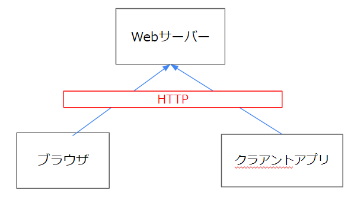
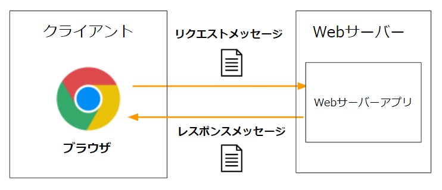
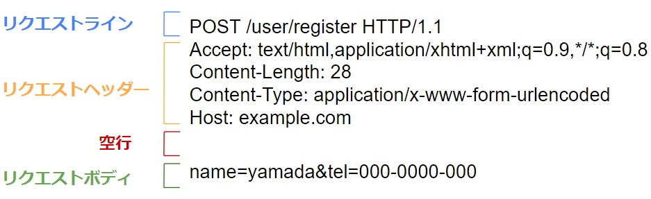
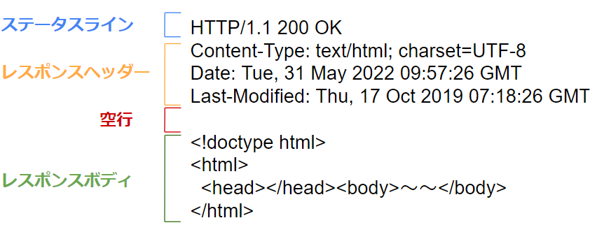
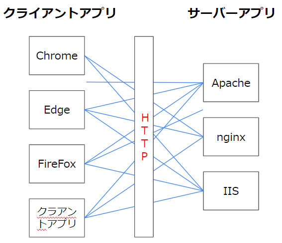

# HTTPとは

## HTTPとは  
クライアント（ブラウザなど）とサーバーの間で、さまざまなデータを転送するために使用するプロトコル（通信規約）のことです。  

HTTPは「Hypertext Transfer Protocol」の略で、ハイパーテキストというデータ（主にHTML）を転送するための通信プロトコルとして生まれました。  
ただ実際にはHTMLだけではなく、画像、動画、PDFなど、コンピュータで扱えるデータなら何でも転送出来ます。  

HTTPはシンプルな仕様な為、多くの用途で利用されています。  
クライアントもブラウザだけに限らず、クライアントアプリ（iPhone、Android、Windowsにインストールして実行するアプリ）もサーバーとの通信時にHTTPを利用する事が多いです。  



以下、HTTPで定められている具体的なルールについて説明していきます。  


## リクエスト、レスポンス

HTTPでは、クライアントとサーバー間で**HTTPメッセージ**と呼ばれる文字列データをやり取りして必要な情報を伝え合います。    
まずはクライアントがメッセージを送り、それに応答するメッセージをサーバーが返します。  

それぞれのメッセージは次のように呼ばれます。  
- リクエストメッセージ  
サーバーにアクションを起こさせる為に、クライアントがサーバーに送信するHTTPメッセージ。  
（HTTPリクエスト、HTTPリクエストメッセージなどとも呼ばれます。）  

- レスポンスメッセージ  
リクエストメッセージに対する回答として、サーバーがクライアントに送信するHTTPメッセージ  
（HTTPレスポンス、HTTPレスポンスメッセージなどとも呼ばれます。）  


  
メッセージの構造は単純です。  
例えば、ブラウザでgoogle.comのWebサイトを開く際、以下のようなメッセージがやりとりされます。  
（行数が増えてしまうので省略したものを記載しています。）   

リクエストメッセージ（ブラウザ→Webサーバー）
```
GET / HTTP/1.1
host: example.com
Accept: text/html,application/xhtml+xmlsigned-exchange;v=b3;q=0.9

```

レスポンスメッセージ（Webサーバー→ブラウザ）
```
HTTP/1.1 200 OK
content-type: text/html; charset=UTF-8
Date: Tue, 31 May 2022 09:57:26 GMT

<!doctype html>
<html>
  <head></head>～～<body></body>
</html>
```

このようなメッセージをやり取りすることで、クライアントとサーバー間でデータを受け渡しています。  


これらのメッセージの仕様はHTTPプロトコルの仕様の1部として[規定](https://triple-underscore.github.io/rfc-others/RFC2616-ja.html#section-4)されています。  
以下それぞれのメッセージのに仕様について説明していきます。  

### リクエストメッセージ  
リクエストメッセージは、以下のような文字列になります。  
例（http\//example.com/user/registerにアクセスした場合）  

```
POST /user/register HTTP/1.1
Accept: text/html,application/xhtml+xml;q=0.9,*/*;q=0.8
content-length: 28
content-type: application/x-www-form-urlencoded
host: example.com

name=yamada&tel=000-0000-000
```
（ヘッダーは表示幅の関係で省略しています。）

リクエストメッセージは以下のブロックに分かれています。  




#### リクエストライン（1行目） 
```
POST /user/register HTTP/1.1
```
の部分に当たります。  
ここはさらに以下の要素に分けられます。  


- メソッド  
  サーバーにリクエストの種類を伝えるために使用します。  
  情報が欲しいときはGET、登録をしたい場合はPOSTを指定、などの使い方をします。  
  詳細は[後ほど解説](#httpメソッド)します。  

- リクエスト対象  
  URLのドメイン名以降の部分が入ります。  
  例えばURLが「http\://example.com/user/mypage?id=1」だった場合、「/user/mypage?id=1」が入ります。  
  この例は`http//example.com/user/register`というURLにアクセスしているため、`/user/register`が記載されています。    

- バージョン  
  HTTPのバージョンが入ります。  
  大抵はHTTP/1.1以降のバージョンが指定されます。    

#### リクエストヘッダー（2行目～空行まで）   
```
Accept: text/html,application/xhtml+xml;q=0.9,*/*;q=0.8
content-length: 28
content-type: application/x-www-form-urlencoded
host: example.com
```

の部分に当たります。  
サーバーに様々な情報を伝える目的で使われます。  

例えばレスポンスの言語を指定したり、Cookie（別記事で解説）を記載できます。  
1行につき1つのヘッダー情報を`ヘッダー名: 値`形式で記載します。  
複数ヘッダーがある場合、複数行で構成します。  
（ヘッダの順序は任意です。） 
 
よく利用されるヘッダーには、以下のようなものがあります。  
- host  
URLのホスト名とポート番号が記載されます。（80,443ポートは省略可能）  
**このヘッダは必須です。**  

- accept  
受け入れ可能なリソースのMIMEタイプ（[後述](#mimeタイプ)）を指定します。   

- cookie  
Cookieを送信する際に利用します。  

- user-agent  
ユーザーエージェント名（ブラウザの種類など）を記載します。  
サーバー側はこのヘッダー値を確認することで、どのブラウザからのリクエストかを判定することが出来ます。  
（IE11がエージェントの場合にだけ違うHTMLを返したい、といった場合に使われることがあります。）

- content-type  
リクエストボディ（後述）が存在する場合、そのデータの種類を示すMIMEタイプ（後述）を指定します。  

- content-length  
リクエストボディ（後述）が存在する場合、そのデータの長さをオクテット（1オクテット＝8ビット）単位で指定します。  

- accept-encoding  
レスポンスを圧縮する場合、どの圧縮方法をクライアントが理解できるかを示します。    
gzip、compressなど

他にも様々なヘッダーがあります。  
ヘッダーもHTTPの仕様の一部として[定義](https://httpwg.org/specs/rfc7231.html#request.header.fields)されています。  

また、独自のヘッダーを記載することも可能です。  
(Webサーバーアプリは不明なヘッダーがあっても無視します。)  


##### ヘッダーの設定方法
ブラウザは、user-agentヘッダーにブラウザ自身の情報を記載したり、本文がある場合にcontent-lengthヘッダーを計算して設定するなど、実行環境や内容に合わせてリクエストヘッダーを自動的に設定します。  

Javascriptやクライアントアプリ（スマホアプリなど）からリクエストを発行する場合は、リクエストメッセージを作成する処理を自分でコーディングします。  
その場合はヘッダーを自由に設定することが可能です。  


#### リクエストボディ（空行から後ろ） 
本文とも呼ばれます。   
```

name=yamada&tel=000-0000-000
```
の部分に当たります。 

ヘッダーフィールドの後に空行を挟み、リクエストボディが続きます。  
主にユーザーが入力した値をサーバーに渡したい場合などに使用します。  
データが無い場合は省略可能です。  

サーバーアプリは、ヘッダーフィールドのcontent-lengthで指定された長さのデータをリクエストボディから読み込みます。  

リクエストボディを利用したパラメータの送信については、[別記事](2_1.ブラウザがHTTPリクエストを送るタイミング.md)で解説しています。    

### レスポンスメッセージ 
リクエストメッセージに対する応答として、Webサーバーはレスポンスメッセージをブラウザに送信します。  
レスポンスメッセージにはHTMLなどのブラウザ側に返却したいコンテンツ情報が含まれています。  

レスポンスメッセージは、以下のような文字列になります。  
例  
```
HTTP/1.1 200 OK
content-type: text/html; charset=UTF-8
Date: Tue, 31 May 2022 09:57:26 GMT
Last-Modified: Thu, 17 Oct 2019 07:18:26 GMT

<!doctype html>
<html>
  <head></head>～～<body></body>
</html>
```
（ヘッダーは表示幅の関係で省略しています。）


リクエストメッセージと同じく、レスポンスメッセージの構文もHTTPの仕様の一部として定義されています。  
以下レスポンスメッセージの仕様を説明します。  




#### ステータスライン （1行目） 
```
HTTP/1.1 200 OK
```
の部分を指します。  

ステータスラインはさらに以下の要素に分けられます。  

- プロトコルバージョン  
HTTPのバージョンを表します。  
通常「HTTP/1.1」です。  


- ステータスコード  
リクエストメッセージがどのように処理されたを示す3桁の数字コードです。  
よく使われるステータスコードには、以下のようのなものがあります。  
  - 200  
  処理が正常に終了したことを示す。  

  - 301
  リダイレクトをする必要があることを示す。  
  この場合、ブラウザはレスポンスヘッダーの`Location`ヘッダーに記載されたURLに自動的に遷移する。  

  - 404  
  リクエストされたパスの対する処理が見つからなかったことを示す。 
  URLが間違っていた際などによく返却される。  

  - 500
  サーバー側で何らかのエラーが発生した状態

  301レスポンスのように、ステータスコードによってはブラウザが特定の動作をするものがあります。  

- 説明句  
ステータスコードに対する補足の情報を文字列として持ちます。  
人間が判断する為のもので、ブラウザの処理には影響を与えません。  
どのような文字列でもよいのですが、ステータスコード毎に一般的に設定される文字列があります。  
(200のとき): OK  
(301のとき): Moved Permanently  
(404のとき): Not Found  

#### レスポンスヘッダー（2行目～空行まで）    
```
content-type: text/html; charset=UTF-8
date: Tue, 31 May 2022 09:57:26 GMT
last-modified: Thu, 17 Oct 2019 07:18:26 GMT
```
の部分を指します。 

リクエストと同じく、様々な情報を伝える目的で使われます。  
記述の形式もリクエストと同じ（`ヘッダー名: 値`）で、複数ヘッダーを順不同で指定できます。  
ただ利用されるヘッダーは一部異なります。

例えば以下のようなヘッダーがあります。  
- date  
レスポンスを生成した日時を示す。

- last-modified  
返却するリソースの最終更新日時を示す。  
（Windowsの場合、ファイルのプロパティ→「更新日時」のことです。）  
静的ファイルを返却する場合に指定され、キャッシュ動作の際に利用されます。  

- set-cookie  
サーバーがCookie値を指定する際に指定します。  

- content-length  
後述する本文が存在する場合、そのデータ長を示します。  
(オクテット単位)

- content-type  
レスポンスするリソースの種類を示すMIMEタイプ（後述）を指定します。  
例えばHTMLを返す場合は、「text/html」を指定します。  
ブラウザはこのヘッダーを見てレスポンスホディをどう扱うかを判断します。  

- location  
ステータスコードが301の際に遷移する先のURLが指定します。  

リクエストヘッダーと同じく、独自のヘッダーを記載することも可能です。  
（ブラウザは不明なヘッダーが来ても無視します。）  


#### レスポンスボディ（空行から後ろ）  
本文とも呼ばれます。  
```

<!doctype html>
<html>
  <head></head>～～<body></body>
</html>
```
の部分を指します。 


ここに応答する内容本体が入ります。  
HTMLを返却する場合は、HTMLの文字列が記述されています。  

応答によっては本文が無いものもあります。  
また、ファイルをダウンロードする際などは、文字列では無くバイナリデータが記載されます。  


### HTTPメッセージの構造  
まとめると、リクエスト・レスポンスのどちらも以下の構造になります。  
ただしそれぞれ1行目の内容やヘッダーの種類が異なります。  


以上が簡単なHTTPの説明になります。  

## HTTPの仕様標準化団体 
上で説明したHTTPプロトコルの仕様は、IETFという標準化団体が策定しています。   
仕様文書（[原文](https://httpwg.org/specs/rfc7231.html)、[日本語訳](https://triple-underscore.github.io/rfc-others/RFC2616-ja.html#section-4)）  

HTTPの仕様は1996年にバージョン1.0が策定され、1999年頃にバージョン1.1が策定されました（「HTTP/1.1」と書きます）。  
このHTTP/1.1が2022年現在でも広く利用されています。  

2015年にはHTTP/2も策定されましたが、パフォーマンスアップの為の変更が主で、基本的な仕様（メッセージの形式など）には大きな変化はありません。  


## HTTPメソッド
リクエストメッセージの先頭行に記載されるHTTPメソッドについて、少し詳しく説明します。  

```
GET / HTTP/1.1
```

HTTPメソッドは、指定したURLのリソースに対して、どのような処理をしたいかをサーバーに伝える為に使われます。  
メソッドもHTTPの仕様の一部として[定義](https://datatracker.ietf.org/doc/html/rfc7231#section-4)されています。  
主に使われるメソッドは以下で、それぞれの意味が定義されています。  


|  メソッド  |  意味  | 
|  ----  |  ----  | 
| GET | データの取得 | 
| POST | データの作成・追加、その他処理全般 | 
| PUT | データの更新・作成 | 
| DELETE | データの削除 | 


このうち特に使われるのがGET、POSTです。  

ブラウザが自動的に発行するリクエストは、GETかPOSTいずれかのメソッドになります。  
URLを入力した際やリンクをクリックした際はGET、フォームデータの送信時はGETもしくはPOSTを指定できます。  
(ブラウザが発行するリクエストの種類については[別記事](2_1.ブラウザがHTTPリクエストを送るタイミング.md)で解説します。) 

PUTやDELETEは、javascriptなどにて直接リクエストメッセージを作成・送信する場合に使用されます。  

POSTはデータの作成・追加が主な意味ですが、実際はどの用途でも使われています。  
何らかの制限で他のメソッドを使えない場合はとりあえずPOSTを使うことになります。  
(GETを使いたいがURLが長くなりすぎてブラウザの制限に引っかかる場合など)


### HTTPメソッドの利用方法
HTTPメソッドは、サーバーにどのような処理を行うかを伝えるためのものと説明しました。  
(データが欲しいときはGET、データを登録・更新したい場合はPOSTなど)

ただ実際にどのような処理をするかはサーバー側の実装によります。  
例えばGETメソッドで削除処理をするようサーバー側を実装することも可能です。  

このようにHTTPメソッドをどれだけ重視するかは設計者・実装者次第になります。  
例えばURLを同じにし、HTTPメソッドで処理を分けるようにサーバー側のプログラムを実装することもできます。  
それとは逆にメソッドは全てPOSTを使用し、URLのリクエストパスやパラメータで処理を分ける事よう実装することも可能です。  

- メソッドで処理を分ける場合
   ```
   データ取得
   GET /user?id=1 HTTP/1.1
   
   データ削除
   DELETE /user?id=1 HTTP/1.1
   ```

- URLのパスやパラメータで処理を分ける場合
   ```
   データ取得
   POST /user/get?id=1 HTTP/1.1
   
   データ削除
   POST /user/delete?id=1 HTTP/1.1
   ```

どちらにするかは、分かりやすさや実装のしやすさなどを考慮し、設計者・実装者が判断する事です。  
HTTPメソッドは、あくまでサーバー側で処理を判断する材料の1つということです。  


## MIMEタイプ
リクエスト・レスポンスヘッダーの「content-type」ヘッダーでは、本文に記載されているもののデータ形式（リソースの種類）を記載します。  
これを「MIMEタイプ」や「メディアタイプ」と呼びます。  

MIMEタイプに指定可能な値はIANAという団体によって策定されています。  
[MIMEタイプ一覧](https://www.iana.org/assignments/media-types/media-types.xhtml)


### よく利用されるMIMEタイプ

- text/html  
HTMLを表します。  
Webサイトを表示する場合のレスポンスメッセージには、これが指定されます。  

- application/json  
JSON形式のデータを表します。  
javascriptやクライアントアプリからのリクエストでよく利用されます。  
（詳しくは[別記事](2_3.JSONとは.md)で解説します。）  

- image/png、image/jpeg、image/gif  
画像ファイルを表します。  
ブラウザはHTMLのimg要素のsrc属性にURLが指定されていた場合、そのURLにリクエストを発行し、結果を画像としてimg要素の箇所に表示します。  
その際のレスポンスヘッダーに指定されることが多いです。  

- application/octet-stream   
任意のバイナリ形式のファイルを意味します。  
ファイル形式が不明な場合などによく用いられます。  


### MIMEタイプが不明な場合のブラウザの動作
「content-type」が指定されていない、もしくは未知のMIMEタイプが指定されていた場合、ブラウザは実際に本文を読み込み、その内容からMIMEタイプを推測します。（これを「MIME sniffing」と言います）

それでも不明な場合は、ダウンロードダイアログを表示し、未知のファイルとして保存するか確認することが一般的です。  


## メッセージヘッダーの利用方法
リクエストやレスポンスのヘッダーに様々な情報を記載できると説明しました。  
ヘッダーで指定したそれらの情報は、どのように利用されるのでしょうか。  

- ブラウザやWebサーバーのメッセージ解析処理に利用される  
  ブラウザはcontent-typeによりレスポンスボディを解析するロジックを変更します。  
  またブラウザもWebサーバーも、content-lengthにしたがってボディからデータを読み込みます。  
  このように、メッセージを解析するための内部処理に用いられるヘッダーがあります。   
  
- ブラウザやWebサーバーに特定の動作を行わせる  
  ヘッダーによっては、ブラウザやWebサーバーが特定の動作を行うものがあります。  
  例えばブラウザはレスポンスコードが302の時、レスポンスのlocationヘッダーで指定されたURLに自動的に遷移します。
    
  またWebサーバーでレスポンスを圧縮する設定にしていた場合、リクエストのaccept-encodingヘッダーに合わせた方法で圧縮を行います。  
  (ヘッダが指定されていないと圧縮自体を行いません)  
  
  このようにブラウザやWebサーバーに特定の動作を行わせる為に用いられるヘッダーがあります。   

- Webアプリでの処理に利用される  
  サーバー上には、JavaやC#などで作成したプログラムを配置することも多いです。  
  (Webアプリと呼ばれます。[別記事](3_1.Webサーバーの構成.md)で解説します。)  
  
  そのプログラム内での処理に利用されることもあります。  
  例えば複数言語に対応したWebページを作成する場合、リクエストのaccept-languageヘッダーを取得し、それに合わせて返却するHTMLを分岐する、といったコードを書くこともあります。  
  また独自のヘッダーでパラメータを受け渡すことも出来ます。  
  (パラメータの受け渡しについては[別記事](2_2.Webサーバーへのパラメータの渡し方.md)で解説します。)  


## HTTPという共通仕様が策定されている意味
上記説明してきたように、ブラウザやWebサーバーはHTTPのプロトコル（使用）に基づいてリクエスト・レスポンスをやりとりしています。  
例えば、サーバーは仕様通りレスポンスボディの位置にクライアントに返却するコンテンツ(HTMLなど)を記述しますし、ブラウザは仕様通りレスポンスボディの位置からサーバーから返却されたコンテンツを取り出します。  

このように、どこに何が書かれているか、それがどんな意味かが仕様として決まっているため、それに準拠しているクライアントとサーバー同士ならデータをやり取りすることが出来ます。  

  


## 参考資料
[MDN HTTP](https://developer.mozilla.org/ja/docs/Web/HTTP)

[MDN MIMEタイプ](https://developer.mozilla.org/ja/docs/Web/HTTP/Basics_of_HTTP/MIME_types)


