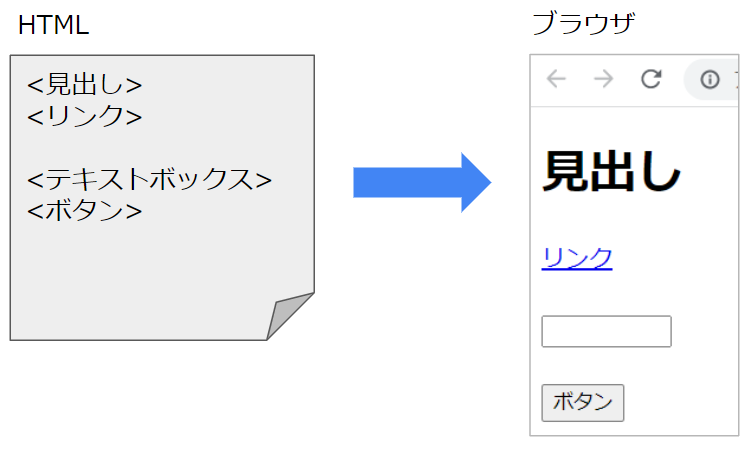
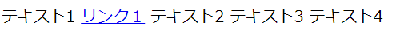

# HTMLとは

## なにこれ？
HTMLはWebサイトをブラウザ上に表示する際に用いられるテキストデータです。  
現在のシステムやサービスはWebサイトとして提供されているものが多く、Web開発者にとっては避けては通れない知識となります。  
この記事はHTMLを理解することを目的としています。    

## 対象者
HTMLがよく分からない人

## HTMLとは
ブラウザにウェブサイトの構成を伝えるための言語です。  
ブラウザ上になにを描画するかを文字列として記述します。   
（ボタンやテキストボックスを表示する、画像を表示する、リンクとして別のリソースを参照する、など）  
ブラウザはHTML言語で書かれた文字列を解析し、実際の画面を描画します。   

  

このような視覚表現や構造を表現する言語をマークアップ言語といいます。  

## HTMLの基本的な文法  
マークアップとは、文字列に意味を持つマークをつけることです。  
マークを付けることで、ブラウザがテキストの意味を解釈出来ます。  
HTMLでは`<>`と`</>`で囲む事により文字列をマークアップします。  

まずは実際のHTMLの例を見てみましょう。  
```
<!DOCTYPE html> 
<html>
  <head>
    <title>タイトルです</title>
  </head>
  <body>
    <h1>見出しです</h1>
    <a href="http://example.com">リンク</a>
    <button>ボタン</button>
  </body>
<html>
```
これをブラウザが描画すると以下のような画面になります。

  


`<>～</>`の部分をタグと呼びます。  
HTMLはこのようにタグを組み合わせて文書を記述していきます。  
以下タグを含めたHTMLの基本的な文法や名称について説明していきます。  

*例えば`<title>タイトルです</title>`の箇所は、ここにタイトルの情報が記述されていることをブラウザに伝えてます。  
この場合ブラウザはページを開いているタブに「タイトルです」という文字を表示します。  
このように`title`などのタグ名毎の動作も仕様で定義されています。   

### 要素

前述の通り、HTMLは、`<></>`で囲まれた**タグ**を組み合わせて記述します。  
例えば以下のように記述します。  

```
<h1>見出しです</h1>
```
タグのそれぞれの部分の呼び名を説明します。  


- 開始タグ  
左の`<>`で囲まれた部分  

- 終了タグ  
右の`</>`で囲まれた部分 


- 要素名  
`<>`の中に書かれている名前（例だと`h1`）  
そのタグが何であるかを表す。  

- 要素内容  
タグに囲まれた部分

- 要素  
開始タグ～終了タグまでのまとまり


要素名にはそれぞれ意味があり、仕様で[定義](https://html.spec.whatwg.org/#semantics)されています。  

例えば`h1`は、見出しとしてタグで囲まれた部分の文字列を強調表示する、という意味があります。  
ブラウザはこのタグを表示する際、要素内容を強調表示します。  
```
<h1>見出しサンプル</h1>
```
上記のタグをブラウザは以下のように描画します。  


別の例として、外部へのリンクを表示する場合は`a`というタグを利用します。  
この場合、ブラウザはクリックすると指定したURLへ遷移するリンクを表示します。  
```
<a href='http://google.com'>外部リンクサンプル</a>
```
上記のタグをブラウザは以下のように描画します。  
(このリンクをクリックすると、「http://google.com」にページが遷移します。)    


他にも様々なタグが存在します。  
画面作成者は様々なタグを組合せたHTMLの文字列を作成し、どのような画面を描画するべきかをブラウザに伝えます。  


※要素は改行して記述する事も可能です。  
```html
<a href='http://google.com' target=”_blank”>
  外部リンクサンプル
</a>
```

### 属性

ここで、`a`というタグ名の横に`href`というものが記載されています。  
これは**属性**とよばれ、タグに情報を付加する為に利用されます。  

属性の種類と意味もHTMLの仕様で定義されています。  
例えば`href`はリンクがクリックされた場合の遷移先URLを記載します。  
タグ毎に共通の属性と、特定のタグでだけ使われる属性があります。  

属性は`属性名=属性値`という形式で記述され、複数指定可能です。  
属性を各部分の名称は以下になります。  


### よく使われる要素
以下では特によく使われる要素をいくつか紹介します。  

- div  
   div要素は特別な意味を持たず、画面上には特に何も描画されません。  
   多くの要素を子要素にできるため、要素をグルーピングする際によく利用されます。  
   
   例えば以下のように要素をグループ化することで、特定のグループの要素にだけ特定のスタイルを適用する、などが柔軟に行えます。  
   
   ```html
   <div id="nameBlock" style="color:blue">
     <h3>基本情報</h3>
     <label>山田太郎<label>
     <label>20歳<label>
   </div>
   
   <div id="addressBlock" style="color:red">
     <h3>住所</h3>
     <label>都道府県：北海道<label>
   </div>
   ```

     

- table  
  表形式でデータを表現する為に利用します。  
   ```html
   <style>
     table, td, th { 
       border: 1px #2b2b2b solid; 
       border-collapse: collapse;
       padding: 8px;
     }
    </style>

   <table>
    <thead>
      <tr>
        <th>地域</th>
        <th>気温</th>
      </tr>
    </thead>
    <tbody>
      <tr>
        <td>札幌</td>
        <td>20°</td>
      </tr>
      <tr>
        <td>東京</td>
        <td>25°</td>
      </tr>
      <tr>
        <td>沖縄</td>
        <td>30°</td>
      </tr>
    </tbody>
   </table>
   ```
     

- form、input、select  
   ユーザーが入力可能なテキストボックスやセレクトリストを表示する為に利用します。  
   詳細は[別記事](2_1.ブラウザがHTTPリクエストを送るタイミング.md#フォームコントロールとは)で   解説します。  

- a  
   外部リソースへのリンクを表示します。  
   ```html
   <a href='http://google.com'>外部リンクサンプル</a>
   ```
     

- span  
   divと同じく特別な意味を持たず、画面上には特に何も描画されません。  
   こちらもグループ化のために用いられますが、divと異なりインライン要素になります。  

この他にも様々な要素が定義されています。  
[MDN HTML要素リファレンス](https://developer.mozilla.org/ja/docs/Web/HTML/Element)


### 要素の入れ子
HTMLは要素を組合せて記述されます。  
要素は並べて記載することだけでなく、入れ子にする事も可能です。  

例
```html
<!DOCTYPE html> 
<html>
  <head>
    <title>タイトルです</title>
  </head>
  <body>
    <h1>見出しです</h1>
    <button>ボタン</button>
  </body>
<html>

```

入れ子になった要素は、以下のような階層構造になっています。  


ある要素（タグ）から見て、すぐ外側の要素を**親要素**、直下の要素を**子要素**といいます。  
共通の親要素をもつ要素は**兄弟要素**といいます。  


### ヘッダーとボディ
HTMLは、一番外側の`<html>`要素と、ヘッダー情報を表す`<head>`、コンテンツ情報を表す`<body>`要素の組合せが基本的な構造になります。  

```html
<!DOCTYPE html> 
<html>
  <head>
    <!-- ヘッダー情報-->
    <!-- HTML自体の情報を記載する。 -->
    <!-- ここに記載した要素は画面上に描画されません。* -->
  </head>
  <body>
     <!-- コンテンツ情報 -->
     <!-- ここに記述した要素が画面上に描画される。 -->
  </body>
<html>
```

headerとbodyには以下の情報を記載します。  

- header  
HTML自体の情報をブラウザに伝えるための部分です。  
*ここには画面上に描画する要素は記載しません。*   
（記載しても描画されません。）  
メタデータや参照するCSS、Script(後述)などの情報を記載します。  

- body  
画面に表示するコンテンツの情報を記述する部分です。  
*ここに画面上に描画する要素を記述します。*  


#### ヘッダーに記載される要素
ヘッダーに主に記載されるのは以下の要素です。  
- `<title>`  
文書のタイトルを表します。  
タイトルはブラウザのタブに表示されます。

- `<link>`  
CSSなどの他のリソースhへのパスを記載します。  

- `<style>`  
CSSを直接記載します。

- `<script>`  
主にJavascriptを記載します。  
直接記載する場合と、外部のjavascriptファイルのパスを記載する場合があります。  
`<script>`タグはbodyにも記載出来ます。  
ページ描画のパフォーマンスなどの関係で、bodyの末尾にscriptタグを記載することも多いです。  

- `<meta>`
文字コードや画面幅などの情報を記載します。  
特に以下の文字コードの指定はほぼ必須です。  
   ```<meta charset="UTF-8">```  
  
  metaタグでは他にも様々な指定が可能です。  
  (画面幅に関するviewportなど)

### 終了タグの省略

要素内容をもたない要素を空要素といい、終了タグを省略することが可能です。  
例えば改行を表す`br`タグは以下のどちらでも記載出来ます。  
```
<!-- 終了タグを省略しない場合 -->
<br></br>

<!-- 終了タグを省略する場合 -->
<br/>
```


### コメント
HTML上のコメントは以下のように記述します。  
```<!-- コメント内容 -->```

コメントアウトされた部分はブラウザに無視されます。  
ただし、HTMLファイル上に文字列としては残ってしまいます。  
表示中のページのHTMLはブラウザの右クリック→「ソースを表示」で確認出来てしまうので、基本的にHTMLのコメントは使わないほうがよいです。    

### DOCTYPE
HTMLは、先頭行で`<!DOCTYPE>`を記述しなければいけません。  
これがHTML文である目印になります。  

DOCTYPEではHTMLのバージョンを指定します。  
最新を指定するには以下の定義をすることが大半です。    
`<!DOCTYPE html> `


### HTMLの仕様文書
上述したHtmlの仕様は、WHATWGという標準化団体により策定されています。   
策定されて仕様は[HTML Living Standard](https://html.spec.whatwg.org/)という名で公開されています。  
(以前はW3Cと言う団体でも定義されていましたが、WHATWGに一本化されました。)  

文法ルールや、タグがどのような意味か（ブラウザが何を描画するべきか）などが定義されています。  
以前はHTML5などのバージョン毎の仕様が定義されていましたが現在はバージョンは廃止されています。  
上記の仕様書に常に最新の仕様が適用されます。  


以上で基本的な文法についての説明を終わります。  
もう少し詳しく知りたい方は末尾の参考資料などを確認してください。  

## その他

### HTMLの基本テンプレート
HTMLを記載する際の必須の情報を記載した必要最小限の構成は以下になります。  

```html
<!DOCTYPE html> 
<html ja>
  <head>
    <!-- ヘッダー情報を記載 -->
    <meta charset="UTF-8">
  </head>
  <body>
     <!-- コンテンツ情報を記載 -->
  </body>
<html>
```

`<html>`タグには言語指定を行います。(ja)  
これによりデフォルトのフォントが変わったり、一部要素で表示される文字が変更される場合もあります。  

また`meta`タグで「charset="UTF-8"」を指定しています。  
これはこのHTMLどの文字コードで保存されているのか指定しており、この記述が無いと文字化けの原因となることがあります。  


### CSS、Javascript 
HTMLだけでもブラウザは画面を描画できます。  
ただHTMLだけだと、見た目が質素で動きのないWebページになってしまいます。  

その為、デザインを指定する**CSS**と、振る舞いを定義する**Javascript**と呼ばれるものを同時に利用することが多いです。  

これらはHTMLとは別の仕様(言語)であり、異なる文法で記述されます。  
ただしお互いに関連は深く、HTMLの特定の箇所に直接CssやJavascriptを記載することが可能です。  
（HTMLとは別のファイルとして定義することも可能です。）  

HTML、CSS、Javascriptの役割は以下になります。  
- HTML  
Webサイトの構造（どこに何を表示するか）を定義します。  

- CSS  
Webサイトのデザインを定義します。  

- Javascript  
Webサイトの振る舞いを定義します。  


それぞれについては別の記事で解説します。  
[CSS](1_5.CSSとは.md)  
[Javascript](1_6.Javascriptとは.md)  


### 外部ファイルの読み込み順  
HTMLのタグには、外部のファイル（CSS、JavaScript、画像など）を読み込むためのタグが用意されています。  
ブラウザはHTMLの要素を上から解析していき、**それらのタグが出現する度にHttpリクエストを発行します。**

1. ブラウザがHTMLファイルを解析

1. HTMLファイル内で外部ファイルが参照されていた場合、そのURLに対してHttpリクエストを発行し、外部ファイルを取得します。  
（`<style>`、`<script>`、``タグなど）

1. 取得したファイルを解析し、HTMLに適用します。  


外部ファイルが多くなるとHTTPリクエストを発行する回数が多くなり、画面表示のパフォーマンスに影響を与える可能性があります。  
そのため、複数のCss、Javascriptをまとめてファイル数を少なくするなどの工夫をすることが多いです。 


### ブロックレベル要素とインライン要素
HTMLの要素は、ブロックレベル要素、インライン要素のいづれかに分類されます。  
ここでは簡単にそれぞれの意味を説明します。  

#### ブロックレベル要素
段落など、ある程度大きなかたまり（グループ）を表現する為の要素です。  
特定の意味毎に要素をまとめる場合などに利用します。  
div、h1、pなど  

ブロックレベル要素のレイアウトには以下の特徴があります。  

- 横幅  
**親のブロックレベル要素の横幅全体を占有します。**  
つまり、ブロック要素の後の要素は、1段下に表示されることになります。  
CSSでwidthを指定してもこの特性は変わりません。  

- 高さ  
要素内容のコンテンツの高さに自動的に調整されます。  
つまり要素内容が空のブロック要素は、高さが0になり画面に表示されなくなります。  
ただしCSSのheightが指定されていた場合はそちらが優先されます。  

```html
<!-- 横幅を占有する -->
<div style="background-color:blue;">テキスト</div>
<label>次の要素</label>

<!-- widthを指定しても横幅を占有する -->
<div style="width:80px;background-color:blue;">テキスト</div>
<label>次の要素</label>

<!-- 要素内容が空だと高さが0になり表示されない -->
<div style="background-color:red;"></div>

<!-- heightの高さが優先される。 -->
<div style="height:20px;background-color:yellow;"></div>
```

  

`<body>`要素もブロックレベル要素です。  

参考：[MDN ブロックレベル要素](https://developer.mozilla.org/ja/docs/Web/HTML/Block-level_elements)


#### インライン要素
行の中の要素という意味で、ブロック要素と異なり横幅を占有しません。  
label、a、spanなど  

レイアウト上の特徴は以下になります。
- 横幅  
要素内容に合わせて自動的に調整されます。  
ブロック要素と異なり横幅を占有しません。
**widthの指定は出来ません。**

- 縦幅  
要素内容に合わせて自動的に調整されます。  
**heightの指定は出来ません。**

```html
<!-- 横幅を占有しない為並んで表示される。 -->
<label>テキスト1</label>
 <a href="#">リンク１</a>
 <label>テキスト2</label>
 <span>
   <label>テキスト3</label>
   <label>テキスト4</label>
 </span>
```

  

参考：[MDN インライン要素](https://developer.mozilla.org/ja/docs/Web/HTML/Inline_elements)


長くなるのでここでは概要だけを説明しました。  
ページをレイアウトするうえで重要な概念なので、参照先のURLなどで読んでみて下さい。  


### DOM
ブラウザはHTMLを読み込んだ際、要素の入れ子関係やそれぞれの要素の情報を解析しメモリ上に保持します。  
この解析結果は**DOMツリー**と呼ばれる木構造のデータになります。  

例えば以下のようなHTMLがあった場合
```html
<html>
  <head>
    <title>サンプル</title>
  </head>
  <body>
    <h1>見出し</h1>
    <p>テキストです</p>
  </body>
</html>
```

以下のようなDOMツリーを持ちます。  


ツリー構造の個々の構成要素を**ノード（node）**といいます。  
ノードは自分自身の情報（その要素の属性など）と、親ノード、子ノードへの参照を持ちます。  
ツリーの一番上の「document」は、HTML全体を表すノードです。

ブラウザーは、HTMLを解析しDOMツリーを構築した後、CSSのスタイルを適用し画面を描画します。  
このように、HTMLを解釈して画面に表示する一連の工程を**レンダリング（rendering）**といいます。

ブラウザ上で動作するJavascriptには、このDOMを操作する為のオブジェクト・メソッドが用意されており、DOM APIと呼ばれています。  
詳しくはJavascriptの記事で[説明](1_6.Javascriptとは.md#dom-api)します。  

### ブラウザで閲覧中のWebサイトのHTMLの表示
ChromeなどのブラウザでWebサイトを開き、画面上で右クリック→「ページのソースを表示」 を選択すると、そのサイトのHTMLを見ることが出来ます。  
自分が普段見ているサイトのHTMLを見て勉強してみるのもいいかも知れません。  


## 参考資料  
- Webサイト  
  [MDN HTMLについて](https://developer.mozilla.org/ja/docs/Web/HTML)  
  
  [MDN HTML要素リファレンス](https://developer.mozilla.org/ja/docs/Web/HTML/Element)  

- 書籍  
  [HTML解体新書](https://www.borndigital.co.jp/book/25999.html)  

