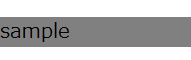
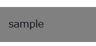
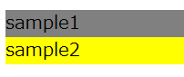
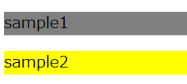

# CSSとは


## CSSとは  
CSS（Cascading Style Sheets）は、HTML要素が画面上でどのように表現されるかを定義する為のスタイルシート言語です。  
幅・高さ・色など、見た目のデザインに関する様々な情報を指定できます。

例えば、ある要素の背景色を青にする場合は以下のように記載します。
```html
<h1 style="background-color:blue;">見出しです</h1>
```  

上記のHtmlは以下のように描画されます。  


この例の`background-color:blue;`の部分で「背景色を青にする」という指定をしています。  
他にも様々な見た目に関する指定を行うことができます。  

以下ではCSSの基本的な文法について説明していきます。  


## CSSの構文
cssの構文は以下になります。  
`プロパティ名: プロパティ値;`  

複数ある場合は続けて記述します。  
例  
```css
background-color:blue;color:white;width:120px;height:120px;
```

CSSのプロパティには様々なものが定義されています。  
例えば以下のプロパティがあります。

- width、height  
要素のサイズを指定します。  

- border  
要素の枠線の見た目を定義します。  

- padding、margin  
要素の間隔を定義します。  
よく使うので詳細は後述します。  

プロパティを組み合わせることで様々なデザインを定義できます。  
例）枠が黄色の点線で角を丸くする、文字は白で影を付けて中央寄せ、背景は青のグラデーション
```css
.Sample {
  background:linear-gradient(blue, white);  /* BOXの背景色をグラデーションに */
  background-clip:padding-box;  /* 背景が枠線と重ならないように指定 */
  color: white; /* 文字色 */
  text-shadow: 3px 2px gray; /* 影の指定*/
  text-align: center;  /* 文字を中央寄せ*/

  border        : 4px dotted red;   /* 枠線の指定  */
  border-radius : 43px;                /* 角丸の指定  */
  padding: 8px; /* 余白 */
}
～
<div class="Sample">テキスト</div>
```

以下のような見た目になります。

   

（あくまでサンプルの為のコードです。実際にこんな見た目にすることはありません。）

プロパティの仕様（そのプロパティが指定された際に画面にどう描画されるか）は標準化団体により[定義](https://www.w3.org/Style/CSS/specs.en.html)されています。  
ブラウザはこの仕様に従って画面を描画します。  

## CSSの適用方法
CSSをHTMLに適用方法は3つあります。  

### タグの`style`属性に直接指定する  
Htmlの全てのタグに`style`という属性を指定でき、そこにCSSを記述できます。  

```html
<h1 style="backgroundcolor:red;">見出しです</h1>
```  


### `<style>`タグの内部に定義する  
HTMLの`<style>`タグ内に定義します。  
`<style>`タグは`<header>`タグ内に定義します。

定義する際、**セレクタ**にてどの要素にスタイルを適用するかを指定します。  
（セレクタについては後述します。）  
そのstyleタグ以降の要素に対し定義が適用されます。   

```html
<style>
  h1 {
    background-color: blue;
  }
</style>

～～略～～

<h1>見出しです。</h1>
```

### 外部ファイルに記載し、`<link>`タグで読み込む  
HTMLとは別ファイルにcssを定義し、HTTPでアクセス出来る場所に配置しておきます。  
HTMLの`<link>`タグの`href`属性でそのファイルのURLを指定すると、ブラウザがそのファイルを読み込み、セレクタにマッチする属性に適用してくれます。  

・外部CSS  
mycss.css
```css
h1 {
  background-color: blue;
}

button {
  color: red;
}
```

・HTML
```html
<link href="http://～～/mycss.css" rel="stylesheet"/>
<!-- hrefで指定した外部CSSが読み込まれ、ここに展開されるイメージ。 -->`

～

<h1>見出しです。</h1>
```

直接記述する方法だと記述箇所が増えた際に管理が大変になるため、外部ファイルとして定義する事が多いです。  
②、③の方法で記載する場合は、**セレクタ**でどの要素に定義を適用するかを指定します。  


## セレクタ
要素外にCSSを定義する場合、どの要素にCSSを適用するかを表す**セレクタ**を指定する必要があります。   

セレクタとは、CSS定義を適応する対象の要素を指定するための書式です。  
セレクタを利用する際は書き方は以下になります。  

```
セレクタ {
  プロパティ名: プロパティ値;
}
```

例えば、全てのhh1要素の背景色をと高さを変更する場合は以下のように指定します。  
```css
h1 {
  background-color: blue;
  height: 20px;
}
```

このような定義をHTMLの`<style>`タグ内に記述するか、外部ファイルに記述し`<link>`タグで参照することで、セレクタの条件に合致する全ての要素にCSSの定義が適用されます。  


### セレクタの指定方法
セレクタでは様々な条件で要素を指定できます。  
主なものは以下になります。  
(以下の例では`<style>`タグなどは省略しています。)

#### 要素名での指定
CSSを適用したい要素名を指定します。  
```css
div {
  background-color: blue;
}

～
<div id="myid"></div>
```

#### idでの指定
CSSを適用したい要素のid属性を指定します。
`#id名`という指定になります。
  
```css
#myid {
  background-color: blue;
}

～
<div id="myid"></div>
```

#### クラス名での指定
`.クラス名`という書式で記述します。  
class属性にそのクラス名が指定されている要素に定義が適用されます。  

```css
.myClass {
  background-color: blue;
}

～
<div class="myClass"></div>
```

#### 特定の属性値での指定

```css
[name="myname"] {
  background-color: blue;
}

～
<div name="myname"></div>
```

#### 複数指定の組み合わせ
複数の指定を組み合わせることも出来ます。  

mynameというname属性を持ったdivに適用する場合
```css
div[name="myname"] {
  background-color: blue;
}

～
<div name="myname">テキスト</div>
```

#### 子孫要素の指定
半角スペースでつなげて記述することで子孫要素を指定できます。  

例）myidというid属性を持った要素の子孫要素のdivを指定　　
```css
#myid div {
  background-color: blue;
}

～
<div id="myid">
  <div>テキスト</div>
</div>
```

直下の子要素に限定する場合は、` > `でつなげて記述します。  
```css
#myid > div {
  background-color: blue;
}
```


その他の指定は参考資料を確認ください。  
[MDN セレクタ](https://developer.mozilla.org/ja/docs/Web/CSS/CSS_Selectors)

## padding、margin
要素自体や要素間の間隔を指定するpadding、marginというCSSプロパティがあります。  
非常によく使われるのでここで概要を説明します。  

### padding
要素の枠と要素内容との間隔を指定します。  

例えば以下のCSS定義とHTML要素があるとします。  
（分かりやすいように背景色を付けています。）  
```css
div {
  background-color: gray;
}

<div>sample</div>
```
  

この場合、要素内の文字と要素の枠との間隔はあまりありません。  
ここでpaddingを指定すると以下の見た目になります。  
```css
div {
  background-color: gray;
  padding: 16px;
}

<div>sample</div>
```
  

このように要素の外枠と要素内容（ここではsampleというテキスト）との間隔が広がっています。  


間隔を適用する方向（上下左右）を指定する事も可能です。
以下のプロパティで指定します。    
`padding-right`、`padding-left`、`padding-top`、`padding-bottom`

paddingだけを指定すると、4方向全てに指定した間隔が適用されます。  

### margin
要素間の間隔を指定します。 


例えば以下のCSS定義とHTML要素があるとします。  
（分かりやすいように背景色を付けています。）  
```css
#div1 {
  background-color: gray;
}

#div2 {
  background-color: yellow;
}

<div id="div1">sample1</div>
<div id="div2">sample2</div>
```
  

この場合、2つの要素の間隔はありません。  
ここでmarginを指定することで要素間の間隔を空けることが出来ます。  
```css
#div1 {
  background-color: gray;
}

#div2 {
  background-color: yellow;
  margin-top: 16px;
}

<div id="div1">sample1</div>
<div id="div2">sample2</div>
```

  

(上の要素の`margin-bottom`を指定しても同じことが出来ます。)  

marginもpaddingと同様に、間隔を適用する方向（上下左右）を指定する事も出来ます。  
`margin-right`、`margin-left`、`margin-top`、`margin-bottom`

marginだけを指定すると、4方向全てに指定した間隔が適用されます。  

## CSSの仕様文書  
CSSの仕様はW3Cという団体によって[策定](https://www.w3.org/Style/CSS/specs.en.html)されています。 


## 参考資料

[MDN CSSについて](https://developer.mozilla.org/ja/docs/Glossary/CSS_Selector)


[MDN ボックスモデル](https://developer.mozilla.org/ja/docs/Learn/CSS/Building_blocks/The_box_model#what_is_the_css_box_model)

[MDN セレクタ](https://developer.mozilla.org/ja/docs/Web/CSS/CSS_Selectors)  


