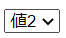

# ブラウザがHTTPリクエストを送るタイミング

## なにこれ？
Webページを表示する仕組みを説明した[記事](1_1.Webページを表示する仕組み)では、ブラウザにURLを入力してWebページを表示する場合を例にしました。  
それ以外にも、ブラウザからHTTPリクエストが発行されるタイミングがいくつかあります。  

本記事ではそのタイミングについて説明します。  

## ブラウザがHTTPリクエストを送るタイミング
ブラウザがHTTPリクエストを送信するタイミングは以下になります。  

- ブラウザURLを直接入力した場合
- ページ上のリンクから遷移した際 
- フォームデータの送信時  
- javascriptからのリクエスト

以下それぞれについて説明していきます。  

## ブラウザURLを直接入力した場合  
  入力されたURL（のホスト名のIP）に対してHTTPリクエストを送信します。  
  
  ブラウザが送信するHTTPはGETメソッドとなります。
  Webページ全体が再読み込みされ、javascriptの変数などの情報は全てクリアされます。  

#### Webページ全体の再読み込み  
  この記事では、画面が一度真っ白になり、ブラウザのタブの右に読み込みマークが表示される遷移のことをこう呼ぶことにします。  
  別のURLへ遷移した際や、画面をリフレッシュした場合の動作の事です。  

  図  


## ページ上のリンクから遷移した際  
  URLを直接入力したときと動きは同じです。  
  例えばyahooのニュースクリックした際などの動作です。  

  リンクはhtml上はaタグで作成されており、そのhref属性に指定されたURLにリクエストを発行します。  
  ```html
  <a href="https://google.com">リンク</a>
  ```
  


## フォームデータの送信時  
フォームとはhtmlの`<form>`タグで囲まれた部分の事で、画面上でユーザーが入力した情報をサーバーに送信する際などに利用します。  
例えばユーザー登録画面で、顧客が入力した名前などの情報をサーバーに送る場合などです。  

例  
  

この入力フォームのHtmlは以下になります。  
```html
<form action="http://www.foo.com" method="GET">
  名前<input name="name"/>
  住所<input name="tel"/>
  <button type="submit">送信</button>
</form>
```

### formタグの仕様
`<form>`タグの中にある、`type="submit"`属性が指定された`<button>`をクリックすると、formタグのaction属性に指定されたURLにHTTPリクエストを送信し、遷移します。  
（この動作を「フォームをサブミットする」などと言います。）    
その際のHTTPメソッドは`method`属性で指定されたものになります。  
`method`属性には`GET`、もしくは`POST`が指定できます。  

例えば以下のformの場合
```html
<form action="http://www.foo.com" method="GET">

    <button type="submit">送信</button>
</form>
```

送信ボタンを押した際のリクエスト先は以下になります。  
```
GET http://www.foo.com
```

リクエスト先のURLに遷移しWebページ全体の再読み込みされます。 
（その為リクエスト先のURLはHTMLを返す必要があります。） 

また、フォームデータの送信時、**フォームコントロールに入力されたデータがリクエストに記載されます。**  

### フォームコントロールとは
人が値を入力・選択できるHTML要素のことです。  
（テキストボックスやチェックボックスなど）  

`<form>`タグの中に記載することが多いです。  
主なフォームコントロールは以下になります。  

#### text  
テキストボックスを表示します。  
`input`タグで`type`属性に`text`を指定します。  

```html
テキスト<input type="text" name="myText">
```

    


入力された値は`value`属性に設定されます。   
```html
テキスト<input type="text" name="myText" value="textVal">
```  

    

#### select  
セレクトリクストを表示します。  
`select`タグの中に`option`タグを複数記述します。  
`option`タグが選択肢を表します。  
```html
  <select name="mySelect">
    <option value="selectVal1">値1</option>
    <option value="selectVal2">値2</option>
  </select>
```  

  

選択された`option`要素に`selected`属性が付きます。  
```html
  <select name="mySelect">
    <option value="selectVal1">値1</option>
    <option value="selectVal2" selected>値2</option>
  </select>
```   
  

#### checkbox
チェックボックスを表示します。 
`input`タグで`type`属性に`checkbox`を指定します。  
```html
<input type="checkbox" name="myCheck">チェックボックス
```
  


チェックされた場合は`checked`属性が付きます。  
```html
<input type="checkbox" name="myCheck" checked>チェックボックス
```
  

#### radio
ラジオボタンを表示します。  
`input`タグで`type`属性に`radio`を指定します。  
同じname属性のものがグループ化され、グループ内で一つしか同時に選択できません。  

```html
値1<input type="radio" name="myRedio" value="redioVal1">
値2<input type="radio" name="myRedio" value="redioVal2">
値3<input type="radio" name="myRedio" value="redioVal3">
```
  

選択された要素に`checked`属性が付きます。   

```html
値1<input type="radio" name="myRedio" value="redioVal1">
値2<input type="radio" name="myRedio" value="redioVal2">
値3<input type="radio" name="myRedio" value="redioVal3" checked>
```

  

### 入力値のサーバーへの送信
`form`タグ内のフォームコントロールに入力・選択された値は、フォームサブミット時にHTTPリクエストに記載されます。  

記載される形式は`パラメータ名=値`です。   
それぞれのフォームコントロールで以下のようになります。  

- text  
`name`属性の値=`value`属性の値

- select  
`select`要素の`name`属性の値=`selected`属性のついた`option`タグの`value属性`の値

- checkbox  
（`checked`属性が付いたもののみ送信される） 
  - value属性がある場合  
  `name`属性の値=`value`属性の値
  - value属性が無い場合  
  `name`属性の値=on

- redio  
`name`属性の値=`checked`属性のついたタグの`value属性`の値


### HTTPメソッド毎の送信方法の違い
どのようにリクエストに記載されるかは、`method`に指定したHTTPメソッド(GET or POST)によって異なります。  

以下のformを送信する場合を例に説明します。  
```html
<form action="http://example.com" method="">
 <div>
   テキスト<input type="text" name="myText" value="textVal">
 </div>
 
 <div>
   <select name="mySelect">
      <option value="selectVal1">値1</option>
      <option value="selectVal2" selected>値2</option>
   </select>
 </div>
 
 <div>
   <input type="checkbox" name="myCheck" value="checkVal" checked>チェックボックス
 </div>
 <div>
    値1<input type="radio" name="myRedio" value="redioVal1">
    値2<input type="radio" name="myRedio" value="redioVal2">
    値3<input type="radio" name="myRedio" value="redioVal3" checked>
   </div>

   <button type="submit">送信</button>
</form>
```

  

#### methodにGETを指定した場合 
URLのクエリストリングにフォームコントロールの値が記載されます。  

例のformをsubmitした際のクエリストリングは以下になります。  
```
http://example.com?myText=textVal&mySelect=selectVal2&myCheck=checkVal&myRedio=redioVal3
```

#### methodにPOSTを指定した場合  
HTTPリクエストのリクエストボディに記載されます。  
Content-Typeヘッダーにフォームデータ形式を表す`application/x-www-form-urlencoded`が指定されます。  
例のformをsubmitした際のHTTPリクエストは以下になります。 
```http
POST / HTTP/1.1
Host: example.com
Content-Type: application/x-www-form-urlencoded
Content-Length: 69

myText=textVal&mySelect=selectVal2&myCheck=checkVal&myRedio=redioVal3
```


※どちらの場合も、全角文字はURLエンコードという処理がされたものが送信されます。  
詳しくは[別記事]()で解説します。  

#### GETとPOSTのどちらを選ぶか  
GETとPOSTで以下のような特徴があります。 
 
- GET  
  URLさえあれば同じパラメータを送信できます。  
  その為、ブックマークされ別のタイミングで表示されるページによく利用されます。  
  (検索結果画面などの参照系のページ)  
  
  ただ、送信する値が多い場合、ブラウザによるURLの文字列制限に引っかかる可能性があります。  
  その場合は参照系の画面であっても、文字数制限のないPOSTを利用する事になります。  

- POST  
  URLにパラメータが含まれない為、URLだけをコピーしても同じ処理は行えません。
  その為、ブックマークされ再度リクエストを送られたくないURLによく利用されます。
  （登録、削除を行う処理のURLなど）  
  
  またパラメータに個人情報や機密情報が含まれる場合も、URLに表示されることを避けPOSTを利用することが多いです。  
  （URLにパラメータが表示されると別の人に見られる可能性があります。  
  またWebサーバー側のログを取っている場合、リクエストされたURLを記録している場合が多く、ログにパラメータが保存されてしまいます。  
  ですが、リクエストボディまでは記録しないことが多いです。）
  
  リクエストボディには文字数の制限がない為、パラメータ数が多くなる場合は参照系の画面でも利用されます。  


## Javascriptからのリクエスト  

上の3つの方法は、HTTPリクエストの作成・送信と、レスポンスに対する処理（Htmlの描画）をブラウザが自動で行ってくれました。  
それとは別に、ブラウザ上に読み込まれたJavascriptからリクエストを発行する事も出来ます。  
この場合、Httpメッセージの作成やレスポンスに対する処理を自分でコーディングすることになります。  


### javascriptからのリクエストの特徴  
javascriptからリクエストを発行しても、ブラウザは何もしません。  
URLを入力してページを開いた時のような、ページの再読み込みや画面の再描画は行いませんし、ブラウザ上のURLも変更されません。  
その為、ブラウザを操作しているユーザーに気付かれずにリクエストを発行することが出来ます。  

また、レスポンスに対してどのような処理を行うかもJavascriptのコードで記述します。

また、レスポンスに対してどのような処理を行うかもJavascriptのコードで記述する必要があります。  
（逆に言うとレスポンスに対しどのような処理を行うか開発者が自由に定義できます。）  

javascriptからのリクエスト発行は主に以下の用途で使われます。  

#### ログの送信  
ボタンのクリックなど、ユーザーの行動ログをサーバーに送る際に利用します。  
前述した通りリクエストを発行してもブラウザ上は何の変化も無い為、ユーザーに影響を与えずログを送信できます。  


#### サーバーからの情報をもとに画面の一部を書き換える  
ブラウザで動作するjavascriptには、表示中のHtml要素を書き変え再描画出来る機能（API）が用意されています。  
（そのようなHtmlを操作する為のAPIを**DOM**といいます。）  

これを利用し、Webサーバーから受け取った情報を元に、画面の一部を書き換えることが出来ます。  

例えば検索ボタンを押した際、Javascriptから検索の為のHttpリクエストを発行し、Webサーバーからのレスポンスを元に検索結果リストを変更する、などです。  

図  
gif  


検索結果用のWebページに遷移する場合と比べ、ページの再読み込みが発生しない為、ユーザーからすると反応が早く感じます。（サクサク動いているように感じるということです）  

このような、JavascriptでHTTPリクエストを発行し画面の一部を置き換える仕組みは**ajax**とも呼ばれます。

### HTTP通信処理の実装方法
JavascriptからHTTP通信を発行するための関数やオブジェクトは仕様で定められており、各ブラウザに実装されています。  
XMLRequestとFetchという、2種類の方法があります。 

（どちらの方法でも、Webサーバーとの値のやり取りは、プログラムで解釈しやすい**Json**という形式の文字列で行うことが多いです。  
Jsonについては[別記事]()で説明します。）   

- XMLRequest  
古くからある方法で、IEでも動作します。  
ただコードが冗長になる為、IEのサポートが切れる2022/7以降はFetchを使った方がいいです。  
(レスポンスに対する処理をコールバック関数として記述する為、冗長になりがちです。)   
  
  記述例  
    ```js
    const xmlHttpRequest = new XMLHttpRequest();

    xmlHttpRequest.open( 'POST', 'http://example.com', false );
 
    //ヘッダーを指定 
    xmlHttpRequest.setRequestHeader('Content-Type', 'application/json');


    //レスポンスが返ってきた際の処理
    xmlHttpRequest.onreadystatechange = () => {
      // readyStateが4: リクエストが終了して準備が完了
      if (xhr.readyState == 4 && xhr.status == 200) {
        // レスポンスボディのjson文字列をJavascriptのオブジェクトに変換
        const result = JSON.parse(xhr.responseText);      
        
        //以下取得した値を使った処理を記述       
      }
    }  
 
    // データをリクエストボディに含めて送信する
    const data = { id = 1, name = yamada}
    xmlHttpRequest.send( JSON.stringify(data) );

    ```
- Fetch  
こちらの方が新しい方法で、IE以外のブラウザなら対応しています。  
XMLRequestと比べてコードもきれいに書けるため、IE対応が必要なければこちらを利用する方がいいです。  
(Promiseという仕組みを利用しており、async、awaitという構文が使えます。)  
  
  記述例  
   ```js
   const data = { id = 1, name = yamada}

   const response = await fetch('http://example.com', {
       method: 'POST', //HTTPメソッドを指定
     
       headers: {
         'Content-Type': 'application/json'
       },  //ヘッダーを指定 
   
       body: JSON.stringify(data) // JavascriptのオブジェクトをJson文字列に変換してボディに設定
    })

    const result = await response.json(); // レスポンスボディのjsonをJavaScriptオブジェクトに変換
   ```
  
どちらの場合も。送信されるリクエストメッセージは以下になります。  
```http
POST / HTTP/1.1
Host: example.com
Content-Type: application/json
Content-Length: 24

{"id"=1,"name"="yamada"}
```


#### ajaxの実装
上で説明したように、JavascriptでHTTPリクエストを発行し画面の一部を置き換える仕組みは**ajax**とも呼ばれます。  
ユーザーエクスペリエンスを向上出来るため、今時のWebサイトではよく使われています。  

実際のコードのイメージは以下になります。    
例 検索処理を行い結果を書き換える場合     
```js
const search = () => {
    const searchTextElement = document.getElementById("searchText")
    const data = { searchText = searchTextElement.value}
    
    const response = await fetch('http://example.com', {
        method: 'POST',
        headers: {
          'Content-Type': 'application/json'
        },
        body: JSON.stringify(data) //検索フィールドの値を送信
    })
    
    //レスポンスとして、{"resultText": "TEST"}という文字列が返ってきたとする
    const result = await response.json(); 
    
    const resultElement = document.getElementById("result")
    resultElement.text = result.ResultText
    
    //resultElementの表示が「TEST」になる。
}
```
以下のようにボタンクリックなどのイベントで実行することが多いです。  
```html
<button onclick="search">検索</button>
```

図  

## まとめ  

以下、それぞれの呼び出し方の特徴をまとめました。  

|    |  HTTPメソッド  |  HTTPレスポンスへの対応  |  画面の再読み込み  |  URL  |
| ---- | ---- | ---- | ---- | ---- |
|  URLを直接入力   |  GET  | ブラウザが行う  | 発生する  | 遷移先のURLになる  |
|  リンクから遷移  |  GET  | ブラウザが行う  | 発生する  | 遷移先のURLになる  |
|  フォームデータの送信  |  GET or POST <br>(formタグのmethod属性で指定する)  | ブラウザが行う  | 発生する  |  遷移先のURLになる |
|  javascriptから送信  |  自由<br>（Httpメッセージ作成メソッドの引数で指定する。）  | javascriptでコーディング  | 発生しない  | 変化しない  |


## 参考

・[MDN HTMLフォーム](https://developer.mozilla.org/ja/docs/Learn/Forms)

・[MDN Ajax](https://developer.mozilla.org/ja/docs/Web/Guide/AJAX)

・[MDN XMLHttpRequestの使用](https://developer.mozilla.org/ja/docs/Web/API/XMLHttpRequest/Using_XMLHttpRequest)  

・[MDN Fetchの使用](https://developer.mozilla.org/ja/docs/Web/API/Fetch_API/Using_Fetch)


