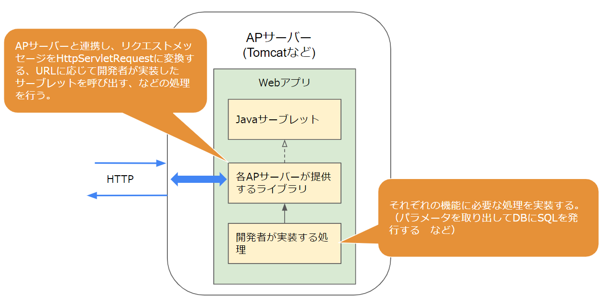

# Webアプリケーションの実装

## なにこれ？ 
Webアプリケーション(以下Webアプリ)とはアプリケーションサーバー上で動作するプログラムのことです。  
ここでは、Webアプリをどのように実装するかについて説明します。  

## アプリケーションサーバーに配置できるプログラム
APサーバーにはどんな実装のプログラムでも配置できるわけではありません。  
例えば、Mainメソッドでコンソール画面にHelloWorldと出力するだけのプログラムは配置できません。  

**APサーバーに配置できるのは、APサーバーが想定する仕様にそって実装されたプログラムだけです。**  
この仕様は言語やAPサーバーごとに決められています。  

たとえばJavaには「**Java Servlet**」というWebアプリの為の仕様があり、Java系のAPサーバー（TomcatやJBossなど）には、この仕様に沿ったプログラムしか配置できません。    
（その為これらのAPサーバーは「サーブレットコンテナ」とも呼ばれます。） 

それらのAPサーバーに配置するWebアプリを開発する場合、開発者はJavaServletの仕様に沿ってプログラムを実装していくことになります。  

以降ではJavaでWebアプリ開発する場合を例に、具体的な実装方法について説明していきます。  
(他の言語も大体似たような仕組みのはずです)  

## JavaでのWebアプリ開発
Javaには「**Java Servlet**」というWebアプリの為の仕様があると説明しました。  
(以降では省略して**サーブレット**と呼びます)

以降ではこのサーブレットを用いた開発方法について説明していきます。  

### Java Servletとは
JavaSerletとは、Webアプリが実装すべきインターフェース(interface)や抽象クラス(abstract class)を定義したものです。  
(public interface ～のように記述する、プログラム的な意味のインターフェースの事です。)

サーブレットの[定義書](https://github.megascus.dev/servlet-spec/docs/apidocs/)を見ると、様々なインターフェースが定義されています。  
例えばリクエストメッセージを表す「```HttpServletRequest```」や、レスポンスメッセージを表す「```HttpServletResponse```」などのインターフェースが定義されています。

```HttpServletRequest```の[定義](https://github.megascus.dev/servlet-spec/docs/apidocs/)をみると、以下のように記載されています。  
> 「サーブレットコンテナはHttpServletRequestを作成してサーブレットのservice(doGet、doPost、など)メソッドの引数として渡します。」

また、```HttpServletRequest```で定義されている各メソッドについても説明されています。  
例えば以下のようなメソッドが定義されています。  

> String getHeader(String name)
> 
> リクエストヘッダーの指定された値をStringとして返します。 リクエストが指定された名前のヘッダーを含まない場合はnullを返します。 もしヘッダーに同じ名前で複数の値が含まれていた場合、このメソッドはリクエストの最初のヘッダーを返します。 ヘッダー名は大文字小文字を区別しません。 このメソッドは任意のリクエストヘッダーに対して使用できます。
> 
> パラメータ:
> name - ヘッダー名を指定する名前のString
> 戻り値:
> リクエストのヘッダーの値を含むString、リクエストのヘッダーがその名前を持たない場合はnull

このように、JavaServletでは以下の情報が定義されています。  
- ある情報をどのインターフェース、抽象クラスで表現するか  
例えばリクエストメッセージの情報は「```HttpServletRequest```」インターフェースで表現される。  

- そのインターフェース（を実装したクラス）はどのように作成されるか  
「サーブレットコンテナはHttpServletRequestを作成してサーブレットのservice(doGet、doPost、など)メソッドの引数として渡します。」など

- そのインターフェースはどのようなメソッドを持ち、そのメソッドはどのような処理を行うべきか

- そのメソッドはどのようなシグニチャか

※ シグニチャとは、メソッド名、引数の数とそれぞれの型、返り値の型の定義の事です。  

重要なのは、Servletはあくまでインターフェースや抽象クラスの集まりであり、**実装は提供していない**ということです。  
インターフェースを継承し、実際の処理を記述したクラスは含まれません。  

※ユーティリティクラス的なクラスは含まれています。  

### JavaServletの実装
開発者がサーブレットの実装を開発することは難しいです。  
例えば```HttpServletRequest```インターフェースを実装したクラスは、そもそもAPサーバーがどのようにリクエストメッセージを保持しているか分からないと作成できません。  

例えばgetHeaderメソッドは、そもそもAPサーバーがどのようにリクエストメッセージを保持しているか分からないと実装できません。  

ではサーブレットの実装はどのように提供されるのでしょうか？  
**サーブレットの実装は、各APサーバーにより提供されます。**  

例えばtomcatでは「servlet-api.jar」という、サーブレットの実装クラスをまとめたライブラリをjarファイルとして提供しています。  
他のAPサーバーでは、JBossは「jboss-servlet-api*.jar」、WebSphereで「j2ee.jar」という名前でjarファイルを提供しています。  
これらのjarファイルは名前は違いますが、中身はJavaServletを実装したクラス群なので、jar内に含まれるクラス名やメソッドのシグニチャは同じです。  
（その為、どのjarを参照したとしても、開発者が実装するプログラムは同じになります。）  

HttpServletRequestを実装したクラスや、リクエストメッセージからそれを作成する処理などは、このjarファイル内に実装されています。  
開発者はこのjarファイル内のクラス・メソッドを利用してプログラムを開発していきます。  


### 開発者が実装する部分
上述した通り、JavaServletの実装は各APサーバーが提供しているライブラリの中で行われます。  
開発者は、それを利用した具体的な処理を実装していきます。  

例えば、マイページのHTMLを作成する、という処理の場合、DBからユーザーデータを取得したり、それをもとにHTMLを作成する部分を実装します。  

### 実装方法
サーブレットの場合、ライブラリが提供する「```HttpServlet```」を継承したクラスを作成し、その中に処理を記述していきます。  

例えば以下のようなコードを記述します。  

```java
@WebServlet("/mypage")
public class MyServlet extends HttpServlet {

  protected void doGet(HttpServletRequest request, HttpServletResponse response)
        throws ServletException,IOException {

    //この部分を開発者が実装する

    //リクエストからパラメータを取得出来る。
    //（この場合リクエストボディからフォームパラメータを取得している）
    String id = request.getParameter("id"); 

    //取得したパラメータを元にしたDBから値を取得処理などを記述。
　　UserInfo info = dao.getUser(id);

    //DBから取得した値をもとにしたHTML作成処理などを記述
    response.getWriter()
       .append("<html><body>")
       .append("<div>").append(info.name).append("</div>")
       //～
       ;
  }
}
```
※DBにアクセスするためのクラスの初期化処理などは省略しています。  

URLのパスが```@WebServlet```で指定したパスと一致し、GETメソッドだった場合にサンプルの```doGet```メソッドが呼び出されます。  
(doGetメソッドはHttpServletに定義されているメソッドをオーバーライドしたものです)    

パスが一致するかの判断や、クラスのインスタンス化、メソッドへ渡す引数（HttpServletRequest、HttpServletResponse）の作成、メソッドの呼び出しなどの処理はライブラリ側が行ってくれています。  
開発者が実装するのはその後の部分になります。  


図  

このように、Webアプリはサーブレットのライブラリを使用して処理を記述していきます。  
  


### Webアプリの作成方法
このようなWebアプリを作成することは難しくはありません。
主要なIDE（Eclipseなどの統合開発環境）では、Webライブラリを使用したプロジェクトを作るメニューが存在しており、これを利用すると簡単に作成できます。  


  


設定ファイルやフォルダ構成、必要な処理が定義などが設定された状態のプロジェクトが作成されますので、そのまま利用してもいいですし、必要な箇所は変更しながら利用できます。  

  


### ここまでのまとめ

- APサーバーに配置できるのは、APサーバーが想定する仕様にそって実装されたプログラムだけ
- Javaではその仕様は「Java Servlet」と呼ばれる
- Java Servletの実装は各APサーバーがjarとして提供している。
- そのjar内のクラス・メソッドを適切に利用したプログラムがWebアプリ
- Webアプリのひな形はEclipseなどのIDEから簡単に作成できる。


### .NETのWebアプリ
他の言語として、マイクロソフトの.NET(C#、VB)でWebアプリを作成する場合についても簡単に説明します。  

マイクロソフトはWebアプリを構築するためのツールとライブラリ群を提供しており、これは「ASP.NET」と呼ばれます。    
（ライブラリ群はdll形式で提供されており、javaで各APサーバーが提供しているjarにあたるものです。）  

.NETのバージョン5未満（4.xまで）では、ASP.NETのライブラリ群はマイクロソフトが提供しているもの以外存在せず、それを利用して作成したWebアプリは同じくマイクロソフト製のAPサーバーである「IIS」にしか配置できません。  
（Javaのように様々なAPサーバーが存在し、各APサーバーがサーブレットの実装を提供している状態とは異なります。）  

.NET 5以降はライブラリ自体がAPサーバーの機能を内包するようになっており、APサーバーに配置するのではなくそれ自体で独立して動作するようになりました。  

図  
参考[]()

このように、言語によって少し状況は違います。  
ただどの場合も、提供されているWebアプリ用のライブラリを利用して開発を行っていくという点で変わりはありません。  


## Webフレームワーク
上述した通り、WebアプリはWebアプリ用のライブラリを利用して開発していきます。   
ただその場合、少し記述な冗長になってしまいがちです。   

たとえばJavaサーブレットでは、パス毎、GETやPOSTのメソッド毎にしか処理を記述できず、複数のパスに対する処理を1つのクラスにまとめることが出来ませんでした。  
またリクエストパラメータをリクエストから取り出す処理も自分で実装する必要がありました。    

そのような手間を省くための、Webライブラリをより使いやすくするためのフレームワークが存在します。  
たとえばJavaの場合はSpringMVCなどが有名です。  

実際の開発時はそれらのフレームワークを利用する事が多いです。  

例えばSpringの場合、同じ処理を以下のように記述できます。  

フレームワークを利用しなかった場合  
```java


```

フレームワーク（SpringMVC）を利用した場合  
```java


```

このようなフレームワークを利用する場合、サーブレットなどの仕組みはフレームワークの裏側に隠ぺいされ、直接触ることは少なくなります。  

図  


これらのフレームワークはサードパーティー製の場合もありますし、言語の自体の開発元が作成している場合もあります。  
例えば、.NETのWebフレームワークである「ASP.NET MVC」はMicrosoftが開発しています。  
（.NETのバージョン5以降はASP.NETにASP.NET MVCが吸収されました）

各言語ごとによく使われるWebフレームワークがあります。  

|  言語  |  フレームワーク  | 
|  ----  |  ----  | 
| Java | Spring MVC <br/>（昔はStrutsなども使われていました） | 
| .NET |  ASP.NET MVC | 
| Ruby | Ruby on Rails | 


## HTMLを作成しやすくする機能
Webアプリは処理の結果として、動的に作成したHTMLの文字列を返すことも多いです。  

ただ、HTMLは文字数も多くなる為、Stringだけで作るのは大変です。  
例えば、JavaのServletでは以下のようなコードになってしまいます。  
```java

```

これだと開始タグと終了タグの関連も分かりにくくなりますし、ダブルクオーテーションなどをエスケープする必要もあります。  

これを解消する為、大半のWebライブラリはHTML作成をサポートする為の仕組みを持っています。  
Javaサーブレットにあれば**JSP**という仕組みがあります。  
（フレームワーク側で仕組みを持っている場合もあります。  
SpringMVCの「Thymeleaf」や、ASP.NET MVCの「Razor」など）      

以下ではJSPを例に説明します。  

JSPは.jspという外部ファイルに記載します。  
HTMLのように記述でき、Javaの変数も埋め込めます。   

JSPの例
```jsp

```

上記のjspは、ビルドした際に、内部的に文字列を作成するコードに置き換えられます。  
(埋め込んだサーバー側の変数もこの時評価されます。)  

以下のコードに変換されるイメージです。  

```java

```

その結果として出力された文字列が、クライアントにレスポンスされることになります。  


## Appサーバーへのプログラムの配置方法 
デプロイとは「配置する」、「展開する」という意味で、作成したプログラムをAPサーバーに配置する際などに使われる言葉です。  

基本的に以下の2パターンの配置方法があります。  

### もともとサーバーにインストール済みのAPサーバーにデプロイする
TomcatやIISなどをサーバーにインストールしておき、そこにWebアプリを配置します。  
Webアプリケーションをデプロイする方法は、APサーバーにより異なります。  
基本的にビルドしたプログラムを特定のフォルダに配置し、パスやポートと対応付ける設定を行います。  
APサーバーによりデプロイの為のメニューが用意されている場合が多いです。  

図  
IISの例  

### Webアプリ自体にAPサーバーの機能を内包させる
.NET5以降のASP.NETでは、Webライブラリ自体にAPサーバーの機能が内包されています。  
またSpringMVCをさらに拡張した「SpringBoot」を利用すると、Tomcat内包した形でプログラムをビルドすることも可能です。  

図  

このような場合、APサーバーアプリがインストールされていない環境でもそのまま実行できます。  
mainメソッドにAPサーバーを実行するコードが記載されており、プログラムを実行するとAPサーバーが立ち上がります。  
（Listenするポートなどは設定ファイルで指定します。）  

こちらの形式の方が取り回ししやすい為、最近のアプリはこの形式が多いです。  


## 参考

[MDN サーバサイド Web サイトプログラミング](https://developer.mozilla.org/ja/docs/Learn/Server-side)  

[Spring mvc](https://spring.pleiades.io/spring-framework/docs/current/reference/html/web.html)  


servlet-apiとAPサーバーの関係  
https://stackoverflow.com/questions/25256768/understanding-who-provides-servlet-api-jar-is-it-web-container-or-part-of-java

各AppサーバーのJ2EEのjar  
https://www.microfocus.co.jp/manuals/ED60/VS2017/GUID-7B2BE673-515D-4204-9B5E-F23B4603D4AE.html

サーブレットの実装  
https://qiita.com/toshi_solution/items/75560ac5353a16703ddc

https://www.ulsystems.co.jp/archives/035.html

spring mvc  
https://spring.pleiades.io/spring-framework/docs/current/reference/html/web.html  

springのメリット  
https://stackoverflow.com/questions/10775522/raw-servlet-vs-spring-mvc

https://www.quora.com/Which-is-better-Java-servlets-or-Spring-to-develop-a-good-website
Springでは、国際化とローカリゼーション、sitemeshのより良い使用、依存性注入、aop、アドバイスなど、jspサーブレットでは得られない多くの機能が提供されます。  

https://spring.pleiades.io/spring-framework/docs/current/javadoc-api/org/springframework/web/servlet/DispatcherServlet.html

spring-boot  
https://www.slideshare.net/OgawaTakeshi/spring-boot-71285225

サーバサイド Web サイトプログラミング  
https://developer.mozilla.org/ja/docs/Learn/Server-side


