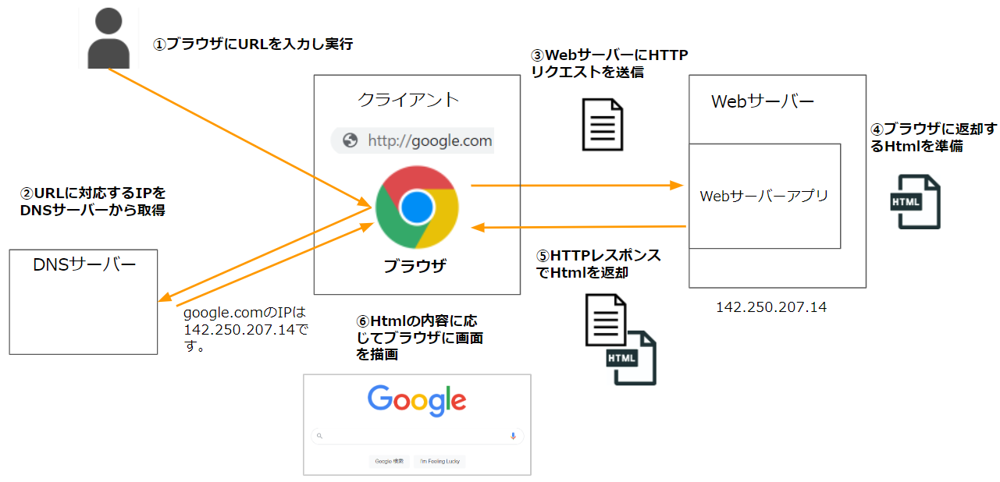
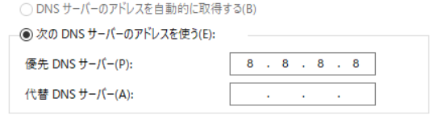

# Webサイトを表示する仕組み

## なにこれ？  
皆さんはChromeやSafariなどのブラウザから、googleやyoutubeなどのWebサイトを表示したことがあるかと思います。  
ただ、どのような仕組みでWebサイトが表示されているかまでは分かってない方もいるのではないでしょうか。

弊社の開発案件ではそのようなブラウザからアクセスするWebサイトを作成することも多く、どのような仕組みかを理解する必要があります。

この記事はWebサイトを表示する仕組みを理解できるようになることを目的としています。


## 対象者
Webサイトを表示する仕組みがいまいちよく分からない人  

## 読み方
この記事は概要を説明しており、細かい内容は別の記事で記述しています。  
まずはこの記事を最後まで読んでもらい、その後に詳細の記事を読むのが読みやすいかと思います。  


## Webサイト表示の流れ
まず初めに、Webサイトを表示する際の大まかな流れを記載します。  
その後に、それぞれのフェーズの細かい内容を説明していきます。

1. （人）ブラウザ上にURLを入力


1. （ブラウザ）URLに対応するIPをDNSサーバーから取得
DNSという仕組みでURLに対応するIPを取得します。  
DNSとやり取りする機能はOSに備わっており、ブラウザがそれを利用しています。

1. （ブラウザ）IPを取得したWebサーバーに対して、HTTPリクエストと呼ばれる形式のメッセージを送信
送信する処理はOSに依頼しています。

1. （Webサーバー）HTTPリクエストを受け取り、返却するHtmlを用意  
Htmlとはブラウザが画面を描画する為に必要なファイルです。  
このほかにもcssやjavascriptなどのファイルも返却します。  
詳しくは後ほど説明します。  

1. （Webサーバー）HTTPレスポンスと呼ばれる形式のメッセージで用意したHTMLを返却


1. （ブラウザ）HTTPレスポンスからHtmlを取り出し、その内容に応じで画面を描画する。





## 各部分の詳細

### 1.（ブラウザ）URLからWebサーバーのIPを取得  
ブラウザはまずURLを解析し、リクエストを送る先のサーバーの場所（IP）を表す箇所を抜き出します。  

ここで、URLについて簡単に説明します。   

#### URLとは  
URLはいくつかの要素で構成されています。  

例えば以下のURLがあった場合  

http://yahoo.co.jp/aaa/bbb/ccc  

以下のように分解できます。  


- URIスキーム  
そのURIが利用するプロトコルです。  
Webページを表示する際は、**http**か**https**が指定されます。  
(URIとはURLと微妙に違う意味なのですが、ここでは同じものと思って大丈夫です。)  

- ホスト名  
Webサーバーの場所（IP）が記載されます。  
以下の2つの指定方法があります。  
  - IPを直接記載  
  IPアドレスを直接指定します。   

  - ドメイン名を記載
IPではなくドメイン名と呼ばれる文字列を指定します。  
DNSという仕組みでドメイン名からIPを取得します。（後述）  
<br/>
人が見て理解しやすいので、ドメイン名を利用する事が一般的です。    

- パス  
ホストの中の何かを表す情報を示します。  

これが一番基本的なURLの構成です。  
他にも以下の情報を記載出来ます。  

図  

- ポート番号  
http通信の際のポート番号を指定します。  
省略した場合は、以下のポートが自動で指定されます。  
http 80  
https: 443  

- クエリパラメータ（クエリ文字列）  
パスの後ろの区切り文字`?`以降の文字列で、`名前=値`形式で記述します。  
複数ある場合は`&`で連結します。  

このようなURLの仕様もHTTPの仕様の一部として規定されています。  

#### WebサーバーのIPの取得手順  
ブラウザがURLからWebサーバーのIPを取得する手順は大まかに以下になります。

1. URLからホスト名を取得

2. ホスト名に対するIPをDNSサーバーに問い合わせる  
ホスト名に対応するIPを取得する為には、DNSという仕組みを利用します。  
DNSとは、インターネット上でドメイン名を管理・運用するための仕組みで、
ドメイン名に対応するIPなどの情報を管理しています。  

ブラウザはDNSサーバーに対して、ドメインに対するIPを教えて下さいとリクエストすることになります。  
DNSに問い合わせる機能自体は実際はOSが持っており、ブラウザはOSが提供する機能を利用して問い合わせを行っています。  


DNSサーバーはOSに設定されています。  
例えばWindowsだと以下の画面から設定できます。  




DNSについてはネットワーク的な話になるので、概要だけの説明になります。
詳しく知りたい方は以下の書籍を参照してください。  
[ネットワークはなぜつながるのか](https://www.amazon.co.jp/dp/4822283119)


### 2.（ブラウザ）Webサーバーに対してHTTPリクエストを送信  
ブラウザはHTTPリクエストというメッセージをWebサーバーに送信します。  
まずはHTTPとは何かについて簡単に説明します。  

### HTTPとは  

クライアント（ブラウザなど）とWebサーバーの間で、さまざまなデータを転送するために使用するプロトコル（通信規約）のことです。
（Htmlだけではなく、画像、動画、PDFなど、コンピュータで扱えるデータなら何でも転送出来ます。）  

HTTPプロトコルの仕様は、IETFという標準化団体が策定しています。   
仕様文書（[原文](https://httpwg.org/specs/rfc7231.html)、[日本語訳](https://triple-underscore.github.io/rfc-others/RFC2616-ja.html#section-4)）  
[仕様文書(原文)](https://httpwg.org/specs/rfc7231.html)  
[仕様文書(日本語訳)](https://triple-underscore.github.io/rfc-others/RFC2616-ja.html#section-4)  


HTTPでは、HTTPメッセージと呼ばれる文字列データをやり取りして必要な情報を伝え合います。    
HTTPメッセージには以下の2種類があります。  
- HTTPリクエスト  
クライアントが送信してサーバーにアクションを起こさせる為のHTTPメッセージ  

- HTTPレスポンス  
HTTPリクエストに対するサーバーの回答であるHTTPメッセージ  

図  


メッセージの仕様（どこにどんな情報をどうやって記載するか）はHTTPプロトコルの仕様の1部として[規定](https://triple-underscore.github.io/rfc-others/RFC2616-ja.html#section-4)されています。  

以下それぞれのメッセージについて説明します。  

### HTTPリクエスト  
HTTPリクエストは、以下のような文字列になります。  
例  

```
GET / HTTP/1.1
Host: google.com
Accept: text/html,application/xhtml+xmlsigned-exchange;v=b3;q=0.9
Accept-Encoding: gzip, deflate
Accept-Language: ja,en-US;q=0.9,en;q=0.8
Connection: keep-alive

```


HTTPリクエストは大まかに以下のブロックに分かれます。  
#### ・リクエストライン（1行目） 
```
POST / HTTP/1.1
```
の部分に当たります。  
ここは以下の要素で構成されています。  
図  
- メソッド  
  サーバーにリクエストの種類を伝えるために使用します。  
  情報が欲しいときはGET、登録をしたい場合はPOSTを指定、などの使い方をします。  
  詳細は別記事で解説します。  

- リクエスト対象  
  URLのドメイン名以降の部分が入ります。  

- バージョン  
  HTTPのバージョンが入ります。  
  大抵はHTTP/1.1が指定されます。  

#### ・HTTPヘッダー（2行目～空行まで）   
```
Accept: text/html,application/xhtml+xmlsigned-exchange;v=b3;q=0.9
Accept-Encoding: gzip, deflate
Accept-Language: ja,en-US;q=0.9,en;q=0.8
Host: google.com
```

の部分に当たります。  
サーバーに補助的な情報を伝える目的で使われます。  
例えばレスポンスの言語を指定したり、Cookie（別記事で解説）を記載できます。  
1行につき1つの情報を`ヘッダー名: 値`形式で記載し、複数行で構成可能です。  
 
例えば以下のようなヘッダーがあります。  
- Host  
URLのホスト名が記載されます。  

- Cookie  

- User-Agent  


これらのヘッダーの種類もHTTPの仕様の一部としてとして[定義](https://httpwg.org/specs/rfc7231.html#request.header.fields)されています。  
ブラウザやWebサーバーはこの仕様に基づいて実装されています。  
例えば、ブラウザはCookieを送りたい場合Cookieヘッダーに記載しますし、サーバーアプリはCookie情報を取得したい場合Cookieヘッダー確認します。  


よく使われるヘッダーについては別記事で解説します。  


#### ・本文（空行から後ろ）  
```

```
の部分に当たります。 

ユーザーが入力した情報などを記載します。  
詳しくは別記事で解説します。  

データが無い場合は省略可能です。  


### HTTPレスポンス
HTTPリクエストに対する応答として、WebサーバーはHTTPレスポンスメッセージをブラウザに送信します。  
HTTPレスポンスにはHtmlなどのブラウザ側に返却したいコンテンツ情報が含まれています。  

HTTPレスポンスは、以下のような文字列になります。  
例  


図  

HTTPリクエストと同じく、HTTPレスポンスの構文もHTTPの仕様の一部として定義されています。
以下HTTPレスポンスの構造を簡単に説明します。

#### ・ステータスライン （1行目） 
```

```
の部分を指します。  

ステータスラインは以下の情報を持ちます。  

- プロトコルバージョン  
通常「HTTP/1.1」です。  

- ステータスコード  
HTTPリクエストがどのように処理されたを示す3桁の数字コードです。  
例えば以下のステータスコードがあります。  
  - 200  
  処理が正常に終了したことを示す。  

  - 301
  リダイレクトをする必要があることを示す。  
  この場合、ブラウザはレスポンスヘッダーの`Location`ヘッダーに記載されたURLに自動的に遷移する。  

  - 404  
  リクエストされたパスの対する処理が見つからなかったことを示す。 

301レスポンスのように、ステータスコードによってはブラウザが特定の動作をするものがあります。  

- 説明句 
ステータスコードに対する補足の情報を文字列として持ちます。  
どのような文字列でもよいのですが、ステータスコード毎に一般的に設定される文字列があります。  
例  
(200のとき): OK  
(301のとき): Moved Permanently  
(404のとき): Not Found  

#### ・レスポンスヘッダー（2行目～空行まで）    
リクエストと同じく、補助的な情報を伝える目的で使われます。  
記述の書式も同一です。（`ヘッダー名: 値`）

例えば以下のようなヘッダーがあります。  
- Date  


- Set-Cookie  

- Content-Length 


#### ・レスポンスボディ（空行から後ろ）  
ここに応答したい内容が入ります。  
Htmlファイルを返却したい場合は、Htmlファイルの内容が記述されています。  
404など、応答によっては本文が無いものもあります。  

図  


まとめると、リクエスト・レスポンスのどちらも以下の構造になります。  
ただしそれぞれ1行目の内容やヘッダーの種類が異なります。  

図  

以上が簡単なHTTPの説明になります。  
もう少し詳しい説明は別記事で行います。  


#### Webサーバーに対してHTTPリクエストを送信  
元の話に戻ると、ブラウザはWebサーバーのIPを確認後、HTTPリクエストを生成しWebサーバーに送信します。  
例として、googleサイトを開いた際のリクエストを添付します。    

```


```
Webサイトを表示する際、このようなHTTPリクエストの作成・送信処理をブラウザがやってくれているわけです。  


### 3.（Webサーバー）HTTPリクエストを受け取り、返却すべきHtmlを用意  

ブラウザから送られてきたHTTPリクエストをWebサーバーが受け取り、Webサーバーアプリに受け渡されます。  

Webサーバーアプリはリクエストの内容を解析し、リクエストの内容によって返すべきコンテンツを準備します。  
今回のような、ブラウザにURLが入力された際のリクエストに対しては、まず**Html**というWebページを表示する為のファイルを返却します。  

どのようなHtmlを返すかは、URLのパスやパラメータによって判断します。  
例えばURLが/loginならログインページ、/mypageならマイページ表示用のHtmlを返す、などです。  
このような、どのリクエストに対してどのコンテンツを返すかのルールは設計者・開発者が決め実装します。

#### Webページの種類  
Webページには内容が変わらない静的ファイル（ヘルプページなど）と、条件によって内容が異なる動的ファイル（ユーザー毎に内容が違うマイページなど）があります。  

静的ファイルの場合、返却すべきhtmlをあらかじめ用意しておき、それを返却します。  
(後ほど説明しますが、そのhtmlファイルの中身の文字列をHttpレスポンスに記載します。)    

動的ファイルの場合は、データベースから取り出した情報をもとにHtmlファイルを作成する、といった処理が必要になります。  
この際にjavaなどの言語で書かれたプログラムを呼び出す必要があります。  
このあたりは別記事で詳しく説明します。  


### 4.（Webサーバー）コンテンツをHTTPレスポンスで返却

Webサーバーは返却したい情報（この場合はHtml）をHTTPレスポンスとしてブラウザに送信します。  
HTTPレスポンスの本文部分に、返却したい情報が記載されています。  

HTTPレスポンスの仕様については上で説明した通りです。  


例として、Gooleのサイトを開いた際のレスポンスを記載します。    
```

```
Webサーバーはリクエストに応じて、このようなレスポンスを返却してきます。  


### 5.（ブラウザ）HTTPレスポンスからHtmlを取り出し、その内容に応じで画面を描画する。

図  

ブラウザがWebサーバーから返却されたHttpレスポンスを解析し、その本文からHtmlファイルを読み取ります。  

Htmlにはブラウザが画面のどこに何を描画すべきかが記載されており、ブラウザはその内容に従って画面を描画します。  

例えば、Htmlに`<button>ボタンです</button>`と記載されていた場合、画面には以下のようにボタンが描画されます。  

図  

このようなHtmlの仕様（Htmlに何が書かれていたら画面に何を描画するかというルール）は、W3CとWHATWGという標準化団体により策定されています。   
策定されて仕様は[HTML Living Standard](https://html.spec.whatwg.org/)という名で公開されています。  

例  
googleのHtml

これでWebサイトを表示する際の流れの説明は完了です。   
みなさんがブラウザでWebサイトを見ている際は、このような処理をブラウザやWebサーバーが行ってくれています。  


## Html、Css、Javascript
ブラウザが画面を描画する際は、上で言及したHtmlに加え、Css・Javascriptというものが利用されます。  

以下それぞれの概要を説明します。  

### Htmlとは
前述の通り、ブラウザにウェブサイトの構成を伝えるための言語です。  
（このような視覚表現や構造を表現する言語をマークアップ言語といいます。）  

`<`と`>`で囲まれた**タグ**を組み合わせて記述します。  
例えば以下のように記述します。  

`<h1>見出しです</h1>`


左の`<>`で囲まれた部分が**開始タグ**、右の`</>`が**終了タグ**と呼ばれます。  
`<>`の中に書かれている`h1`は、そのタグが何であるかを表します。  
例えば`h1`は、見出しとしてタグで囲まれた部分の文字列を強調表示する、という意味があります。

タグに囲まれた部分は、**a**と呼ばれます。

図  

どのタグが何の意味を持つかは前述した仕様で定義されています。  
他の例として、外部へのリンクを表示する場合は`a`というタグを利用します。  

`<a href='http://google.com'>外部リンクはこちら</a>`  

ここで、`a`というタグ名の横に`href`というものが記載されています。  
これは**属性**とよばれ、タグに情報を付加する為に利用されます。  
`href`はリンクがクリックされた場合の遷移先URLを記載します。  

属性の種類も仕様で定義されており、複数のタグに使われる属性と、特定のタグにのみ使われる属性があります。  


このように開始タグ～終了タグまでのまとまりを**要素**といいます。  

まとめると以下になります。  

図  

htmlはこのような要素を組合せて記述されます。  
要素は並べて記載することも入れ子にする事も可能で、木構造になっています。  

木構造

例えば、ブラウザで適当なサイトを開き、右クリック→ソースを表示 を選択すると、そのサイトのhtmlを見ることが出来ます。  

図  


### Css、Javascript 

画面描画の為にブラウザが使用するものとして、html以外に**Css**、**Javascript** と呼ばれるものがあります。  
これらはhtmlとは別の仕様で、異なる文法で記述されます。  

ただしお互いに関連は深く、Htmlの特定の箇所に直接CssやJavascriptを記載することが可能です。  
（Htmlとはのファイルとして定義することも可能です。記述場所については後ほど詳しく説明します。）  

### Cssとは  
HTMLの要素をどのように修飾（表示）するかを指示するものです。  
幅・高さ・色など、見た目のデザインに関する情報を指定できます。

Cssは以下のように記載します。  

例  
'''

'''


この例は、この要素の背景色は赤、という定義しています。  
他にも、例えば以下のような定義が可能です。

- 
- 
- 

このようなCssの仕様(backgroundcolorは背景色を表す、などのルール)はW3Cという団体によって[策定](https://www.w3.org/Style/CSS/specs.en.html)されています。  

cssの適用方法は3つあります。  

1. タグのstyle属性に直接指定する  

1. `<style>`タグの内部に記載する  

1. 外部ファイルに記載し、`<style>`タグから参照する


直接記述する方法だと記述箇所が増えた際に管理が大変になるため、外部ファイルとして定義する事も多いです。  

Cssの詳しい仕様については別の記事で解説します。  

②、③の方法で記載する場合は、***セレクタ***という、どの要素にどの定義を適用するかという情報を記載します。  

セレクタは以下のように記載します。  

例  

これはh1タグの背景色を全て赤色にするという定義です。  
cssでは様々なセレクタを定義できます。  

- タグ


- 特定の属性を持った要素

- 独自の定義

これはhtmlの`class`属性に同様の名前が定義されている要素に適用されます。

cssは他にも特定の属性を持つものを対象にしたり、独自の名前を付けた定義を作成出来ます。  


### Javascriptとは
Webサイトのふるまいを定義する為のプログラミング言語です。  
例えば、あるボタンが押された際にある処理を行う、などの処理を記述します。  


例  


サーバー側はJavascriptの文字列を返却しているだけです。
Javascriptが実行されるのはブラウザ上になります。    
主要なブラウザはJavascriptの実行エンジンを持っており、読み込んだjavascriptを解析して実行します。  

図  

Javascirptが実行された結果（上の例の背景色の変更など）は、そのブラウザのみで起こっていることです。  
他のクライアントのブラウザに影響しません。  

図


図  
複数クライアントにjavascriptが返されてる図  


javascriptの仕様も標準化団体によって定められているのですが、以下の2つの仕様があります。  

1. javascript自体の言語仕様  
例えば変数やメソッドの定義の仕方などの基本的な部分の定義です。  
TC39という団体により定義されており、その仕様は[ECMAScript](https://tc39.es/ecma262/)と呼ばれています。  


1. Webブラウザ環境で実行する場合特有の機能の仕様  
html要素の操作など、ブラウザ環境で実行される場合限定の機能の仕様が定義されています。  
こちらはHtmlと同じ[Living Standard](https://html.spec.whatwg.org/)として作成されています。  
(Javascriptをサーバーサイドで動かす場合もあるのですが、その場合これらの機能は利用できません。)  

javascriptの記載方法も、cssと同じく３つあります。  

1. タグのイベント属性に直接指定する  

1. `<script>`タグの内部に記載する  

1. 外部ファイルに記載し、`<script>`タグから参照する


#### Html、Css、Javascriptのそれぞれの役割

html、css、javascriptの役割をまとめると以下になります。  
- Html  
Webサイトの構造（どこに何を表示するか）を定義します。  

- Css  
Webサイトのデザインを定義します。  

- Javascript  
Webサイトの振る舞いを定義します。  


#### 外部ファイルの読み込み順  

css、javascriptをhtmlとは別ファイルとした場合、それぞれのファイル毎にHttpリクエストを発行します。  

htmlのタグにはCSSとJavaScriptファイルを読み込むためのタグが用意されています。  


以下のように処理されます。  

1. ブラウザがhtmlファイルを解析

1. htmlファイル内の`<style>`、`<script>`タグで外部ファイルが参照されていた場合、そのURLに対してHttpリクエストを発行し、外部ファイルを取得します。

1. 取得したcssファイル、scriptファイルを解析し、htmlに適用します。  


図


- css
`<style>`タグで指定します。
例

- javascript
`<style>`


## 仕様の策定について
HTTPやHTMLなどの仕様は仕様策定団体によって定義されており、主要なアプリ（ブラウザやWebサーバーアプリ）はその仕様に準拠する形で実装されています。  

例えば、ブラウザはHTTPリクエストを送る際、仕様通り先頭行に要求メソッドなどを記載します。  
Webサーバーアプリも仕様通り先頭行に要求メソッドなどが書かれている前提でHTTPリクエストを解析します。    

このように共通の仕様を前提に各アプリが実装されている為、どのような組合せでもHTTPのやり取りを行えるわけです。  

図  

もし共通の仕様が無ければ、特定のブラウザとWebアプリの組合せでしかやりとりが出来なくなってしまいます。  


もし共通の仕様が決まっていなければどうなるでしょうか。  
例えばブラウザやWebサーバーごとに想定するHttpリクエストの形式が異なっていると、特定のブラウザとWebアプリの組合せでしかやりとりが出来なくなってしまいます。  

図  


HTML、Css、Javascriptにも同じことが言えます。  
Htmlのタグやcssの意味、javascriptの構文やメソッドの処理内容などは、共通の仕様で定義されています。  
各ブラウザはその仕様をもとに実装されているので、どのブラウザで見ても同じWebページを表示できるわけです。  
(後述しますがたまに見れないときはあります。)  

図  
androidやiOSでも見れるのを表す  


もしブラウザごとにそれらの解釈が異なるのなら、各ブラウザ向けに返却するHTMLを変えなくてはいけなくなります。  

図  

そのような事態を避ける為に仕様策定団体が存在しており、各アプリの開発ベンダーもそれに従っているわけです。  

この仕様には強制力はありませんが、仕様に準拠していないアプリは扱いにくくなるため利用者が減ってしまいます。  
その為自然とこの仕様に従うようになります。  


このように共通の仕様や規格を作るのは、Webシステムに限った話ではありません。  
TCP/IPのようなプロトコルもそうですし、USBの形状なども共通の規格が決まっています。  
このように共通の仕様を決めることで、全体の利便性が高まるわけです。  


#### IE（Internet Explorer）について
各アプリが共通の仕様に準拠していると書きましたが、MicrosoftのIEは共通の仕様にあまり対応していませんでした。  
（Html・Css・Javascript関連で、「IEでは動作しない」という機能が多かったです。）  
  
その為、開発者はIE用と他のブラウザ用の２つの実装をコーディングしなくてはいけませんでした。   
（IEはWindows標準搭載で一定のシェアがあるため無視することは出来ませんでした。）  

ネットで調べ物をするとIEの場合はこうコーディングする、といった情報が書かれている場合がありますが、それは上記の理由の為です。  

IEは2022/6月でサポートが終了しますが、古い業務アプリなどはIEでしか動かないものもあるので注意が必要です。  


#### 各ブラウザの仕様対応状況  
各アプリは共通仕様に対応しようとしていますが、一部の機能に対応していないことがあります。  
特にブラウザ側はURI、Http、Html、css、javascript・・と対応しなければいけない仕様が多く、各ブラウザで対応状況に差があります。  

対応状況は[ここ]()で確認できます。  


## 参考資料  

・MDN HTTPについての説明サイト  
https://developer.mozilla.org/ja/docs/Web/HTTP


・MDN URLとは何か  
https://developer.mozilla.org/ja/docs/Learn/Common_questions/What_is_a_URL


