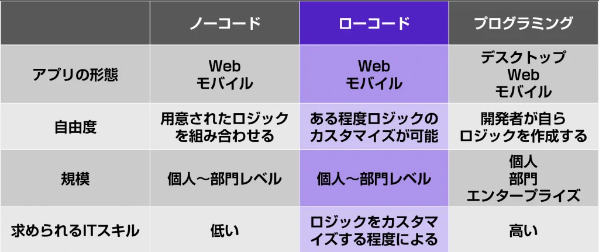
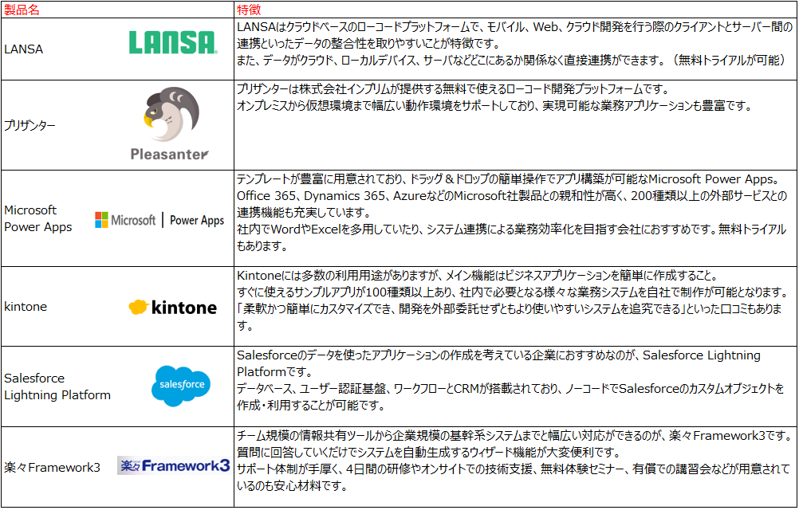

[^1]:　2018年9月7日に経済産業省が発表したDXレポートにて、DXへの取り組みの重要性とともに発信した警告。老朽化した既存の基幹システムの問題点を指摘し、2025年までにシステムの刷新をしないと、2025年以降、年間最大12兆円の経済損失が発生する可能性があると説明した。

# ローコード開発とは

## 概要
ローコード開発 (Low code development) とは、可能な限りプログラミング作業を減らし、  
マウス操作などで用意された部品を組み合わせて（＝GUI：グラフィカル・ユーザー・インターフェース）、アプリを開発する手法です。

※イメージ図  

 
 

## ローコード開発が注目される理由
代表的な理由として、主に下記が挙げられます。
* システムを迅速に提供可能
* 企業のシステム内製化が活発
* 「2025年の崖」問題[^1] （DXへの取り組み）
 
 

## 「ノーコード開発」との違い
類義表現に「ノーコード開発」と呼ばれるものが存在します。  
こちらは、名前の通りプログラミングせずにアプリを開発するアプローチです。  
「ローコード」、「ノーコード」、「プログラミング（※一般的な開発案件）」それぞれを比較したものが、下記になります。

 
 

## ローコード開発のメリット
メリットとしては、主に下記が挙げられます。
* **開発期間／コスト削減（＝生産性／品質の向上）**  
あらかじめ用意された部品を用いるため、開発スピードの向上とバグの低減が期待できる。  
結果として開発期間、コストの削減に繋がる。

* **IT人材の有効活用**  
現場部門の担当者でも技術習得可能なため、少数人数で構成されている情報システム部門等においても、IT人材を他の業務へ回すことが可能。

* **セキュリティ対策**  
用意された部品については、一定のセキュリティ対策が担保されているため、ゼロから設計をする工数を省くことが可能。
 
 

## ローコード開発のデメリット
デメリットとしては、主に下記が挙げられます
* **機能の制約**  
「部品が用意されている」ことの裏返しとして、細かな部分のカスタマイズが行えない（開発自由度の制限）といった事が発生する。

* **ある程度の開発知識（知見）が必要**  
カスタマイズの度合いにも依るが、要件実現のために、ある程度の開発経験が必要となる場合がある。

* **ブラックボックス化の可能性**  
開発が比較的迅速に進められる一方、明確な設計書無しに進むことも可能であるため、担当者の異動／退職等にともない、後任担当者が作られたアプリの内容を読み解けず、結果ブラックボックスとなってしまうリスクがある。
 
 

## ローコード開発の領域
多種多様なツールがリリースされていますが、目的・用途に応じたものを選択する必要があります。  
大まかに、下記の４種に分類されます。  
1. **業務アプリケーション開発**
   * 企業、団体の業務を実現するアプリケーション開発のための開発ツール
1. **外部向けウェブサイト制作**
   * 企業、団体、個人が外部に発信するウェブサイト制作のための開発ツール
1. **ECサイト制作**
   * 企業、団体、個人がECサイトを制作するための開発ツール
1. **データシステム連携**
   * データやシステム連携を司る開発ツール
 
 

## 具体的なツール（本稿執筆2022年8月時点）
ローコードツールについて、代表的なものを以下に記載します。

### 各種ツール公式サイト
* LANSA
   *  https://www.lansa.jp/
* pleasanter
   *  https://pleasanter.org/
* Microsoft powerapps
   *  https://powerapps.microsoft.com/ja-jp/
* Kintone
   *  https://kintone.cybozu.co.jp/
* Salesforce Lightning Platform
   *  https://www.salesforce.com/jp/products/platform/lightning/
* 楽々Framework3
   *  https://www.sei-info.co.jp/framework/
 
 

## ツール選定のポイント
大きく、３点あります。
1. **実現できることの把握**  
「ローコード開発の領域」の記載内容と重複しますが、導入目的・ゴールを明確にした上で、それらを実現できるツールを選定する必要があります。

1. **ITリテラシーの向上**  
導入当初は情報部門が中心となる場合でも、将来的には現場部門主体でも進められるよう、早期にハンズオンメニューやガイドラインを整備し、会社全体でのITリテラシー向上を図る事が重要です。

1. **サポート体制の確認**  
開発時、不明点や不足の事態に見舞われた際に備えて、サポート内容を事前にチェックしておきます。特に問い合わせ可能な方法や受付時間、回答を得るまでに要する時間は重要なポイントです。
 
 

## ローコード開発の将来性
今後は、ローコード開発技術を非情報部門が購入・利用し、ビジネスユーザーが直接、ビジネスアプリケーションの開発を行うケースが増えるかもしれません。  
また、すでにローコード開発をスタンダードにした開発体制をとる企業も出始めています。  
したがって、ローコード開発自体の将来性は十分に高いと言えるでしょう。  

ただし、ローコード開発で作られたシステムの保守・運用・改修などはプログラミングスキルを持った人材でなければ難しいのが実情です。  
そのため、プログラミングスキルを持ったエンジニアがローコード開発の技術を身に着けることで、キャリアアップの一助になると考えられます。
 
 

## まとめ
「ローコード開発」は、「ノーコード開発」よりもカスタマイズ性があり、「プログラミング」よりも少ない手数とコストで、一定品質のアプリ開発が可能となります。  
Tエンジニアの不足や、品質／工数削減の両立の必要性といった背景から、「ローコード開発」への期待／需要は、今後一層高まるものと思われます。