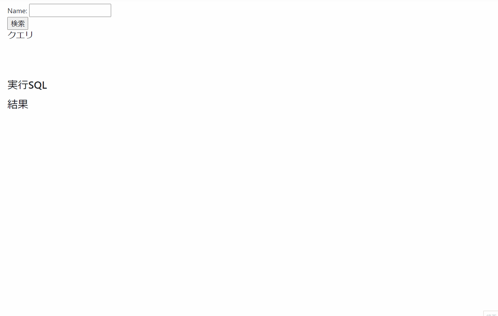

# １．SQLインジェクション

## ■一言でいうと  

悪意あるユーザーの入力により意図しないSQLが実行されてしまうこと。

## ■ 発生しうる脅威  
* 非公開情報（個人情報、機密情報）の流出  

* データの改ざん

* テーブル破壊  

   など

## ■ 対策  
* SQLの組み立てはプリペアドステートメント（プレースホルダ）を利用する。  
  パラメータによるバインドを利用したSQL実行を行う。  
  文字列結合で組み立てない。  

* エラーメッセージをブラウザにそのまま表示しない。  
  データベースやテーブル構造が予測されるような情報を外部に見えないようにする。

* SQLを実行するアカウントに適切な権限を与える。  
  もし攻撃された場合に被害を最小限にとどめる。  

## ■デモ

### 例1）非公開情報の流出  

画像1では最初にデータベースに登録されている「鈴木」を検索しています。  
その際に実行されているSQLが「SELECT * FROM members WHERE deleted_flag = 0 AND name LIKE '%鈴木%'」と表示されていますが、このSQLからは”deleted_flag = 0”（削除されていない）が条件であること、入力した「鈴木」がLIKE句に指定されていることが分かります。

ここで検索条件の「鈴木」の代わりに「' OR 1 =1 OR '' = '」を指定すると、
LIKE句は先頭のシングルクォートで区切られ、「OR 1 = 1」がSQLの条件として有効になります。

結果、削除して見えない筈の「鈴木 四郎」などのデータが参照でき、非公開の情報が参照できるようになってしまいます。


<!--   -->

<div style="width:80%;text-align:center">画像1.非公開情報の抽出</div>

### 例2）データ改ざん  

非公開情報の流出のデモではWHERE句の書き換えを行いましたが、同じような方法で全く別のSQLを実行することも可能です。  

例えば下記のSQLをNameの検索ボックスに指定すると「' OR 1 =1;」のセミコロンでSQLが一旦終了し、
後続のINSERT文が実行され「佐藤 太郎」が追加されます。

````
' OR 1 =1; INSERT INTO members (name, deleted_flag) VALUES ('佐藤 太郎', 0); SELECT * FROM members WHERE '1' = '1
````

もちろんINSERT文だけではなく、DELETE文など他のDML、DROP文などのDDLも好きなように実行できますので、テーブルの破壊も可能になります。


<div style="width:80%;text-align:center">画像2.データ改ざん</div>

## ■攻撃者視点でテストしてみる。

SQLインジェクションの脆弱性を見つけるにはまず、「' OR 1 =1;」のような検索を行うことで発見できます。  
ただ、実際に攻撃を行うにはテーブル構造を知る必要があるので、エラーを起こすなどして調べることになりますが、上記の対策がされている場合には画面に何も表示されません。  

その場合には下記のSQLでテーブル構造を確認できます。   
※画面に氏名が表示されていることから「name」という列名を予測しています。


````
' AND 1 = 2 UNION SELECT table_name as name, 0 as deleted_flag FROM information_schema.tables WHERE table_schema NOT IN ('information_schema','mysql','performance_schema','sys')  OR '' = '
````


<div style="width:80%;text-align:center">画像3.テーブル取得</div>


以上